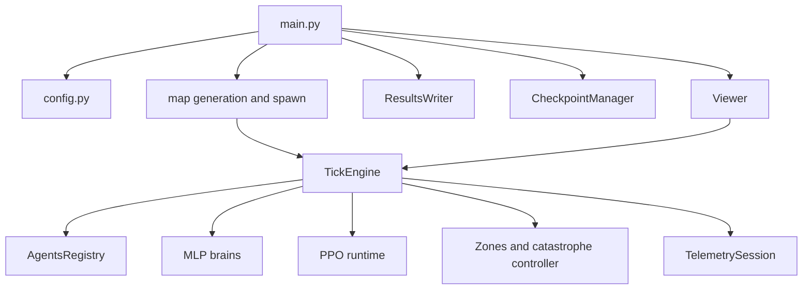

# Neural-Abyss

> **Overview**  
> `Neural-Abyss` is a grid-based multi-agent combat simulation implemented in Python with PyTorch. The repository combines a tensor-backed world state, a slot-based agent registry, neural policy/value networks, a per-slot PPO runtime, signed zone mechanics with runtime catastrophe overrides, a Pygame viewer, crash-safe checkpointing, and structured telemetry. The public repository name is **Neural-Abyss**; some internal strings and historical paths still use older labels such as `Neural Siege` and `Infinite_War_Simulation`.

## What the repository implements

At its core, the repository runs a discrete tick loop:

1. Build observations for alive agents.
2. Build legal-action masks.
3. Run policy inference for each live slot.
4. Resolve combat.
5. Apply deaths.
6. Resolve movement.
7. Apply zone effects, control-point scoring, and respawn logic.
8. Record telemetry and PPO data.
9. Advance to the next tick.

The world state is stored in PyTorch tensors. A slot-based registry holds per-agent state and brain modules. The runtime can run with a viewer or without one, can save and resume checkpoints, and can append outputs into an existing run directory when resuming.

## Principal components

- **Tensor-backed simulation state**  
  Grid state is stored as a `(C, H, W)` tensor. Agent state is stored in a dense slot-based registry tensor. The code selects CUDA when available and enabled in config.
- **Multi-agent combat loop**  
  Combat resolves before movement. The action space is discrete and mask-driven. The current configuration exposes `41` actions by default.
- **Two unit types**  
  Soldier and archer unit IDs are defined in config. Archers have configurable range and optional wall-blocked line of sight.
- **Neural policy/value modules**  
  `agent/mlp_brain.py` defines five MLP-based actor-critic variants. `agent/ensemble.py` groups compatible models for batched inference and can use `torch.func` / `vmap` when enabled.
- **Per-slot PPO runtime**  
  `rl/ppo_runtime.py` keeps one model state and one optimizer per slot. Parameters are not shared across slots. Rollouts, GAE, clipped PPO updates, gradient clipping, KL guards, and LR scheduling are implemented in code.
- **Procedural map and zone mechanics**  
  Random walls are generated at startup. Base zones are stored as a signed float field rather than a heal-only mask. Capture-point masks are maintained separately.
- **Runtime catastrophe layer**  
  `engine/catastrophe.py` applies transient overrides on top of the canonical base-zone field. Manual catastrophe presets and a deterministic dynamic scheduler are both implemented. Catastrophe state is checkpointed.
- **Viewer and operator controls**  
  `ui/viewer.py` provides a real-time Pygame UI with inspection, overlays, manual checkpointing, and catastrophe controls. A no-output inspector mode is also present.
- **Checkpointing and observability**  
  Checkpoints include world state, brains, PPO state, catastrophe state, viewer state, and RNG state. Results and telemetry are written into a run directory with append-safe resume handling.

## Repository layout

```text
.
├─ main.py
├─ config.py
├─ agent/
│  ├─ ensemble.py
│  ├─ mlp_brain.py
│  └─ obs_spec.py
├─ engine/
│  ├─ agent_registry.py
│  ├─ catastrophe.py
│  ├─ grid.py
│  ├─ mapgen.py
│  ├─ respawn.py
│  ├─ spawn.py
│  ├─ tick.py
│  ├─ game/move_mask.py
│  └─ ray_engine/
├─ rl/ppo_runtime.py
├─ simulation/stats.py
├─ ui/
│  ├─ camera.py
│  └─ viewer.py
├─ utils/
│  ├─ checkpointing.py
│  ├─ persistence.py
│  ├─ profiler.py
│  └─ telemetry.py
└─ recorder/
   ├─ recorder.py
   ├─ schemas.py
   └─ video_writer.py
```

## Runtime flow



## Configuration

Runtime configuration is environment-variable driven through `config.py`.

Verified categories include device selection, UI or headless mode, grid size and initial population, PPO hyperparameters, respawn settings, catastrophe controls, telemetry cadence, checkpoint cadence and retention, viewer layout, and video settings.

The startup banner is generated from `config.summary_str()` and reports the resolved device, grid size, initial per-team count, observation width, action count, and AMP status.

## Requirements

The repository does **not** currently publish a pinned dependency manifest in the audited files. Installation therefore needs to be done in the active Python environment.

Observed imports in the code indicate these dependencies:

- **Required:** `torch`, `numpy`
- **Required for the viewer:** `pygame`
- **Optional:** `cv2` / OpenCV for `simulation_raw.avi`, `imageio` for the standalone recorder utility, and `pyarrow` for schema-related recorder utilities when available

CUDA is optional. The config selects CUDA when available and enabled.

## Installation

Clone the repository and prepare a Python environment with the required packages installed.

```bash
git clone https://github.com/ayushdnb/Neural-Abyss.git
cd Neural-Abyss
```

Because configuration is env-driven and there is no audited CLI wrapper, the usual entrypoint is:

```bash
python main.py
```

## Running

### Default viewer run

```bash
python main.py
```

### Headless run

PowerShell:

```powershell
$env:FWS_UI="0"
python main.py
```

POSIX:

```bash
FWS_UI=0 python main.py
```

### Resume from a checkpoint

`main.py` reads `FWS_CHECKPOINT_PATH` and restores world state first, then runtime state.

```powershell
$env:FWS_CHECKPOINT_PATH="results\sim_YYYY-MM-DD_HH-MM-SS\checkpoints\ckpt_tXXXXX_YYYY-MM-DD_HH-MM-SS"
python main.py
```

Output continuity is enabled by default. On resume, the runtime appends into the original run directory unless `FWS_RESUME_FORCE_NEW_RUN=1` is set.

### Inspector UI without creating outputs

```powershell
$env:FWS_CHECKPOINT_PATH="results\sim_YYYY-MM-DD_HH-MM-SS\checkpoints\ckpt_tXXXXX_YYYY-MM-DD_HH-MM-SS"
$env:FWS_INSPECTOR_MODE="ui_no_output"
python main.py
```

In this mode the viewer starts without creating results, telemetry, or checkpoint files.

## Checkpoint and resume behavior

Checkpointing is implemented in `utils/checkpointing.py` and is integrated into both UI and headless execution paths.

Verified behavior in code:

- periodic checkpointing by tick count
- on-exit checkpointing
- manual checkpointing from the viewer with `F9`
- trigger-file checkpointing via `checkpoint.now` in the run directory
- pinned checkpoints for manual saves
- retention pruning for non-pinned checkpoints
- `latest.txt` pointer in the `checkpoints/` directory
- checkpoint path resolution from a checkpoint directory, a checkpoint file, or a checkpoints root containing `latest.txt`

Saved checkpoint payloads include world state, zone state, registry data, brains, PPO state, catastrophe state, viewer state when saved from the UI, RNG state, and checkpoint metadata.

## Viewer controls

The following keys are verified in `ui/viewer.py`.

| Input | Action |
|---|---|
| Left mouse button | Inspect world cell and select occupant |
| Mouse wheel | Zoom |
| `W A S D` / arrows | Pan camera |
| `Space` / `.` | Pause-resume / single-step while paused |
| `+` / `-` | Change speed multiplier |
| `Z` | Toggle signed-zone overlay |
| `R` / `T` | Toggle ray display / threat overlay |
| `B` / `N` | Toggle battle view / brain labels |
| `M` | Mark selected agent |
| `S` | Save selected brain state dict |
| `F9` / `F11` | Manual checkpoint / fullscreen |
| `[` / `]` | Decrease / increase selected cell base-zone value |
| `0`, `Backspace`, `Delete` | Reset selected cell base-zone value |
| `1`–`6` | Trigger manual catastrophe presets |
| `Shift+I`, `Shift+O` | Trigger experimental inversion / full dormancy |
| `G`, `Shift+G`, `C` | Toggle catastrophe system / scheduler / clear active catastrophe |

## Outputs

A normal run creates a timestamped run directory under `results/` unless output continuity is reusing an existing directory.

```text
results/
└─ sim_YYYY-MM-DD_HH-MM-SS/
   ├─ config.json
   ├─ stats.csv
   ├─ dead_agents_log.csv
   ├─ summary.json
   ├─ crash_trace.txt                  # only on crash
   ├─ simulation_raw.avi               # only when recording is enabled
   ├─ checkpoints/
   │  ├─ ckpt_t.../
   │  └─ latest.txt
   └─ telemetry/
      ├─ schema_manifest.json
      ├─ run_meta.json
      ├─ agent_static.csv
      ├─ tick_summary.csv
      ├─ telemetry_summary.csv
      ├─ ppo_training_telemetry.csv
      ├─ mutation_events.csv
      └─ events/events_000000.jsonl
```

Additional telemetry sidecars are written by `utils/telemetry.py` when enabled.

## Current status and limitations

This README stays conservative about maturity and results.

Visible limitations in the audited files:

- **Naming is not fully unified.** The public repository is `Neural-Abyss`, while internal strings and historical paths still use `Neural Siege` and `Infinite_War_Simulation`.
- **Configuration is env-heavy.** The audited files do not provide a dedicated CLI wrapper or a pinned dependency file.
- **PPO is implemented, but outcome is not asserted here.** The repository contains a full PPO runtime and training telemetry, but code inspection alone does not establish convergence quality.
- **Viewer brain saves go to the working directory.** `ui/viewer.py` does not route those `.pth` files into the run directory.
- **Compatibility code is present.** Checkpoint and zone migration bridges indicate that older runtime formats are still supported.

## License

This repository is released under the **MIT License**.

See [`LICENSE`](LICENSE) for the license text.
