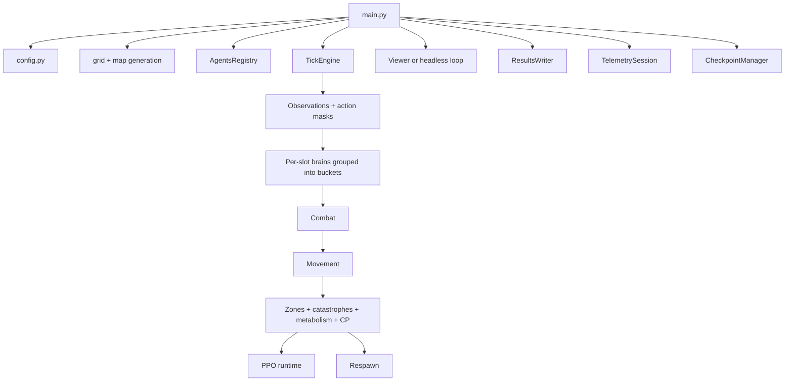

# Project Overview

This document describes what the repository implements at a high level, without repeating lower-level implementation detail from the rest of the suite.

The public repository is **Neural-Abyss**. Some internal strings and older runtime labels still refer to `Neural Siege` or `Infinite_War_Simulation`. Those internal names should be interpreted as legacy identifiers, not as separate systems.

## What the repository implements

The repository implements a discrete-time, grid-based, two-team combat simulation in which agents are stored in a slot-based registry, act through per-slot neural policies, and are updated by a vectorized tick engine. The main runtime is built around these ideas:

- the world grid is represented as PyTorch tensors
- agent state is stored in a dense registry tensor plus per-slot Python objects for brains
- observations are rebuilt every tick for alive agents
- discrete actions are masked and sampled from neural logits
- combat resolves before movement
- signed zones and runtime catastrophe overrides affect the environment after movement
- an optional per-slot PPO runtime records rollouts and updates slot-local models
- persistence, telemetry, and checkpointing are built into the main loop

## Major subsystems

### Simulation orchestration

`main.py` creates or restores the world, initializes the tick engine, starts telemetry and result writing, and runs either the viewer loop or the headless loop. It is the runtime coordinator rather than the place where core game rules live.

### World and engine

`engine/` contains the world update logic:

- grid creation
- wall and zone generation
- slot-based registry management
- action masking
- observation construction
- combat, movement, environment effects, and respawn
- catastrophe overlay state and scheduling

### Agent-side policy code

`agent/` contains the current MLP brain family, observation-schema helpers, and batched bucket inference utilities. The current inspected code does **not** expose the older model families mentioned in some public prose; it exposes a family of MLP actor-critic variants.

### Learning runtime

`rl/ppo_runtime.py` implements a slot-local PPO runtime. Each slot can own its own model parameters, optimizer, scheduler, rollout buffer, and cached value state. The runtime is therefore materially different from a shared-policy multi-agent PPO setup.

### Operator tooling

`ui/viewer.py` provides a Pygame viewer with inspection, runtime controls, manual catastrophe triggers, checkpoint hotkeys, and signed-zone editing controls. `main.py` also supports a headless mode and an explicit no-output inspector mode.

### Persistence and observability

`utils/persistence.py`, `utils/checkpointing.py`, and `utils/telemetry.py` provide asynchronous CSV writing, atomic checkpoints, resume-in-place support, and structured telemetry.

## What the repository is not

The inspected code should **not** be described as any of the following without further external validation:

- a benchmarked learning system
- a shared-policy MARL framework
- a standard Gym-style environment API
- a complete evaluation harness
- a production deployment package
- a finished experiment-reporting stack with full statistical validation

The repository is a runnable simulation runtime with integrated learning code and strong operational tooling. That is the supported claim.

## High-level execution story

A normal run follows this pattern:

1. The runtime loads config, seeds random number generators, and either creates a fresh world or restores one from checkpoint.
2. The tick engine builds observations for alive agents and legal-action masks.
3. Neural policies are evaluated bucket-wise, where “bucket” means a group of alive slots sharing the same architecture signature.
4. Actions are sampled from masked logits.
5. Combat resolves first.
6. Dead agents are removed.
7. Movement resolves for surviving agents, including conflict handling.
8. Signed zone effects, catastrophe overrides, metabolism, and control-point scoring are applied.
9. PPO rollout records are updated, and training windows may trigger optimizer work.
10. Respawn runs for eligible teams and slots.
11. Statistics, telemetry, and optional checkpoints are flushed by the outer runtime loop.

## Compact architecture view

## Where to go next

- For setup and launch, continue to [Getting started](02-getting-started.md).
- For code layout, continue to [Repository map](03-repository-map.md).
- For the exact tick sequence, continue to [Simulation runtime](05-simulation-runtime.md).
- For terminology, use the [Glossary and notation](15-glossary-and-notation.md).
