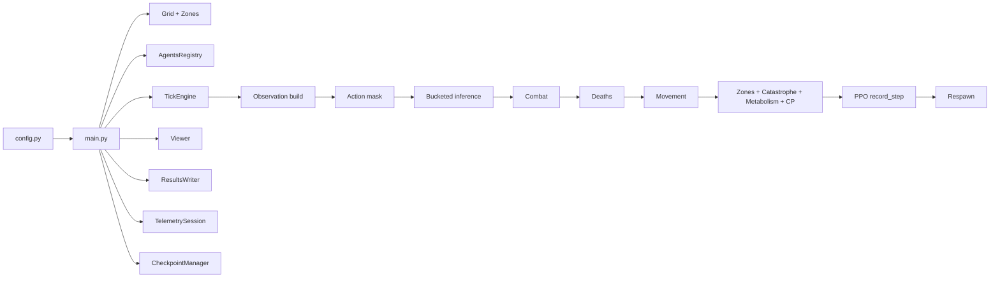

# System Architecture

This document describes the structural decomposition of the inspected repository and the principal interactions between modules.

It focuses on code-backed subsystem boundaries rather than on aspirational architecture.

## Architectural summary

The repository is organized around one central runtime object, `TickEngine`, and one central launch path, `main.py`.

At a high level:

- `main.py` owns lifecycle
- `config.py` owns configuration resolution
- `AgentsRegistry` owns slot-local state and per-slot brain references
- `TickEngine` owns state transition logic
- `PerAgentPPORuntime` owns slot-local training state
- `Viewer` owns interactive inspection and operator controls
- `CheckpointManager`, `ResultsWriter`, and `TelemetrySession` own persistence and observability

## Core subsystem decomposition

### 1. Configuration

**Primary module:** `config.py`

Responsibilities:

- parse environment variables into typed config values
- apply profile overrides
- validate invariant relationships between config knobs
- expose canonical constants such as `OBS_DIM`, `NUM_ACTIONS`, `GRID_WIDTH`, and catastrophe parameters

Boundary:

- configuration is read broadly across the repository
- the module does not own runtime state transitions

### 2. Runtime orchestration

**Primary module:** `main.py`

Responsibilities:

- create or restore world objects
- wire together engine, telemetry, checkpointing, and viewer
- choose UI loop vs headless loop
- enforce graceful shutdown and on-exit persistence

Boundary:

- `main.py` coordinates but does not define combat, movement, respawn, or catastrophe rules

### 3. World state

**Primary modules:** `engine/grid.py`, `engine/mapgen.py`, `engine/agent_registry.py`

Responsibilities:

- grid allocation
- wall placement
- canonical signed zone storage
- slot-local agent tensor state
- per-slot brain ownership and architecture metadata

Critical invariant:

- the grid and the registry represent the same world from different views
- if one is mutated without the other being updated consistently, downstream logic can observe desynchronization

### 4. Tick execution

**Primary module:** `engine/tick.py`

Responsibilities:

- alive-slot filtering
- observation assembly
- legal-action masking
- bucketed inference
- combat
- death application
- movement resolution
- zone effects, catastrophe overlays, metabolism, and control-point handling
- PPO record submission
- respawn execution

This is the central state transition module.

### 5. Policy models and inference helpers

**Primary modules:** `agent/mlp_brain.py`, `agent/ensemble.py`, `agent/obs_spec.py`

Responsibilities:

- define the actor-critic MLP family
- enforce observation schema contracts
- batch inference by architecture bucket
- optionally use `torch.func`/`vmap` for grouped forward paths

Boundary:

- these modules define model structure and forward semantics
- they do not define game rules

### 6. Learning runtime

**Primary module:** `rl/ppo_runtime.py`

Responsibilities:

- hold per-slot rollout buffers
- hold per-slot optimizers and schedulers
- compute returns and advantages
- run PPO updates
- maintain slot-local bootstrap caches
- save and restore PPO state in checkpoints

Boundary:

- the PPO runtime consumes rollouts emitted by the tick engine
- it does not itself choose actions inside the environment loop

### 7. Catastrophe runtime

**Primary module:** `engine/catastrophe.py`

Responsibilities:

- hold active catastrophe state
- hold scheduler state and scheduler RNG
- derive runtime-effective zone values from base values plus override
- expose summary payloads for viewer, telemetry, and checkpoints

Boundary:

- catastrophes do not replace the canonical base-zone layer
- viewer edits still target the base layer

### 8. Operator UI

**Primary module:** `ui/viewer.py`

Responsibilities:

- render the world
- expose inspection tools
- show agent, zone, and scheduler information
- forward verified hotkeys into engine actions
- allow manual checkpoint requests and manual catastrophe controls

Boundary:

- viewer calls into engine methods rather than re-implementing simulation rules

### 9. Persistence and observability

**Primary modules:** `utils/persistence.py`, `utils/checkpointing.py`, `utils/telemetry.py`

Responsibilities:

- write run-level CSV outputs asynchronously
- save atomic checkpoints and restore them
- emit analysis-friendly telemetry sidecars

Boundary:

- these modules observe and serialize runtime state
- they are written defensively so instrumentation failure does not destabilize the main simulation

## Principal data structures

### Grid tensor

The inspected tick engine documents a `grid` tensor shaped `(C, H, W)` with these core channels:

- `grid[0]`: occupancy / terrain marker
- `grid[1]`: health channel
- `grid[2]`: slot-id channel

This grid is used for spatial queries, collision tests, and rendering support.

### Agent registry tensor

`AgentsRegistry.agent_data` is a dense slot-major tensor. Important columns include:

- alive flag
- team id
- `x`, `y`
- HP
- unit type
- HP max
- vision range
- attack power
- persistent agent id display field

The registry also owns:

- `brains`: Python list of per-slot modules or `None`
- `brain_arch_ids`: tensor used to group compatible slots into inference buckets
- `agent_uids`: persistent integer identifiers
- `generations`: lineage metadata

### Zones container

`engine.mapgen.Zones` stores:

- `base_zone_value_map`: canonical signed base-layer values in `[-1, +1]`
- `cp_masks`: separate control-point masks
- runtime edit-lock mask hooks

### Catastrophe state

`CatastropheController` stores:

- global enable state
- active catastrophe state, if any
- dynamic scheduler state and RNG
- runtime-effective zone override layers derived from the base zone map

## Control and data flow

## Module interaction details

### `main.py` and `TickEngine`

`main.py` owns object creation and outer-loop timing. `TickEngine` owns one-step world evolution. The two are intentionally separate so that UI and headless modes can share the same underlying simulation stepper.

### `TickEngine` and `AgentsRegistry`

`TickEngine` reads and mutates registry tensors and asks the registry to construct architecture buckets. Registry metadata therefore directly affects performance-sensitive inference paths.

### `TickEngine` and `PerAgentPPORuntime`

The engine creates the PPO runtime only when `PPO_ENABLED` is true and the runtime class is importable. The engine:

- caches per-slot values from the ordinary decision pass
- sends rollout data into PPO
- flushes dead slots before respawn
- resets PPO state for slots that have been repopulated

### `TickEngine` and `CatastropheController`

`TickEngine` owns the effective environmental consequences of catastrophes by:

- polling scheduler activation at tick start
- refreshing effective zone tensors when catastrophe state changes
- decrementing catastrophe duration at tick end

The controller itself owns the catastrophe lifecycle and payload semantics.

### `Viewer` and `TickEngine`

The viewer is a control surface over a live engine. It does not duplicate catastrophe logic or zone-derivation logic; it calls engine methods such as:

- `set_catastrophe_system_enabled`
- `set_dynamic_catastrophe_enabled`
- `activate_catastrophe`
- `clear_active_catastrophe`

### `CheckpointManager` and runtime objects

Checkpoint save and restore touch nearly every subsystem:

- world grid
- zones
- registry tensor state
- per-slot brains
- catastrophe state
- respawn controller state
- PPO runtime state
- RNG state
- viewer-side auxiliary state

That breadth is why resume semantics are documented separately in [Checkpointing, results, and telemetry](10-checkpointing-results-and-telemetry.md).

## Structural cautions

### The architecture is code-driven, not interface-driven

The repository has strong internal structure, but many boundaries are still Python-object boundaries rather than formal interfaces. That is important when changing code: cross-module assumptions can be strong even when they are not abstracted behind explicit protocols.

### Some historical names remain in place

Examples include `_build_transformer_obs()` and the `Neural Siege` banner string. Those names should not be used as evidence of a separate architecture branch.

### Auxiliary packages exist beside the main path

The `recorder/` package is present, but the main execution path currently uses `_SimpleRecorder` inside `main.py`. That distinction should be preserved in future refactors.

## Related documents

- [Simulation runtime](05-simulation-runtime.md)
- [Agents, observations, and actions](06-agents-observations-actions.md)
- [Checkpointing, results, and telemetry](10-checkpointing-results-and-telemetry.md)
