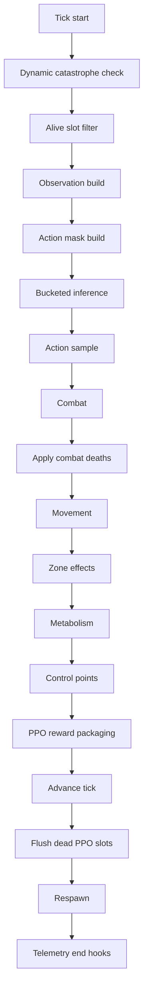

# Simulation Runtime

This document explains the simulation loop from initialization through one complete tick.

It is written to be readable from first principles, then increasingly precise.

## Runtime phases

The inspected runtime has two layers:

1. an outer application loop in `main.py`
2. an inner world-update loop in `TickEngine.run_tick()`

The outer loop decides **when** ticks happen and **what** should be initialized or persisted. The tick engine decides **how** one tick changes the world.

## Initialization flow

A fresh run follows this sequence.

### 1. Config and seed resolution

`main.py`:

- sets PyTorch matmul precision hint
- resolves the seed from config
- seeds Python, NumPy, and PyTorch
- prints a concise runtime summary

### 2. Fresh world creation or checkpoint restore

If `FWS_CHECKPOINT_PATH` is empty:

- create the grid
- create the registry
- create the stats object
- add random walls
- build zones
- spawn the initial population

If `FWS_CHECKPOINT_PATH` is set:

- load checkpoint on CPU
- restore the grid
- reconstruct zones
- create empty runtime containers
- apply checkpoint state to registry, engine, stats, catastrophe state, PPO state, and RNG state

### 3. Tick engine construction

`TickEngine(registry, grid, stats, zones=zones)` is created.

During construction it:

- binds the main world references
- constructs a persistent respawn controller
- creates a catastrophe controller
- caches zone tensors
- allocates reusable scratch buffers
- conditionally creates the PPO runtime

### 4. Output systems

If the runtime is not in no-output inspector mode, `main.py` then creates:

- `ResultsWriter`
- run directory
- `CheckpointManager`
- `TelemetrySession`
- optional `_SimpleRecorder`

### 5. Outer run loop selection

- UI path: `Viewer.run(...)`
- headless path: `_headless_loop(...)`

## Tick semantics

One tick is one discrete update of the world. The code is explicit that this engine uses **combat-first semantics**.

That means an agent killed during combat does **not** move later in the same tick.

## One-tick execution order

The inspected order in `TickEngine.run_tick()` is:

1. set tick-start telemetry context
2. maybe activate a dynamic catastrophe
3. emit catastrophe counters
4. recompute alive slots
5. if nobody is alive, finalize pending PPO boundary, advance time, flush dead PPO slots, respawn, reset PPO state for respawned slots, and return
6. build observations for alive slots
7. build legal-action masks
8. bucket alive slots by architecture
9. run policy inference bucket-wise
10. sample one discrete action per alive slot
11. update the PPO value cache from the normal decision pass
12. reset per-tick reward buffers
13. resolve combat
14. apply combat deaths
15. resolve movement for surviving agents
16. apply runtime-effective zone effects
17. apply metabolism
18. apply control-point logic
19. package PPO rewards and call `record_step()`
20. advance the simulation tick counter
21. flush dead PPO slots
22. run respawn
23. reset PPO state for newly repopulated slots
24. flush periodic telemetry hooks
25. return per-tick metrics

## Runtime flowchart

## Step-by-step walkthrough of one nontrivial tick

The following walkthrough is conceptual, but each stage maps directly to code.

### Step 1: alive filtering

The registry stores capacity-sized tensors. Not every slot is alive. The engine first builds a 1D tensor of alive slot indices. This reduces later compute.

### Step 2: observation build

For those alive slots, the engine gathers positions and builds an observation tensor of shape `(N_alive, OBS_DIM)`.

The current inspected observation combines:

- 32-direction ray features with 8 values per ray
- a 23-column rich feature block
- a 4-column instinct block

Further detail appears in [Agents, observations, and actions](06-agents-observations-actions.md).

### Step 3: legal-action masking

A boolean mask of shape `(N_alive, NUM_ACTIONS)` is built. Invalid actions are masked out before sampling.

### Step 4: bucketed inference

Alive slots are grouped by architecture signature. Each bucket contains slots whose model structures are compatible for grouped forward execution.

For each bucket:

- observations are sliced
- masks are sliced
- `ensemble_forward(...)` is called
- invalid logits are forced to a large negative value
- a categorical sample is drawn

### Step 5: combat

Actions `>= 9` encode directional attacks. Combat is resolved before movement.

The engine:

- decodes direction and range
- computes targets
- applies optional line-of-sight restrictions for archers
- aggregates damage
- credits kill rewards where configured
- records damage and kill telemetry when enabled

### Step 6: combat deaths

Any slot whose HP has dropped to zero or below is removed before the movement phase. This is the point where combat-first semantics becomes visible.

### Step 7: movement

Movement actions are `1..8`.

The engine:

- computes intended destinations
- blocks moves into walls or occupied cells
- resolves same-cell conflicts
- lets a unique highest-HP claimant win
- keeps ties stationary
- rewrites both registry positions and grid channels for winners

### Step 8: environmental phase

After movement, the engine recomputes alive slots and applies:

- positive signed zone effects as healing
- negative signed zone effects as environmental damage
- metabolism as per-unit HP drain
- control-point scoring and contested-CP individual reward shaping where configured

### Step 9: PPO packaging

If PPO is active, the engine computes the reward seen by slots that acted this tick. This includes configured combinations of:

- individual kill reward
- individual damage-dealt shaping
- individual damage-taken penalty
- contested-CP individual reward
- healing-recovery reward
- team kill term
- team death term
- team CP term
- HP-based shaping term

The engine then passes the rollout batch into `PerAgentPPORuntime.record_step(...)`.

### Step 10: end-of-tick lifecycle work

The engine advances the tick counter, flushes dead PPO slots, runs respawn, resets PPO state for newly repopulated slots, and lets telemetry close out the tick.

## Headless loop versus viewer loop

The tick sequence is the same in both modes. The difference is in the outer controller.

### Headless loop

The headless loop in `main.py` adds:

- periodic CSV writing
- periodic death-log flushing
- optional telemetry sidecar updates
- periodic sanity checks
- periodic checkpoints
- periodic status prints
- shutdown checks between ticks

### Viewer loop

The viewer loop adds:

- pause and single-step control
- speed multiplier
- rendering
- interactive inspection
- manual checkpoint hotkey
- manual catastrophe controls

## Important timing semantics

### Combat comes before movement

This is a hard semantic rule in the inspected engine.

### Environment comes after movement

Metabolism and zone effects happen after movement in the same tick.

### Respawn happens after tick advancement

Respawn uses the advanced tick number and occurs after PPO dead-slot flushing.

### Dynamic catastrophe activation is checked at tick start

The scheduler is polled before the rest of the tick logic runs, so an activation can affect the current tick’s zone values.

## Cautions

### `_build_transformer_obs()` is a historical name

The current repository exposes MLP brains, but the observation builder still uses the older method name. The name should not be overinterpreted.

### The runtime is heavily config-shaped

The tick order is stable, but practical behavior depends strongly on config:

- reward weights
- catastrophe parameters
- CP scoring
- metabolism
- respawn settings
- headless/telemetry cadence

### Large parts of the engine assume grid/registry consistency

Any extension that mutates one without the other should be treated as high risk.

## Related documents

- [System architecture](04-system-architecture.md)
- [Agents, observations, and actions](06-agents-observations-actions.md)
- [Learning and optimization](07-learning-and-optimization.md)
