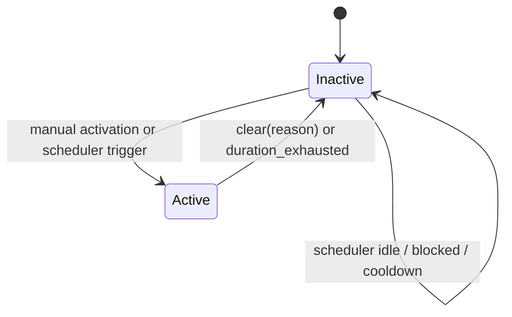

# Catastrophe Mechanics

This document explains the catastrophe and signed-zone system as it exists in the inspected repository.

## Purpose

The catastrophe subsystem is one of the repository-specific mechanics that most strongly differentiates this codebase from a generic grid-combat loop. It therefore requires precise documentation.

## Core idea

The repository separates two layers of zone state:

1. the **canonical base zone layer**
2. the **runtime catastrophe layer**

The canonical layer is persistent and editable. The catastrophe layer is transient and derived at runtime. The effective zone field seen by agents and the environment is resolved from both.

## Canonical base zones

`engine.mapgen.Zones` stores:

- `base_zone_value_map`: signed float grid in `[-1, +1]`
- `cp_masks`: separate control-point masks

The intended semantics are:

- positive values: beneficial / heal-like zone effect
- negative values: harmful / poison-like zone effect
- zero: dormant

The base layer is the authoritative stored world state.

## Runtime catastrophe overlay

`engine.catastrophe.CatastropheController` stores transient catastrophe state. When a catastrophe is active, the effective zone field is computed by taking the base field and replacing selected cells with catastrophe override values under an apply mask.

That means the runtime has three relevant zone views:

- base zone values
- catastrophe override values
- effective resolved values

## Why the separation matters

This design enables three useful properties:

- checkpoints can preserve canonical zone state separately from transient runtime overlay state
- the viewer can continue to edit base zones rather than editing a temporary overlay
- catastrophe activation can be reversible and duration-limited without mutating the persistent base field

## Effective zone resolution

If no catastrophe is active, the effective field equals the base field.

If a catastrophe is active, the controller returns:

- `base`
- `effective`
- `override`
- `apply_mask`
- `edit_lock_mask`

The effective field is then consumed by the tick engine during the environment phase.

## Lifecycle model

The catastrophe controller owns:

- global enable state
- optional active catastrophe state
- dynamic scheduler state
- dynamic scheduler RNG

The active state includes:

- catastrophe type name
- start tick
- duration
- remaining ticks
- apply mask
- override value map
- edit-lock mask
- metadata

## Lifecycle diagram

## Master switch versus scheduler switch

The inspected code distinguishes two controls.

### Master catastrophe system switch

This is the top-level enable flag.

If the master switch is off:

- manual catastrophe activation is blocked
- the dynamic scheduler is effectively blocked
- the viewer reports the system as off
- disabling from the viewer can clear an active catastrophe

### Dynamic scheduler switch

This controls only the auto-scheduler preference. It does **not** replace the master switch.

This distinction is visible both in `engine/catastrophe.py` and in `ui/viewer.py`.

## Scheduler model

The dynamic scheduler is documented in code as a deterministic hazard-law scheduler. It maintains:

- pressure
- cooldown remaining
- ticks since last end
- last roll
- last threshold
- last trigger tick
- last end tick
- last selected preset key
- last trigger mode
- state label
- hard-trigger flag

Pressure accumulates while idle, subject to config gains based on the base zone map. Hazard probability is then derived from pressure and capped by config.

The scheduler also supports:

- cooldown
- minimum interval
- maximum interval
- hard trigger when the max interval is reached

## Manual catastrophe presets present in code

The inspected catastrophe pack includes the following operator-facing manual preset keys:

| Preset key | Meaning |
|---|---|
| `global_attenuation` | attenuate all active nonzero base-zone cells |
| `positive_band_dormancy` | dormancy band over positive base zones |
| `polarity_split_left_negative` | polarity split over the left region |
| `polarity_split_right_negative` | polarity split over the right region |
| `regional_attenuation_left` | attenuation over the left half |
| `regional_attenuation_right` | attenuation over the right half |
| `inversion` | sign inversion over active nonzero base-zone cells |
| `full_dormancy` | dormancy over all active nonzero base-zone cells |

The viewer exposes the first six directly and gates the last two behind `Shift+I` and `Shift+O` as experimental actions.

## Activation and deactivation behavior

### Activation

Activation requires:

- catastrophe system enabled
- shape compatibility between catastrophe spec and world shape
- either no active catastrophe or permission to replace the current one

If replacement is allowed and a catastrophe is already active, the current one is cleared first with reason `"replaced"`.

### Deactivation

A catastrophe can end by:

- manual clear
- disabling the catastrophe system with clearing enabled
- duration exhaustion
- replacement by another catastrophe

## How catastrophe logic affects the world

The tick engine applies catastrophe effects indirectly through the effective zone field.

### Positive effective values

The environment phase interprets positive effective values as healing scaled by:

- local effective magnitude
- `HEAL_RATE`

### Negative effective values

The environment phase interprets negative effective values as environmental damage scaled by:

- absolute local effective magnitude
- `CATASTROPHE_NEGATIVE_ZONE_DAMAGE_RATE`

If environmental damage reduces HP to zero or below, death is applied with `death_cause="environmental"` and without enemy kill credit.

## Edit locking

An active catastrophe can install an edit-lock mask over base-zone cells. This affects viewer-side manual base-zone editing.

The point of this lock is not to change the canonical base layer. It is to prevent the operator from editing cells that are intentionally under catastrophe control at that moment.

## Resume and checkpoint interaction

The checkpoint manager serializes catastrophe state separately from the base zone payload. On load:

- base zones are reconstructed from checkpoint world payload
- catastrophe controller state is restored
- scheduler state, including RNG state, is restored
- active catastrophe metadata is marked as restored from checkpoint

This means catastrophe state is not a purely ephemeral viewer phenomenon. It participates in resume semantics.

## Operator-facing implications

### Viewer information is layered

The viewer can show, for a selected cell:

- base value
- runtime-effective value
- whether catastrophe applies here
- whether editing is locked
- scheduler state summary

That is the correct way to read zone state during an active catastrophe.

### Manual triggers are not silent edits to the base layer

Manual triggers activate runtime catastrophe specs. They do not directly rewrite the canonical base layer.

### System-off and scheduler-off are different states

A user reading the HUD should distinguish:

- system off
- system on, scheduler off
- system on, scheduler on

## Warning about unsupported claims

The inspected code supports:

- transient runtime catastrophe overlays
- duration-limited active catastrophes
- deterministic scheduler state
- checkpointed scheduler state
- viewer control integration

It does **not** justify claims such as:

- experimentally validated extinction modeling
- scientifically calibrated catastrophe rates
- verified ecological realism
- guaranteed non-overlap semantics outside the code’s actual config path

## Related documents

- [Simulation runtime](05-simulation-runtime.md)
- [Viewer and operator guide](09-viewer-and-operator-guide.md)
- [Mathematical foundations](12-mathematical-foundations.md)
