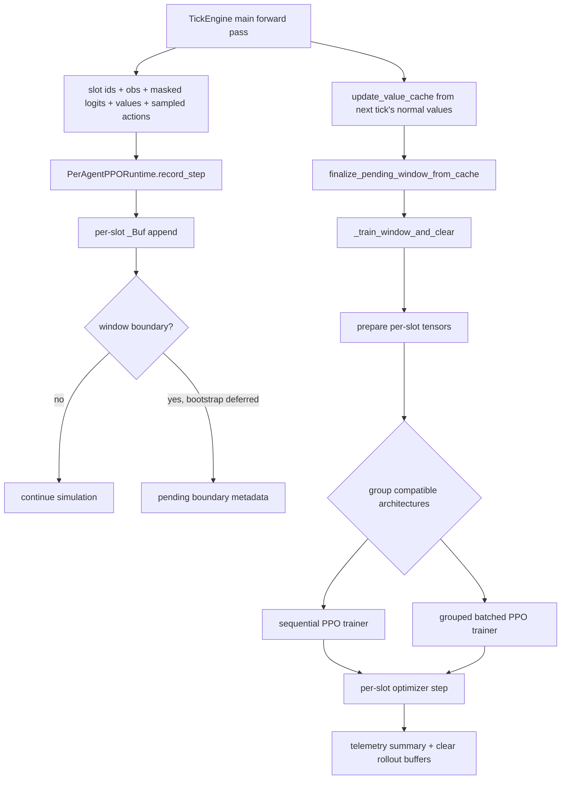

# Neural-Abyss

## RL and PPO Runtime

### Abstract

This monograph examines the reinforcement learning runtime of `Neural-Abyss` as evidenced by the provided source dump. The implementation is not a generic training scaffold bolted onto a simulator. It is a slot-indexed, online, runtime-coupled actor-critic training system that records one decision transition per active slot per tick, accumulates per-slot rollout fragments, computes generalized advantage estimates, and applies PPO-style optimization with clipped policy and value objectives, entropy regularization, gradient clipping, optional KL-based early stopping, and checkpoint-resumable optimizer state.

The central architectural fact is that learning ownership is per slot, not global. Each live registry slot holds its own `nn.Module`, its own optimizer, its own scheduler, its own rollout buffer, and its own slot-local bootstrap cache. The engine nonetheless opportunistically batches inference and, under compatibility constraints, batches training math across architecture-homogeneous groups. That grouped execution does not imply parameter sharing: gradients are scattered back to the original models and optimizer steps remain per slot.

The RL subsystem therefore occupies a middle ground between textbook single-policy PPO and a fully centralized multi-agent learner. It is online, interleaved with simulation ticks, on-policy at the slot level, heavily shaped by local and team reward channels, and engineered around practical operational constraints such as respawn-driven slot reuse, masked action legality, checkpoint portability, telemetry durability, and hot-path performance on GPU.

---

## Reader orientation

This monograph covers the RL/runtime and PPO-learning subsystem only. It focuses on the parts of `Neural-Abyss` that are required to understand how learning actually happens:

- per-slot rollout ownership
- decision-time recording
- reward formation and terminal handling
- GAE and return preparation
- PPO loss construction
- minibatching and epoch loops
- grouped batched training versus sequential fallback
- optimizer and scheduler ownership
- runtime integration with the tick engine
- checkpoint and telemetry interfaces

This monograph does **not** attempt full-system documentation of world mechanics, full observation semantics, viewer workflows, or persistence infrastructure beyond the interfaces needed to situate learning.

### Evidence discipline

To prevent drift, the narrative distinguishes three categories:

**Implementation fact.** Behavior directly evidenced by the repository code.

**Theory.** Standard reinforcement-learning mathematics used only to clarify the code.

**Reasoned inference.** A constrained interpretation of likely design intent when the code suggests, but does not prove, motivation.

### Repository naming note

The source dump is treated here as the implementation basis for `Neural-Abyss`. Within that dump, relevant modules appear under paths such as `Infinite_War_Simulation/rl/ppo_runtime.py`, `engine/tick.py`, and `agent/mlp_brain.py`. The present document follows the requested repository identity and refers to the repository consistently as `Neural-Abyss`.

---

## Executive subsystem view

At the highest level, the RL subsystem receives the following inputs every simulation tick:

- slot ids for currently acting agents
- flattened observations
- masked policy logits from the current actor
- current value predictions
- sampled discrete actions
- end-of-tick scalar rewards
- end-of-tick done flags
- per-action legality masks

It emits the following outputs over longer horizons:

- updated actor-critic parameters for the affected slots
- updated Adam optimizer states and cosine learning-rate schedules
- checkpoint-resumable PPO runtime state
- PPO diagnostics for telemetry and headless summaries

The subsystem is optional at runtime. The tick engine instantiates `PerAgentPPORuntime` only when `config.PPO_ENABLED` is true and the runtime class is importable. When enabled, the engine couples ordinary decision-time inference and end-of-tick reward accounting to PPO recording. Training is then triggered in two ways:

1. **Window flush:** when the global PPO step counter reaches a multiple of the rollout window length.
2. **Immediate flush:** when dead slots are trained and cleared before respawn can reuse their slot indices.

The consequence is that `Neural-Abyss` does not treat “episode” as the only update unit. The true update units are:

- fixed-length global PPO windows for continuing slots, and
- shorter terminal fragments for slots that die before the next window boundary.

That choice is foundational to the entire runtime.

---

## Conceptual framing

### The learning problem solved by the code

The code implements a discrete-action actor-critic learner embedded directly inside a multi-agent grid simulation. Each active slot repeatedly observes a flat state vector, samples one legal action, receives a scalar reward after the environment evolves, and records a terminal flag if the slot occupant died by the end of that tick. The actor supplies action logits. The critic supplies a scalar baseline estimate for the same state. The PPO runtime then treats each slot’s interaction history as an on-policy rollout segment.

### Why PPO fits this runtime

**Theory.** PPO is attractive in online simulation settings because it reuses recent on-policy data for several epochs while constraining policy drift through probability-ratio clipping. It avoids the brittleness of unconstrained policy gradients without requiring a full trust-region solve.

**Implementation fact.** The runtime implements the standard clipped surrogate policy loss, a clipped value loss, entropy regularization, gradient-norm clipping, minibatch updates, and optional KL-based early stopping. It also computes generalized advantage estimates with a bootstrap value at rollout boundaries.

### What kind of learner this is

The implementation is neither a single shared-policy PPO system nor an off-policy replay learner.

It is better described as:

- **online** rather than offline
- **on-policy at slot level**
- **fully decentralized in parameter ownership**
- **centrally orchestrated in runtime control**
- **interleaved with the simulation loop**
- **reward-shaped through both individual and team signals**
- **respawn-aware because slot identity is reusable**

That profile has deep consequences for stability, compute cost, diversity, and reproducibility.

---

## Learning-subsystem architecture

### Core modules

| Module | Role in the learning subsystem |
|---|---|
| `rl/ppo_runtime.py` | Defines `PerAgentPPORuntime`, per-slot buffers, GAE, PPO objectives, sequential and grouped batched training, checkpoint extraction/loading, and telemetry summaries |
| `engine/tick.py` | Calls decision-time inference, updates value cache, assembles PPO rewards, records transitions, flushes dead slots, and resets PPO state on respawn |
| `agent/mlp_brain.py` | Defines actor-critic brain variants used in PPO mode, including shared trunk plus actor and critic heads |
| `agent/ensemble.py` | Batches inference across independent models of the same architecture using either a safe loop or `torch.func`/`vmap` |
| `engine/agent_registry.py` | Stores per-slot brains and architecture metadata, groups alive slots into architecture-homogeneous buckets |
| `config.py` | Defines PPO hyperparameters, reward coefficients, telemetry flags, and related runtime toggles |
| `utils/checkpointing.py` | Saves and restores PPO runtime state as part of full-engine checkpoints |
| telemetry session code | Pulls PPO reward components and rich/update-level training summaries into CSV or headless summaries |

### Internal component structure

The PPO runtime itself contains five important layers of responsibility.

#### 1. Persistent slot-local state

For each slot id, the runtime maintains:

- `_buf[aid]`: a rollout buffer of type `_Buf`
- `_opt[aid]`: a slot-local Adam optimizer
- `_sched[aid]`: a slot-local `CosineAnnealingLR`
- slot-local cached value `self._value_cache[aid]`
- slot-local cache validity bit `self._value_cache_valid[aid]`

No global shared optimizer exists. No shared replay memory exists. No central policy object exists inside `PerAgentPPORuntime`.

#### 2. Transition recording

`record_step(...)` receives a batch aligned by currently acting slot ids and appends each row into that slot’s own `_Buf`.

#### 3. Boundary bootstrap handling

The runtime can train immediately if explicit `bootstrap_values` are provided. The examined engine path does **not** provide them. Instead, it stages boundary metadata and waits for the next tick’s ordinary forward pass to populate `V(s_{t+1})` in a persistent cache.

#### 4. Training execution

When training starts, the runtime materializes per-slot tensors, computes `adv` and `ret`, groups compatible slots by architecture, and chooses either:

- a safe sequential slot-by-slot PPO path, or
- a grouped batched path that uses `torch.func.functional_call` and `vmap`.

#### 5. Operational interfaces

The runtime can:

- flush terminal slots early
- reset reused slots after respawn
- emit diagnostic summaries
- save and load checkpoint state
- expose rich telemetry rows for CSV writing

### Architecture diagram



**Figure 1.** Runtime dataflow from ordinary inference to deferred bootstrap completion and PPO update. The key engineering move is that bootstrap values are obtained from the next tick’s normal critic pass instead of a duplicate post-step inference pass.

---

## Rollout semantics and data collection

### What exactly is stored

The `_Buf` dataclass stores the following per time step for one slot:

| Field | Meaning | Shape / dtype semantics |
|---|---|---|
| `obs` | observation at decision time | one tensor of shape `(obs_dim,)` per step |
| `act` | sampled action | scalar long tensor per step |
| `logp` | behavior-policy log-probability of chosen action | scalar float32 per step |
| `val` | critic estimate for decision-time state | scalar float32 tensor stored as shape `(1,)` |
| `rew` | scalar reward assigned to that transition | scalar float32 per step |
| `done` | terminal flag for that transition | bool per step |
| `act_mask` | legality mask used during action selection | bool vector of shape `(act_dim,)` per step |
| `bootstrap` | critic value for the state after the final recorded step in a window | optional float32 scalar tensor |

This is enough to reconstruct an on-policy PPO update without replay.

### Decision-time semantics

The tick engine performs the following sequence for live slots:

1. build observations for currently alive slots
2. build legal-action masks
3. bucket alive slots by brain architecture
4. run `ensemble_forward(bucket.models, bucket_obs)`
5. mask illegal logits with a large negative finite value
6. sample discrete actions from `Categorical(logits=logits32)`
7. stash slot ids, observations, masked logits, values, actions, action masks, and teams for PPO

The recorded logits are already legality-masked before action sampling. That matters because PPO later recomputes log-probabilities under the same action support.

### End-of-tick transition semantics

Only after combat, death application, movement, healing, metabolism, and objective scoring does the engine assemble scalar PPO rewards and terminal flags. It then calls:

```text
record_step(
    agent_ids=ppo_slot_ids,
    obs=torch.cat(rec_obs),
    logits=torch.cat(rec_logits),
    values=torch.cat(rec_values),
    actions=torch.cat(rec_actions),
    rewards=final_rewards,
    done=(data[ppo_slot_ids, COL_ALIVE] <= 0.5),
    action_masks=torch.cat(rec_action_masks),
    bootstrap_values=None,
)
```

This defines the transition semantics precisely:

- `obs_t`, `logits_t`, `val_t`, and `act_t` come from the decision point near tick start.
- `rew_t` is computed from the consequences of that tick.
- `done_t` means the slot occupant is dead by the end of that tick, before respawn.
- `V(s_{t+1})` is not passed immediately; it is usually supplied later from the value cache.

### Hot-path performance engineering

The recording path is optimized to reduce GPU synchronization overhead:

- batched `detach()` and `to(torch.float32)` happen before the Python loop
- `agent_ids.tolist()` performs one host transfer instead of one `.item()` per agent
- per-slot appends then reuse those already-cast tensors

This does not change semantics, but it reveals a design priority: the learner is expected to run continuously enough for hot-path overhead to matter.

### Rollout segmentation rules

The system has two segmentation rules.

#### Fixed windows

A global counter `self._step` increments once per `record_step` call. When `self._step % self.T == 0`, the current PPO window closes.

This is global wall-clock training cadence, not per-slot episode length.

#### Terminal flushes

If a slot dies before the next boundary, the engine calls `flush_agents(dead_slots)` before respawn. That trains the dead slot’s partial trajectory immediately and clears its buffer so the new occupant of that slot cannot inherit stale trajectory data.

### Pseudocode for the real data path

```text
for each simulation tick:
    gather alive slots
    compute obs and legal action masks
    for each architecture bucket:
        forward actor-critic for bucket
        legality-mask logits
        sample actions
        cache slot ids, obs, masked logits, values, actions, masks
    update slot-local value cache from current critic outputs
    finalize any pending previous-window bootstrap from cache
    run environment consequences
    assemble final scalar rewards per acting slot
    done_t = slot dead by end of tick
    record_step(..., bootstrap_values=None)
    advance tick counter
    flush dead slots immediately
    respawn dead slots
    reset PPO state for newly respawned slots
```

The critical detail is that the runtime is not collecting complete episodes in a dedicated runner. It is embedded inside the live engine.

---

## Reward, return, and advantage handling

### Reward plumbing in the engine

The PPO reward assembled for each acting slot is the sum of three families of terms.

#### 1. Individual shaping terms

The engine accumulates per-slot tensors for:

- kill rewards
- damage dealt rewards
- damage taken penalties
- contested capture-point rewards
- healing-recovered rewards

The final individual component is:

\[
r^{\text{ind}}_t
=
r^{\text{kill}}_t
+
r^{\text{dmg-dealt}}_t
+
r^{\text{dmg-taken}}_t
+
r^{\text{cp}}_t
+
r^{\text{heal}}_t
\]

with the damage-taken term already stored as a negative contribution.

Several features are worth noting.

- Kill credit is assigned to exactly one killer per victim in a deterministic way: highest same-tick damage contributor, ties broken by smallest attacker slot id.
- Damage shaping is dense and per slot.
- Healing reward exists in code via `getattr(config, "PPO_REWARD_HEALING_RECOVERY", 0.0)`, but no explicit config declaration for that coefficient was identified in the examined config section. That suggests an optional or patch-only knob rather than a prominently surfaced default.

#### 2. Team-level shared terms

For each acting slot, the engine adds:

- a team kill term based on enemy deaths in that tick times `TEAM_KILL_REWARD`
- a team death term based on own-team deaths in that tick times `PPO_REWARD_DEATH`
- a team capture-point term based on tick capture rewards

These are broadcast to all acting members of the corresponding team during that tick. Therefore, a decentralized per-slot PPO learner still receives a shared team-performance signal.

#### 3. HP-based dense shaping

A slot also receives a health-based dense reward:

- in `"raw"` mode: proportional to current HP
- in `"threshold_ramp"` mode: zero below a threshold, then smoothly ramps to the raw reward above that threshold

This is an explicit anti-camping and survival-shaping mechanism, depending on scale.

### Final reward formula implemented by the engine

The code-level reward can be written as

\[
r_t
=
r^{\text{ind}}_t
+
r^{\text{team}}_t
+
r^{\text{hp}}_t
\]

where `r_team` is the sum of team kill, team death, and team capture-point contributions.

### Done semantics

The recorded terminal signal is

\[
\text{done}_t = \mathbf{1}\{\text{slot occupant dead after tick consequences}\}
\]

Respawn happens only **after** terminal flushes. That is correct for PPO bookkeeping, because the new occupant must not become the continuation state of the old occupant’s transition stream.

### Bootstrap handling

The runtime’s bootstrap behavior is more engineered than textbook pseudocode.

#### Immediate path

`record_step` supports explicit `bootstrap_values`. If passed on a boundary step, the runtime can train immediately.

#### Deferred cached path

The examined engine uses `bootstrap_values=None`. On a boundary step, the runtime stores:

- pending slot ids
- pending done flags

Then, on the next tick, the engine’s ordinary main forward pass updates a persistent slot-local value cache with current `V(s_t)`. `finalize_pending_window_from_cache()` then copies cached values into each pending buffer’s `bootstrap` field, but only for survivors. Done slots get zero bootstrap.

This is a performance optimization that removes an otherwise redundant post-step observation-and-forward pass.

### GAE implementation

`_gae(rewards, values, dones, last_value)` computes generalized advantage estimates in float32:

\[
\delta_t = r_t + \gamma V(s_{t+1})(1-d_t) - V(s_t)
\]

\[
A_t = \delta_t + \gamma \lambda (1-d_t) A_{t+1}
\]

\[
R_t = A_t + V(s_t)
\]

Three implementation details matter.

1. `last_value` is optional; absent bootstrap defaults to zero.
2. `done_t` masks both the TD bootstrap and recursive GAE carry.
3. `ret` is formed **before** advantage normalization.

After computing `ret = adv + values32`, the code normalizes `adv` to approximately zero mean and unit variance when the trajectory has more than one element:

\[
\hat A_t = \frac{A_t - \mu_A}{\sigma_A + 10^{-8}}
\]

This is a standard stabilization step, but it is important to state precisely: **returns are unnormalized; advantages are normalized.**

### Practical deviation from “episode PPO”

The implementation is not waiting for whole episodes. It computes GAE on:

- fixed windows with a cached bootstrap, or
- shorter terminal fragments flushed early on death.

That is still a legitimate on-policy PPO pattern, but it is segment-based, not episode-complete.

---

## PPO optimization objective

### Exact implemented objective

For one minibatch, the runtime computes:

\[
\log \pi_\theta(a_t \mid s_t)
\]

from the current masked logits, then forms the ratio

\[
r_t(\theta) = \exp(\log \pi_\theta(a_t \mid s_t) - \log \pi_{\text{old}}(a_t \mid s_t))
\]

The policy surrogate is

\[
L_{\pi}
=
-\frac{1}{|B|}
\sum_{t \in B}
\min\left(r_t(\theta)\hat A_t,\;
\mathrm{clip}(r_t(\theta), 1-\epsilon, 1+\epsilon)\hat A_t\right)
\]

The value prediction is clipped relative to the stored old value estimate:

\[
V_{\text{clip}}(s_t)
=
V_{\text{old}}(s_t)
+
\mathrm{clip}(V_\theta(s_t)-V_{\text{old}}(s_t), -\epsilon, +\epsilon)
\]

and the value loss is

\[
L_V
=
\frac{1}{|B|}
\sum_{t \in B}
\max\left(
(V_\theta(s_t)-R_t)^2,\;
(V_{\text{clip}}(s_t)-R_t)^2
\right)
\]

Entropy is computed from the masked categorical policy:

\[
H_t = -\sum_a \pi_\theta(a \mid s_t)\log \pi_\theta(a \mid s_t)
\]

The code defines

\[
L_{\text{ent}} = -\frac{1}{|B|}\sum_{t \in B} H_t
\]

and total loss

\[
L
=
L_{\pi}
+
c_v L_V
+
c_e L_{\text{ent}}
\]

Because \(L_{\text{ent}}\) is the negative mean entropy, adding \(c_e L_{\text{ent}}\) is equivalent to subtracting a positive entropy bonus from the loss.

### Objective-term table

| Term | Implemented form | Notes |
|---|---|---|
| Policy loss | `-mean(min(ratio * adv, clamp(ratio) * adv))` | standard clipped PPO surrogate |
| Value loss | `mean(max((V-ret)^2, (V_clipped-ret)^2))` | uses same clip epsilon as policy |
| Entropy term | `-mean(entropy)` | added with positive coefficient, so it rewards entropy |
| Total loss | `loss_pi + vf_coef * loss_v + ent_coef * loss_ent` | no extra KL penalty term in the objective |

### What is present

The implementation includes:

- clipped surrogate policy objective
- clipped value objective
- entropy bonus
- minibatch SGD-style updates
- multiple epochs over the same rollout
- gradient clipping
- optional approximate-KL early stopping
- normalized advantages
- masked discrete-action policy handling

### What is absent in the examined code

No evidence was found of:

- replay buffers
- target networks
- off-policy corrections
- distributed gradient aggregation
- separate actor and critic optimizers
- explicit KL penalty in the objective
- separate value-clip coefficient
- generalized centralized critic over multiple agents
- recurrent state or sequence-model rollout handling inside PPO
- multi-GPU training orchestration

---

## Actor-critic output semantics

### Brain contract

Every PPO-compatible brain in the examined path obeys the forward contract

```text
(obs_batch) -> (logits_or_dist, value)
```

with output semantics:

- actor logits of shape `(B, act_dim)`
- critic value of shape `(B, 1)` which is squeezed to `(B,)` by PPO helpers

### Current PPO-mode brain family

Although some engine helper names retain older terminology such as `_build_transformer_obs`, the executable PPO-mode brain creation path uses `create_mlp_brain(...)`. The current PPO path therefore instantiates MLP-based actor-critic models, not a separate shared transformer policy.

Each brain variant:

- validates observation width against `OBS_DIM`
- builds a two-token representation from ray features and rich features
- feeds the resulting vector through a trunk
- emits actor logits and a scalar critic value through separate linear heads

The trunk is shared between actor and critic, so this is a shared-backbone actor-critic rather than two fully separate networks.

### Output-coupling invariant

A central correctness invariant is that `act_t`, `logp_old_t`, `val_t`, and `act_mask_t` must all correspond to the **same** decision state and the **same** legality-constrained policy support. The code enforces this in two ways:

1. rollout `logp_old` is computed from the same masked logits used to sample the action
2. training re-applies the stored `act_mask` before recomputing current logits, log-probs, and entropy

That prevents one of the easiest ways to corrupt PPO in environments with dynamic action legality: recomputing policy probabilities under a different action support than the one used during behavior sampling.

---

## Update cadence and runtime integration

### Effective update cadence

The actual update trigger used by the runtime is:

\[
\text{train when } \_step \bmod T = 0
\]

where `T = PPO_WINDOW_TICKS` as read by `PerAgentPPORuntime`.

In the provided config, that default is `256`.

### Important implementation detail: `PPO_UPDATE_TICKS`

The config defines `PPO_UPDATE_TICKS`, but no evidence was found that `PerAgentPPORuntime` uses that value to schedule optimization. In the examined runtime, the operative cadence is controlled by `PPO_WINDOW_TICKS`, not `PPO_UPDATE_TICKS`. The latter appears in config export/reporting paths, but not in the PPO training logic itself.

This is exactly the kind of detail that can mislead operators if they assume every config knob is active.

### Synchrony with the environment loop

The runtime is tightly synchronous with the simulation:

- decision-time values and logits come from the same tick’s normal forward pass
- reward is computed later in that tick
- training may occur immediately after boundary completion or dead-slot flush
- respawn happens only after dead-slot flush
- pending bootstrap for continuing slots is resolved from the next tick’s normal forward pass

This is not an asynchronous learner queue. It is a synchronous learner embedded in the same control loop.

### Operational implications

This cadence implies:

- short-latency online adaptation
- on-policy freshness limited by window size
- more frequent optimizer stepping when many agents die and flush early
- training cost coupled directly to simulation load and mortality structure

A high-mortality regime can therefore produce many short fragment updates even if the configured window is long.

---

## Parameter organization and ownership

### Slot-local ownership

The repository’s strongest RL design choice is full per-slot independence.

Each slot has its own:

- brain module in `registry.brains[aid]`
- rollout buffer
- Adam optimizer
- cosine LR scheduler
- cached bootstrap value state

The runtime even includes a defensive `_assert_no_optimizer_sharing(...)` check to ensure two slots never reference the same optimizer object.

### No parameter sharing, but grouped execution

This design should not be confused with lack of batching. `Neural-Abyss` does batch compatible slots for efficiency:

- inference is bucketed by architecture in `ensemble_forward`
- training can batch grouped slots using `torch.func` and `vmap`

However, grouped execution only batches math. Parameter ownership remains disjoint.

### Respawn and inheritance implications

The broader repository includes brain cloning and perturbation logic. In PPO mode, child brains are instantiated as fresh modules and only load the parent state dict when the inferred architecture matches. After respawn, PPO state is reset for reused slots:

- scheduler removed
- optimizer removed
- rollout buffer removed
- value cache invalidated

This is essential because slot id is not a permanent individual identity. The code explicitly distinguishes slot indices from persistent UIDs.

### Trade-off

This organization maximizes behavioral specialization and minimizes unintended coupling, but it is expensive:

- memory scales with number of live slots
- optimizer state scales with number of live slots
- training work scales per slot even when architectures match
- data efficiency across agents is lower than in a shared-policy learner

---

## Tensor flow, batching, and device behavior

### Core tensor geometry

At training preparation time, one slot’s buffer becomes:

- `obs`: `(T_i, obs_dim)`
- `act`: `(T_i,)`
- `logp_old`: `(T_i,)`
- `val_old`: `(T_i,)`
- `rew`: `(T_i,)`
- `done`: `(T_i,)`
- `act_mask`: `(T_i, act_dim)`
- `adv`: `(T_i,)`
- `ret`: `(T_i,)`

where \(T_i\) is that slot’s currently buffered trajectory length.

### Device policy

The runtime expects record-time tensors on `self.device` and raises on mismatch. During checkpoint save, tensors are recursively moved to CPU for portability. During load, tensors and optimizer state are moved back to the target device.

### Float32 policy for numerically sensitive paths

Even if model forward/backward may run with other dtypes, several RL-sensitive tensors are forced to float32:

- stored log-probabilities
- stored values
- rewards in GAE
- GAE outputs
- log-softmax and entropy calculations

This is a practical stability choice.

### Minibatch formation

For a slot with batch size \(B\):

- `n_mb = max(1, min(minibatches_cfg, B))`
- `mb_size = max(1, B // n_mb)`

Then the loop iterates `for start_i in range(0, B, mb_size)`.

This has a subtle consequence: the actual number of minibatches is `ceil(B / mb_size)`, which can exceed `n_mb` when integer division makes `mb_size` too small. Therefore, the configured minibatch count is not a hard guarantee of exact minibatch cardinality. It is closer to a target used to derive chunk size.

That is a real implementation detail with practical implications for update count and telemetry interpretation.

### Grouped batched training lane semantics

For homogeneous compatible groups, the runtime constructs padded tensors:

- `obs_batch`: `(G, M, obs_dim)`
- `act_batch`: `(G, M)`
- `mask_batch`: `(G, M, act_dim)`
- `logp_old_batch`, `val_old_batch`, `adv_batch`, `ret_batch`: `(G, M)`
- `valid_batch`: `(G, M)` marking true data versus padding

Here:

- `G` = number of participating slots in the lane
- `M` = longest minibatch length among participants for that chunk

Losses are computed per lane row and normalized by each row’s valid count.

### Grouped execution constraints

The grouped batched trainer is used only when all of the following hold:

- group size > 1
- `torch.func` features are available
- all models have the same Python type
- no model is TorchScript
- no model contains `nn.MultiheadAttention`

Attention-bearing models are explicitly routed to the safe sequential path because of documented backward-path alignment issues on CUDA.

### Gradient scattering

The grouped trainer does not step a synthetic stacked optimizer. Instead:

1. `functional_call` with stacked parameters computes batched losses
2. backprop populates gradients on stacked parameter tensors
3. `_assign_stacked_grads_to_models(...)` copies row gradients back to each original model parameter
4. each slot’s own optimizer clips gradients and performs `opt.step()`

That preserves optimizer independence while still exploiting batched forward/backward math.

### Interface table

| Tensor / structure | Producer | Consumer | Invariant |
|---|---|---|---|
| `obs` | tick engine main forward path | PPO recorder, policy/value training path | aligned with `agent_ids` |
| `logits` | actor head through `ensemble_forward` | action sampling, `record_step` | legality-masked before behavior log-prob |
| `values` | critic head | value cache, `record_step`, GAE bootstrap | decision-time estimate for same state as action |
| `action_masks` | move/action legality code | action sampling, `record_step`, PPO training | same support at rollout and training |
| `done` | end-of-tick alive check | GAE and flush logic | true before respawn |
| `bootstrap` | cached next-tick critic values or explicit boundary values | GAE final step | zero for terminal slots |

**Table 1.** Core tensor interfaces that must remain aligned for PPO correctness.

---

## Mathematical and theoretical foundations

### Policy gradient framing

**Theory.** In an actor-critic method, the actor is optimized to increase the log-probability of actions that yielded better-than-baseline outcomes. The critic supplies the baseline \(V(s)\), reducing variance.

The generic policy-gradient direction is

\[
\nabla_\theta J(\theta)
\propto
\mathbb{E}\left[\nabla_\theta \log \pi_\theta(a_t \mid s_t) A_t\right]
\]

In PPO, the ratio trick replaces direct reuse of that expression with a clipped surrogate on recent on-policy data.

### Why advantages matter here

The code stores old critic values and computes GAE, so it is not using raw returns as direct actor weights. That matters because the runtime’s rewards are heavily shaped and can be noisy due to combat, team events, and respawn dynamics. GAE is a natural variance-reduction mechanism in that setting.

### Masked categorical semantics

A masked action policy is not merely a cosmetic UI convenience. It changes the effective policy support.

If \(M_t(a)\in\{0,1\}\) indicates legality, then the implementation effectively constructs logits

\[
\tilde z_t(a) =
\begin{cases}
z_t(a), & M_t(a)=1 \\
\text{very negative finite constant}, & M_t(a)=0
\end{cases}
\]

and computes softmax and log-softmax on \(\tilde z_t\). This makes illegal actions have approximately zero probability without introducing literal \(-\infty\) values into the tensor.

### Clipped value loss rationale

Using a clipped value objective with the same epsilon as policy clipping is a conservative critic-update choice. It keeps the critic from jumping too far from the behavior-time baseline value in a single PPO update. The implementation uses:

\[
\max\left((V-R)^2,\; (V_{\text{clip}}-R)^2\right)
\]

which is the pessimistic clipped form common in PPO implementations.

### Entropy regularization

The code computes entropy directly from the current masked categorical distribution and subtracts it from the loss through the sign convention already described. This encourages action randomness when the entropy coefficient is positive.

### Why theory must not be over-imported here

Although PPO is often described with many optional features, the examined runtime should be understood strictly through its own implemented choices:

- GAE: present
- advantage normalization: present
- KL early stopping: present
- explicit KL penalty term: absent
- replay: absent
- shared policy: absent

That boundary is important because many “standard PPO” descriptions quietly assume features that this runtime does not use.

---

## Interfaces to other subsystems

### Interface to the intelligence stack

The PPO runtime does not own observation construction or action decoding. It depends on the engine and brain modules for that.

Relevant interfaces are:

- flat observation vectors of width `OBS_DIM`
- actor-critic forward contract `(obs) -> (logits, value)`
- architecture grouping via registry buckets

In the examined code, PPO-mode brain creation returns MLP actor-critic variants through `create_mlp_brain(...)`.

### Interface to simulation events and rewards

The engine converts simulation events into reward channels before calling `record_step`. Those include:

- combat kills
- combat damage dealt and taken
- contested capture-point reward
- healing recovery
- HP-based dense shaping
- team kill/death/capture rewards

The PPO runtime itself does not compute these rewards. It only consumes the scalar result.

### Interface to checkpointing

`get_checkpoint_state()` returns a portable CPU-friendly payload containing:

- global PPO step
- training update sequence counters
- rich telemetry row sequence counter
- per-slot rollout buffers
- per-slot optimizer states
- per-slot scheduler states
- value cache and validity mask
- pending boundary slot ids and done flags

Notably, it does **not** save `_Buf.bootstrap` because that value is treated as ephemeral boundary state. Instead, the persistent cache and pending metadata are saved, which is enough to resume boundary completion correctly.

`load_checkpoint_state()` recreates optimizers and schedulers against the current registry brains, loads their state dicts, and migrates internal tensors onto the target device.

### Interface to telemetry

There are two main PPO telemetry surfaces.

#### Reward-component telemetry

The engine emits per-slot PPO reward components such as:

- total reward
- HP reward
- kill reward
- damage dealt reward
- damage taken penalty
- contested-CP reward
- team kill/death/capture rewards
- healing recovery reward

#### Training-summary telemetry

After successful training work, `PerAgentPPORuntime` updates `last_train_summary` and, when rich PPO CSV is enabled, queues update-level rows with fields such as:

- loss means
- entropy mean
- approximate KL mean and max
- clip fraction
- gradient norm
- explained variance
- reward, return, and value statistics
- configured clip epsilon, epochs, minibatches, and max grad norm

A subtle implementation truth is that rich telemetry’s requested granularity may be `"epoch"` or `"minibatch"`, but the minimal path currently emits `"update"`-level rows and annotates any mismatch in a note field.

---

## Design decisions and trade-offs

### 1. Per-slot independent policies instead of a shared team or global policy

**Implementation fact.** Each slot has its own model, optimizer, scheduler, and buffer.

**Likely motivation.** The code comments explicitly reject a “hive mind.” This enables divergent adaptation and different evolutionary or strategic trajectories.

**Benefits.**
- strong specialization
- no optimizer-state interference across slots
- clearer causal ownership of rewards and gradients
- easier reset semantics on respawn

**Costs.**
- high memory and compute load
- less cross-agent sample sharing
- more optimizer objects and scheduler objects
- more complicated checkpoint state

### 2. Online interleaving with the simulation loop

**Implementation fact.** The learner records and trains inside `run_tick()`-adjacent control flow.

**Likely motivation.** Immediate adaptation and operational simplicity.

**Benefits.**
- no external rollout worker process required
- tight coupling to actual runtime dynamics
- dead-slot flushes preserve terminal information before respawn

**Costs.**
- simulation throughput is directly affected by learning cost
- debugging becomes more complex because environment and learner are intertwined
- reproducibility depends on correct checkpointing of both runtime and learning state

### 3. Deferred bootstrap via persistent value cache

**Implementation fact.** Boundary bootstrap is usually obtained from the next tick’s ordinary critic pass, not a duplicate post-step forward pass.

**Likely motivation.** Reduce hot-path cost and eliminate duplicated observation/inference work.

**Benefits.**
- less redundant computation
- no special bootstrap-only pass
- uses already available critic outputs

**Costs.**
- requires extra cache-validity logic
- pending-boundary state must survive checkpointing
- stale-cache contamination becomes a correctness risk if invalidation is wrong

### 4. Masked-action PPO rather than unmasked PPO with illegal-action penalties

**Implementation fact.** Illegal actions are removed from the policy support at both rollout and training time.

**Likely motivation.** Strong legality guarantees and lower wasted exploration.

**Benefits.**
- impossible actions are never sampled
- behavior and training distributions remain consistent
- action semantics better reflect the actual control problem

**Costs.**
- mask/log-prob mismatch becomes a major failure mode
- changing action-mask logic changes the effective policy manifold

### 5. Grouped batched training without parameter sharing

**Implementation fact.** Compatible slots can be trained together using stacked parameters and `vmap`, but optimizers remain separate.

**Likely motivation.** Recover some throughput while preserving decentralized ownership.

**Benefits.**
- better hardware utilization than pure sequential training
- no violation of slot independence
- architecture bucketing is reused across inference and training thinking

**Costs.**
- much more implementation complexity
- special-case fallbacks for TorchScript and attention modules
- gradient scatter-back logic must be correct

### 6. Immediate flush on death

**Implementation fact.** Dead slots are trained and cleared before respawn.

**Likely motivation.** Preserve terminal data and prevent slot reuse corruption.

**Benefits.**
- terminal fragments are not overwritten
- respawned agents do not inherit stale buffers

**Costs.**
- update sizes become irregular
- mortality patterns affect optimization cadence
- many short-fragment updates can increase variance

### 7. Shared actor-critic trunk with separate heads

**Implementation fact.** MLP brains share a trunk and split into actor and critic heads.

**Likely motivation.** Parameter efficiency and common feature extraction.

**Benefits.**
- smaller memory footprint than two separate networks
- shared representation learning

**Costs.**
- actor and critic gradients can interfere
- critic objectives can shape policy features indirectly

---

## Extension guidance

### Adding a new reward term safely

The safest extension point is in the engine’s reward-assembly phase before `record_step(...)` is called. A new reward should be:

1. accumulated in a capacity-sized per-slot tensor
2. included explicitly in the final PPO reward formula
3. optionally emitted into reward-component telemetry
4. scaled carefully relative to existing dense and sparse terms

The PPO runtime itself does not need modification unless the new reward requires new diagnostics.

### Modifying update cadence

The effective update cadence currently depends on `PPO_WINDOW_TICKS` and dead-slot flushes. A safe change should preserve:

- compatibility with pending-bootstrap staging
- correct invalidation on flush/reset
- checkpoint persistence of any new boundary state

Blindly wiring `PPO_UPDATE_TICKS` into the runtime without reconciling window semantics would likely create ambiguous or inconsistent training boundaries.

### Adding a new loss term

A new loss term belongs in both sequential and grouped batched trainers. Safe addition requires:

- computing the term from identically aligned rollout data
- preserving masked-action semantics if action probabilities are involved
- updating telemetry summaries if the term should be observable
- ensuring the grouped path can express the same term with lane padding and `valid_batch`

Any loss added only to the sequential path would silently change behavior depending on architecture compatibility.

### Changing policy-sharing structure

Moving from per-slot independence toward shared or team-shared parameters would require much more than a new config switch. It would alter:

- optimizer ownership
- rollout ownership
- checkpoint structure
- architecture grouping assumptions
- respawn reset semantics
- interpretation of per-slot versus per-policy updates

Such a change would be architectural, not local.

### Swapping PPO components

Possible changes such as separate value clipping, KL penalty terms, or alternative advantage estimators are feasible, but they must be mirrored in both trainers and carefully reconciled with existing telemetry fields. The current codebase is internally consistent because both the sequential and grouped trainers implement the same clipped PPO logic.

---

## Failure modes, risks, and limitations

### Rollout misalignment

If `agent_ids`, `obs`, `logits`, `values`, `actions`, `rewards`, `done`, and `action_masks` lose row alignment, the learner is corrupted immediately. The runtime includes explicit shape checks, but semantic misalignment still remains the highest-risk failure class in live coupled systems.

### Mask/log-prob mismatch

Because the policy is legality-masked, any change in action-mask generation that is not recorded consistently into rollout buffers will break PPO correctness. This is more dangerous than in unmasked discrete-action PPO because the policy support itself changes.

### Stale bootstrap cache contamination

The persistent value cache improves performance but creates a new invariant:

- reused or dead slots must invalidate cached values before another occupant can rely on them

The code explicitly invalidates the cache on flush and reset, which is necessary for correctness.

### Short-fragment variance from immediate terminal flushes

Dead-slot flushes preserve data, but they also allow many updates on short trajectories. That can increase variance, especially when rewards are sparse or highly shaped.

### Config-surface ambiguity

Some config knobs visible in the repository are not clearly active in the examined PPO runtime:

- `PPO_UPDATE_TICKS` is defined but not used by the training trigger logic
- `RESPAWN_RESET_OPT_ON_RESPAWN` is defined but the PPO reset path unconditionally resets slot PPO state
- healing-reward coefficient is queried through `getattr(..., 0.0)` but does not appear as a prominent dedicated config declaration in the examined config section

Operational readers should therefore treat the executable runtime as the source of truth over config commentary.

### Grouped training complexity

The grouped batched path is powerful but delicate:

- it depends on `torch.func`
- it excludes TorchScript and attention modules
- it relies on correct gradient scatter-back
- it pads lanes and masks invalid rows

Any bug here can be architecture-conditional and hard to detect.

### Parameter-fragmentation cost

Per-slot optimizers and schedulers improve independence but can become a heavy systems burden as slot count grows. This is an explicit trade-off, not an accident.

### Telemetry interpretation traps

Requested rich PPO telemetry granularity may not match emitted granularity. Minibatch count inferred from configuration may also not match exact chunk count because of the `B // n_mb` chunk-size construction. Analysts should read logs with those implementation truths in mind.

---

## Conclusion

The RL subsystem of `Neural-Abyss` is best understood as a slot-local, online, actor-critic PPO runtime embedded directly inside the simulation engine. Its most important properties are not the generic textbook labels but the specific implementation decisions visible in the code:

- learning state is owned per registry slot
- action legality is part of the policy definition
- rollout recording occurs at decision time while reward arrives after the tick evolves
- fixed windows are combined with immediate terminal flushes
- bootstrap values are usually resolved from a persistent next-tick value cache
- PPO optimization is clipped, entropy-regularized, and advantage-normalized
- compatible architectures can batch math without sharing parameters or optimizers
- checkpoint and telemetry support are first-class parts of the runtime rather than afterthoughts

This produces a learner that is decentralized in parameters, centralized in orchestration, and strongly shaped by the operational realities of a live, respawn-driven multi-agent simulation.

---

## Glossary

**Actor.** The policy-producing part of the actor-critic model that outputs action logits.

**Critic.** The value-estimating part of the actor-critic model that predicts a scalar baseline \(V(s)\).

**Rollout.** A recorded sequence of transitions used for one PPO update. In this runtime, rollouts are per slot and may be fixed-window or terminal fragments.

**Return.** The target used for value regression. In the examined implementation, `ret = adv + value_old` before advantage normalization.

**Advantage.** A measure of how much better or worse an action was than the critic baseline. Here it is computed with GAE and then normalized.

**Logits.** Unnormalized action scores produced by the actor head before softmax.

**Log probability.** The log of the probability assigned by the policy to the sampled action.

**PPO clipping.** Clamping the policy ratio, and separately the value change relative to old values, to limit update aggressiveness.

**Minibatch.** A chunk of rollout data used for one optimizer step inside an epoch.

**Epoch.** One pass over the current rollout buffer during PPO optimization.

**Slot.** A fixed registry index that may contain different individuals over time because of respawn. The PPO runtime is keyed by slot, not permanent individual UID.

**Bootstrap value.** The critic estimate for the state immediately after the last recorded rollout step, used to complete GAE recursion at a window boundary.

---

## Appendix A. Source-map summary

| Source file | Learning-relevant contents |
|---|---|
| `rl/ppo_runtime.py` | `_Buf`, `_PreparedTrainSlot`, `PerAgentPPORuntime`, GAE, policy/value helpers, sequential and grouped batched PPO trainers, checkpoint state |
| `engine/tick.py` | PPO runtime construction, value-cache updates, reward assembly, `record_step`, dead-slot flush, respawn reset |
| `agent/mlp_brain.py` | shared actor-critic MLP variants, actor head, critic head, orthogonal initialization |
| `agent/ensemble.py` | grouped inference across independent models, optional `vmap` inference path |
| `engine/agent_registry.py` | persistent per-slot brain ownership, architecture metadata, bucket grouping |
| `config.py` | PPO hyperparameters, reward-shaping coefficients, telemetry toggles, action-space size |
| `utils/checkpointing.py` | extraction and restoration of PPO runtime state |
| telemetry session code | dedicated PPO training diagnostics schema and fallback summary export |

---

## Appendix B. PPO configuration surface visible in the examined code

| Config key | Default in examined config | Effective role in runtime |
|---|---:|---|
| `PPO_ENABLED` | `True` | enables PPO runtime creation |
| `PPO_WINDOW_TICKS` | `256` | rollout-window boundary trigger |
| `PPO_LR` | `3e-4` | Adam learning rate |
| `PPO_LR_T_MAX` | `10_000_000` | cosine scheduler horizon |
| `PPO_LR_ETA_MIN` | `1e-6` | cosine scheduler minimum LR |
| `PPO_CLIP` | `0.2` | policy and value clip epsilon |
| `PPO_ENTROPY_COEF` | `0.05` | entropy regularization coefficient |
| `PPO_VALUE_COEF` | `0.5` | value-loss coefficient |
| `PPO_EPOCHS` | `4` | PPO epochs per update |
| `PPO_MINIBATCHES` | `8` | target minibatch count used to derive chunk size |
| `PPO_MAX_GRAD_NORM` | `0.5` | gradient clipping threshold |
| `PPO_TARGET_KL` | `0.02` | optional KL early-stop threshold |
| `PPO_GAMMA` | `0.995` | reward discount factor |
| `PPO_LAMBDA` | `0.95` | GAE lambda |
| `PPO_RESET_LOG` | `False` | respawn-reset logging only |
| `TELEMETRY_LOG_PPO` | `True` | collect PPO training diagnostics |
| `TELEMETRY_PPO_RICH_CSV` | `False` | write dedicated rich PPO CSV |
| `TELEMETRY_PPO_RICH_LEVEL` | `"update"` | requested diagnostic granularity |
| `TELEMETRY_PPO_RICH_FLUSH_EVERY` | `1` | PPO rich CSV flush cadence |

**Appendix note.** `PPO_UPDATE_TICKS` appears in the config surface but was not found in the examined PPO training trigger path.

---

## Appendix C. Reward-component inventory used by PPO

| Component | Source in engine | Nature |
|---|---|---|
| HP reward | current HP each tick, raw or threshold-ramp mode | dense shaping |
| kill reward | deterministic one-killer-per-victim assignment | sparse individual reward |
| damage dealt | aggregated per attacker | dense individual reward |
| damage taken | aggregated per victim and subtracted | dense individual penalty |
| contested capture point | winning side on contested point | sparse/semi-dense individual reward |
| healing recovered | healing-zone HP recovery times optional coefficient | dense individual reward |
| team kill | enemy death count times team coefficient | shared team reward |
| team death | own-team death count times death penalty | shared team penalty |
| team capture point | tick CP score by team | shared team reward |

---

## Appendix D. PPO update pipeline pseudocode

```text
for each slot selected for training:
    stack rollout lists into tensors
    compute adv, ret = GAE(rew, val_old, done, bootstrap)
    derive mb_size from configured minibatch count

group prepared slots by architecture

for each group:
    if group compatible with batched training:
        for each epoch:
            form per-slot permutations
            for each chunk:
                pad active participants into lane tensors
                run stacked functional forward
                compute clipped policy loss, clipped value loss, entropy loss
                backprop once through stacked parameters
                scatter grads back to original models
                clip grad norm and step each slot optimizer
            deactivate lanes whose approx KL exceeds target
        step each slot scheduler
    else:
        for each slot:
            for each epoch:
                permute indices
                for each minibatch:
                    run current policy/value forward
                    compute PPO losses
                    clip gradients and step optimizer
                stop early if epoch KL exceeds target
            step scheduler

clear each trained rollout buffer
update last_train_summary and rich telemetry rows
```

**Figure 2.** The implementation-level PPO update pipeline. The grouped path changes execution strategy, not learning ownership.
