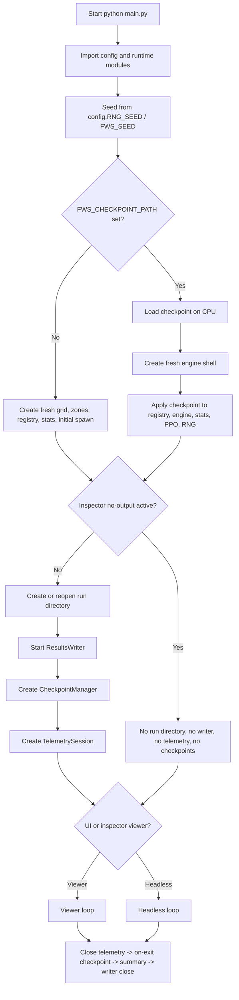
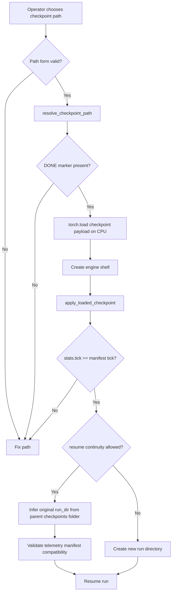

# Neural-Abyss
## Runbook, Configuration, Troubleshooting, and Reproducibility

## Abstract

This document is the operations companion for `Neural-Abyss`. Its purpose is practical rather than promotional: it reconstructs, from repository code, how the system is started, how runtime modes are selected, how results and telemetry are written, how checkpoints are created and restored, how resumed runs continue prior outputs, how inspection-only workflows avoid output pollution, and where the codebase’s reproducibility boundaries actually lie.

The authoritative operational surface is concentrated in `main.py`, `config.py`, `utils/checkpointing.py`, `utils/persistence.py`, `utils/telemetry.py`, `ui/viewer.py`, `utils/profiler.py`, and a small set of standalone helper scripts. The core operational design is a single-process orchestrator with optional UI, a background CSV writer process, append-friendly telemetry, atomic checkpoint directories, and an explicit no-output inspector mode. That design favors long-run continuity and post-interruption resumability over a fully declarative configuration system or perfectly deterministic restart reproducibility.

Several important constraints are visible directly in code. Fresh runs are launched through `main.py`; resumed runs are activated by `FWS_CHECKPOINT_PATH`; output continuity on resume is enabled by default; checkpoint directories are treated as atomic only when a `DONE` marker exists; and no-output inspection suppresses the run directory, telemetry, checkpoints, and results writer. At the same time, some declared configuration knobs are not wired into the active control path, some helper scripts appear stale relative to current module names, and some comments overstate optionality that the import graph does not actually preserve. This manual makes those distinctions explicit.

## Reader orientation

### Scope

This manual covers operational use of `Neural-Abyss` under real runtime conditions:

- startup and invocation
- dependency surface inferred from imports and runtime branches
- environment-variable configuration
- UI, headless, resume, and inspection-only mode selection
- run directory, checkpoint, telemetry, and summary artifact interpretation
- operational validation before, during, and after runs
- troubleshooting grounded in visible failure surfaces
- reproducibility support and its limits

### Deliberate exclusions

This manual does not attempt full subsystem theory for the simulation engine, observation stack, policy networks, PPO mathematics, or telemetry schema internals. Those topics are touched only where they materially affect safe operation.

### Evidence convention

The document uses three evidence classes throughout.

**Implementation** refers to behavior demonstrated directly by repository code.

**Theory** refers to general operational concepts used to explain why a behavior matters, such as atomic write patterns or the difference between deterministic replay and resumable execution.

**Inference** refers to a conservative explanation of likely motivation when the code suggests intent without explicitly proving it.

### Repository identity note

This manual refers to the repository as `Neural-Abyss`, as requested. The uploaded code still contains legacy identifiers such as the package path `Infinite_War_Simulation` and a `config.summary_str()` banner string of `"[Neural Siege: Custom] ..."`. Those strings are treated here as implementation residue rather than as competing repository identities.

## Executive operations view

`Neural-Abyss` is operated through a single orchestration entrypoint, `main.py`. That entrypoint performs six high-level tasks in order:

1. resolve runtime configuration from environment variables and apply a global seed;
2. either create a fresh world or load a checkpoint into a new engine shell;
3. instantiate the simulation engine and reapply checkpoint state if resuming;
4. establish an output surface consisting of a run directory, background CSV writer, checkpoint manager, and telemetry session, unless inspection-only mode suppresses them;
5. optionally attach a simple OpenCV-backed AVI recorder; and
6. enter either the viewer loop or the headless loop, followed by orderly shutdown, telemetry closure, an on-exit checkpoint, summary emission, and writer termination.

That architecture exposes a small number of operational surfaces that matter disproportionately:

- **mode selection**: UI, headless, resume, and no-output inspection are not separate binaries; they are branches inside the same orchestration path;
- **output continuity**: resumed runs append into the original run directory by default when the checkpoint path remains under the original `checkpoints/` tree;
- **checkpoint integrity**: incomplete checkpoints are rejected through the `DONE` marker rule;
- **telemetry compatibility**: append-in-place resume validates the prior telemetry schema manifest before writing more rows;
- **shutdown behavior**: graceful interruption is designed to finish the current tick, close telemetry, attempt an exit checkpoint, write a summary, and then stop the background writer.

The mistakes this runbook is designed to prevent are correspondingly operational rather than algorithmic: resuming from the wrong checkpoint, silently appending into the wrong run directory, assuming a config variable is active when it is merely declared, using inspection mode when production output is needed, using production mode when inspection-only behavior was intended, and mistaking resumability for strong reproducibility.



*Figure 1. Startup and mode-selection flow reconstructed from `main.py`. The critical branch is not simply UI versus headless; it is whether the run is fresh or resumed, and whether inspection-only mode suppresses output creation entirely.*

## Environment and dependency surface

### Core runtime dependencies that are directly evidenced

The code dump makes the following core dependencies visible:

- `torch`
- `numpy`
- Python standard library modules including `json`, `signal`, `traceback`, `multiprocessing`, `csv`, `subprocess`, and `pathlib`

Those are not merely analytical or optional imports. `main.py`, `engine.tick`, checkpointing, persistence, and telemetry all depend on them materially.

### Dependencies that appear operationally required for `main.py`

`main.py` imports `Viewer` directly from `ui.viewer`, and `ui.viewer` imports `pygame` at module import time. This creates an important implementation fact: although comments elsewhere describe the UI as optional, the actual `main.py` import path makes `pygame` effectively required just to start `main.py`, even when `FWS_UI=0` and headless execution is intended.

That means the codebase currently distinguishes between **UI-optional behavior** and **UI-optional imports**. The first exists; the second does not, at least not in the current top-level orchestration path.

### Dependencies that are clearly optional

Several imports are guarded defensively and therefore are operationally optional.

- `cv2` in `main.py` is optional. If it cannot be imported, the simple AVI recorder is silently disabled and the recorder becomes a no-op unless `RECORD_VIDEO` is both enabled and OpenCV is available.
- `torch.profiler` is imported lazily only when profiling is enabled through `FWS_TORCH_PROFILER`.
- `nvidia-smi` is used only through a best-effort subprocess probe for GPU status lines.
- `plotly` is used only by `lineage_tree.py`.
- `pyarrow` and `imageio` appear only in recorder-oriented helper modules and are not wired into the main runtime path shown in `main.py`.

### Platform assumptions visible in code

The repository contains explicit Windows-specific logic in `main.py`. On Windows, if `FWS_WIN_FORRTL_MITIGATE` is truthy, the process sets `FOR_DISABLE_CONSOLE_CTRL_HANDLER=TRUE` before importing scientific libraries. The intent is to prevent Intel Fortran runtime handlers from turning Ctrl+C into an abrupt native abort rather than a Python-level graceful shutdown.

The persistence layer also contains Windows-aware design decisions:

- a dedicated background writer process rather than in-loop synchronous file writes;
- an explicit `if __name__ == "__main__":` entrypoint guard in `main.py` to remain multiprocessing-safe;
- CSV opens with `newline=""` to avoid extra blank lines on Windows.

### Dependency caveat table

| Dependency or tool | Operational role | Status in current code path | Practical implication |
|---|---|---:|---|
| `torch` | engine, PPO, checkpoint, telemetry | required | repository does not start meaningfully without it |
| `numpy` | seeding, recorder, viewer caches | required | runtime assumes it is present |
| `pygame` | viewer import path | effectively required by `main.py` | even headless `python main.py` may fail without it |
| `cv2` | simple AVI recorder in `main.py` | optional | missing OpenCV disables video recording rather than startup |
| `torch.profiler` | optional profiling in headless loop | optional | used only when `FWS_TORCH_PROFILER=1` |
| `nvidia-smi` executable | GPU status line in headless/telemetry summaries | optional | absence only removes GPU summary lines |
| `plotly` | lineage visualization helper | optional | only needed for `lineage_tree.py` |
| `pyarrow`, `imageio` | auxiliary recorder helpers | optional and not on main path | should not be treated as core runtime prerequisites |

*Table 1. Dependency surface inferred from imports and runtime branches, not from packaging metadata. No `requirements.txt`, `pyproject.toml`, or install manifest is evidenced in the uploaded code dump.*

## Entrypoints and invocation surface

### Primary entrypoint

The operational entrypoint is `main.py`. Its standard guard calls `main()` when the file is executed directly. No alternative top-level launcher is evidenced.

The most defensible invocation assumption is execution from the repository’s main package directory:

```bash
cd Infinite_War_Simulation
python main.py
```

```powershell
Set-Location Infinite_War_Simulation
python .\main.py
```

`main.py` also contains a fallback that inserts the repository root into `sys.path` when `config.py` is not initially importable, which suggests the author intended execution from more than one working directory. Even so, the above form is the cleanest defensible command.

### Benchmark helper

A nominal benchmark helper exists at `benchmark_ticks.py`, but its current import surface does not match the rest of the repository.

The script imports:

- `generate_map` from `engine.mapgen`
- `spawn_agents` from `engine.spawn`
- `config.GRID_H` and `config.GRID_W`

The uploaded repository instead exposes `make_zones`, `spawn_symmetric`, `spawn_uniform_random`, `GRID_HEIGHT`, and `GRID_WIDTH`. On static inspection, those benchmark imports do not resolve against the current tree. The benchmark script is therefore best treated as **present but stale**, not as a production-safe entrypoint.

### Lineage/post-run helper

A post-run lineage helper exists at `lineage_tree.py`.

It is a genuine standalone script, but it uses hard-coded local filenames:

- `lineage_edges.csv`
- `agent_life.csv`

It does not accept command-line arguments. In the current run layout, telemetry writes those files under `run_dir/telemetry/`. The operational implication is that `lineage_tree.py` must be executed from inside the telemetry directory, or edited, to operate on a real run.

A defensible usage pattern is therefore:

```bash
cd results/sim_YYYY-MM-DD_HH-MM-SS/telemetry
python ../../../lineage_tree.py
```

or, more conservatively, copying the script into the telemetry directory or adjusting its constants before execution.

### Repository-maintenance helper

`dump_py_to_text.py` exists, but it is repository-maintenance tooling rather than runtime orchestration. It is outside the runbook’s main operational path.

### Invocation surface summary

| Entry file | Operational status | Primary purpose | Notes |
|---|---|---|---|
| `main.py` | active | fresh runs, resume, UI/headless, inspection, checkpointing | canonical runtime entrypoint |
| `benchmark_ticks.py` | present but stale | throughput micro-benchmark | imports appear inconsistent with current tree |
| `lineage_tree.py` | active with caveats | post-run lineage visualization | assumes current working directory already contains telemetry CSVs |
| `dump_py_to_text.py` | ancillary | source aggregation utility | not part of normal runtime operation |

*Table 2. Executable surface reconstructed from repository files. Presence does not imply current correctness; `benchmark_ticks.py` appears out of sync with the rest of the tree.*

## Configuration model

### Configuration architecture

The repository uses a single environment-variable-driven configuration module, `config.py`. Parsing is centralized through helpers such as `_env_bool`, `_env_int`, `_env_float`, and `_env_str`. Parsing is fail-soft by default: malformed values usually fall back to defaults rather than aborting import. `FWS_CONFIG_STRICT=1` escalates selected configuration warnings into exceptions.

Profiles are implemented as macro overrides layered after raw environment parsing. The precedence order is:

1. explicit environment variables;
2. profile preset values from `FWS_PROFILE`; and then
3. hard-coded defaults.

This is a pragmatic design for experimentation, but it makes fully auditable configuration reconstruction dependent on both the chosen profile and the environment actually present at launch.

### Configuration groups that materially affect operation

#### Run identity, resume, and output continuity

| Variable | Role | Operational effect | Notes |
|---|---|---|---|
| `FWS_PROFILE` | profile preset selector | applies `debug`, `train_fast`, or `train_quality` overrides unless a specific env var already exists | also collides historically with legacy profiler toggle behavior |
| `FWS_EXPERIMENT_TAG` | free-form tag | metadata only in current code path | useful for run labeling, not routing |
| `FWS_SEED` | global seed | affects startup seeding and run metadata | also aliased as `RNG_SEED` / `SEED` |
| `FWS_CHECKPOINT_PATH` | resume selector | activates checkpoint load path | empty means fresh run |
| `FWS_RESUME_OUTPUT_CONTINUITY` | append-in-place resume | reopens original run directory when resuming | defaults to `True` |
| `FWS_RESUME_FORCE_NEW_RUN` | break continuity on resume | creates a new run directory even when resuming | safer when appending is not wanted |
| `FWS_RESUME_APPEND_STRICT_CSV_SCHEMA` | root CSV append guard | prevents `stats.csv` and `dead_agents_log.csv` schema drift on append | defaults to strict |

#### Checkpoint control

| Variable | Role | Operational effect | Notes |
|---|---|---|---|
| `FWS_CHECKPOINT_EVERY_TICKS` | periodic checkpoint cadence | saves every N ticks in UI and headless loops | `0` disables periodic save |
| `FWS_CHECKPOINT_ON_EXIT` | graceful shutdown save | attempts a final checkpoint during `finally` | does not protect against hard kill |
| `FWS_CHECKPOINT_KEEP_LAST_N` | retention | prunes unpinned completed checkpoints after saves | never deletes pinned or `latest.txt` target |
| `FWS_CHECKPOINT_PIN_ON_MANUAL` | manual checkpoint protection | manual or trigger-file checkpoints become pinned by default | keeps important checkpoints from prune logic |
| `FWS_CHECKPOINT_PIN_TAG` | pin marker tag | labels pinned checkpoints | default `manual` |
| `FWS_CHECKPOINT_TRIGGER_FILE` | manual checkpoint trigger filename | creating this file inside the run directory requests a save | works in UI and headless loops |

#### Headless observability and profiling

| Variable | Role | Operational effect | Notes |
|---|---|---|---|
| `FWS_UI` | UI toggle | chooses viewer loop versus headless loop unless inspection mode forces viewer | defaults to `True` |
| `FWS_HEADLESS_PRINT_EVERY_TICKS` | console cadence | periodic status print interval in headless mode | `0` disables prints |
| `FWS_HEADLESS_PRINT_LEVEL` | console detail | controls how much status detail is printed | levels `0`, `1`, `2` are used in code |
| `FWS_HEADLESS_PRINT_GPU` | GPU console probe | includes `nvidia-smi` summary in headless console lines | can add polling overhead |
| `FWS_TORCH_PROFILER` | optional torch profiling | enables `torch.profiler` tracing in headless loop | outputs under `prof/` |

#### Telemetry and append safety

| Variable | Role | Operational effect | Notes |
|---|---|---|---|
| `FWS_TELEMETRY` | master telemetry switch | enables `TelemetrySession` | disabled telemetry should not crash the run |
| `FWS_TELEM_SCHEMA` | schema version string | stored in telemetry manifest and run metadata | used for append compatibility |
| `FWS_TELEM_RUN_META` | run metadata write | controls `run_meta.json` emission | preserved on resume-in-place |
| `FWS_TELEM_AGENT_STATIC` | agent static CSV | writes `agent_static.csv` | increases output volume |
| `FWS_TELEM_TICK_SUMMARY_EVERY` | summary cadence | governs `tick_summary.csv` and `telemetry_summary.csv` cadence | operationally important |
| `FWS_TELEM_TICK_EVERY` | tick metric cadence | affects lower-level telemetry richness | not the same as headless prints |
| `FWS_TELEM_FLUSH_EVERY` | flush cadence | trades throughput against crash-loss window | influences buffered streams |
| `FWS_TELEM_APPEND_SCHEMA_STRICT` | telemetry CSV append guard | rejects incompatible append headers | has localized fallback for PPO rich CSV |
| `FWS_TELEM_PPO_RICH_CSV` | rich PPO diagnostics | enables `ppo_training_telemetry.csv` | append behavior has special recovery logic |
| `FWS_TELEM_HEADLESS_SUMMARY` | live headless CSV sidecar | writes `telemetry_summary.csv` independent of console prints | useful for long unattended runs |

#### Viewer and no-output inspection

| Variable | Role | Operational effect | Notes |
|---|---|---|---|
| `FWS_INSPECTOR_MODE` | explicit inspection mode | values such as `ui_no_output`, `inspect`, `inspector`, `no_output`, and `viewer_no_output` activate no-output viewer mode | bypasses normal output creation |
| `FWS_INSPECTOR_UI_NO_OUTPUT` | backward-compatible flag | also activates no-output viewer mode | redundant with `FWS_INSPECTOR_MODE` |
| `FWS_TARGET_FPS` | viewer frame cap | throttles UI loop rendering | headless loop does not use it |
| `FWS_CELL_SIZE` | viewer scale | changes world rendering size | operationally relevant only for UI |
| `FWS_HUD_W` | viewer HUD width | UI layout only | no effect in headless |
| `FWS_RECORD_VIDEO` | AVI recorder switch | activates `_SimpleRecorder` if OpenCV is present | writes `simulation_raw.avi` into run directory |
| `FWS_VIDEO_FPS` / `FWS_VIDEO_SCALE` / `FWS_VIDEO_EVERY_TICKS` | recorder controls | change AVI sampling and frame geometry | no effect when recorder is disabled |

### Declared variables that do not appear wired into the active path

Several configuration names are declared in `config.py` but are not referenced elsewhere in the uploaded repository’s active orchestration path.

The most operationally important are:

- `FWS_RESULTS_DIR`
- `FWS_TARGET_TPS`
- `FWS_AUTOSAVE_EVERY_SEC`
- `FWS_TELEM_REPORT`
- `FWS_TELEM_EXCEL`
- `FWS_TELEM_PNG`

The presence of those declarations does not prove that the runtime uses them. In the uploaded code, fresh runs call `ResultsWriter.start()` without passing `config.RESULTS_DIR`, so fresh run directories still default to `results/sim_YYYY-MM-DD_HH-MM-SS`. Similarly, no active reference to `TARGET_TPS`, `AUTOSAVE_EVERY_SEC`, or the telemetry report flags is visible in the current tree. An operator should not rely on those variables until they are confirmed in the execution path being used.

### Profile behavior

The built-in profiles are modest rather than fully opinionated:

- `debug` reduces world scale and keeps UI on;
- `train_fast` disables UI and reduces the MLP token width;
- `train_quality` disables UI and increases the MLP token width.

Profiles should be understood as convenience presets, not as self-contained experiment manifests.

## Canonical operating modes

### Mode comparison

| Mode | How it is selected | Outputs created | Typical use | Principal caveat |
|---|---|---|---|---|
| Fresh UI run | `FWS_UI=1`, no checkpoint path, no inspector no-output | new run directory, CSVs, telemetry, checkpoints, optional AVI | interactive local execution | `pygame` import is effectively required |
| Fresh headless run | `FWS_UI=0`, no checkpoint path | new run directory, CSVs, telemetry, checkpoints | long unattended run | still imported through `main.py`, so viewer dependency caveat remains |
| Resumed UI run | checkpoint path set, UI on | usually appends into original run directory by default | interactive continuation | append continuity assumes checkpoint still lives under original `checkpoints/` tree |
| Resumed headless run | checkpoint path set, `FWS_UI=0` | usually appends into original run directory by default | long continuation after interruption | schema mismatch can abort append paths |
| No-output inspector | `FWS_INSPECTOR_MODE=ui_no_output` or `FWS_INSPECTOR_UI_NO_OUTPUT=1` | suppresses run dir, telemetry, checkpoints, recorder | safe inspection of a state without polluting outputs | viewer hotkey `S` still writes a `.pth` brain file to the current working directory |
| Resume with forced new outputs | checkpoint path set and `FWS_RESUME_FORCE_NEW_RUN=1` | new run directory instead of append-in-place | branch a new lineage from an old checkpoint | breaks one-directory continuity by design |

*Table 3. Canonical operating modes supported by the current code. The decisive distinction is whether the run is allowed to write outputs and whether a resumed run appends in place or forks into a new directory.*

### Mode semantics

#### Normal UI execution

This mode launches `Viewer.run(...)`, renders the world with Pygame, honors pause and speed controls, allows manual checkpoint saves via `F9`, and still performs automatic checkpoint checks inside the viewer loop when `run_dir` is available.

#### Headless execution

This mode enters `_headless_loop(...)`, runs the engine continuously, writes root CSV outputs through the background writer, drains death logs, optionally sends additive telemetry summary rows, performs periodic runtime sanity checks, polls optional profiler hooks, checks the trigger file, and emits periodic console status lines.

#### Inspector execution with no outputs

The no-output inspector mode is explicit rather than implicit. When active, `main.py` still builds the world or loads the checkpoint, still instantiates the engine, and still launches the viewer, but it suppresses the run directory, `ResultsWriter`, telemetry, checkpoint manager, and video recorder. The viewer receives `run_dir=None`, which disables checkpoint saves from `F9` and automatic checkpointing inside the viewer loop.

The mode is therefore suitable for opening an existing checkpoint without appending more files into its run directory. It is not equivalent to a headless validation pass.

#### Resume-in-place execution

Resume-in-place is the default resumed behavior. When a checkpoint is supplied and `FWS_RESUME_OUTPUT_CONTINUITY=1` while `FWS_RESUME_FORCE_NEW_RUN=0`, `main.py` infers the original run directory from the checkpoint path, reopens that directory through `ResultsWriter.start(..., append_existing=True)`, preserves the prior `config.json` and telemetry `run_meta.json`, validates the telemetry schema manifest, and records a telemetry `resume` event.

That is a strong continuity design. It also means resumed runs can easily contaminate a prior lineage if the wrong checkpoint is chosen.

## Standard operating procedures

### Procedure 1: start a fresh run

**Purpose.** Begin a new simulation lineage with a new run directory.

**Prerequisites.** Working Python environment with at least `torch`, `numpy`, and the imports required by `main.py`; repository working directory set to the package directory.

```bash
python main.py
```

```powershell
python .\main.py
```

**For a fresh headless run:**

```bash
FWS_UI=0 python main.py
```

```powershell
$env:FWS_UI="0"
python .\main.py
```

**What to expect.**

- a deterministic seed line is printed;
- the compact config banner is printed;
- the engine is initialized;
- a new run directory is announced as `Results → ...` unless no-output inspector mode is active;
- telemetry is attached if enabled; and
- the program enters either the viewer or the headless loop.

**What success looks like.**

- root run directory exists;
- `config.json`, `stats.csv`, and `dead_agents_log.csv` appear or begin populating;
- `telemetry/` exists if telemetry is enabled;
- `summary.json` appears at orderly exit;
- `checkpoints/` appears after the first checkpoint opportunity.

**Common mistakes.**

- assuming `FWS_RESULTS_DIR` changes the fresh run location; current code does not show that wiring;
- expecting headless execution to avoid the `pygame` import path; current `main.py` does not do that.

### Procedure 2: start a fresh headless long run with reduced console overhead

**Purpose.** Maximize runtime continuity and reduce terminal overhead during unattended execution.

```bash
FWS_UI=0 \
FWS_HEADLESS_PRINT_EVERY_TICKS=5000 \
FWS_HEADLESS_PRINT_GPU=0 \
python main.py
```

```powershell
$env:FWS_UI="0"
$env:FWS_HEADLESS_PRINT_EVERY_TICKS="5000"
$env:FWS_HEADLESS_PRINT_GPU="0"
python .\main.py
```

**What to expect.** Root CSVs continue through the writer process, telemetry remains independent of console verbosity, and checkpoints continue on their configured cadence.

**Success signal.** Headless status lines appear at the chosen interval, while `stats.csv` and telemetry files keep advancing.

### Procedure 3: resume from the latest checkpoint in a run directory

**Purpose.** Continue an interrupted or previously stopped run from the newest complete checkpoint.

`resolve_checkpoint_path()` accepts a checkpoint root directory containing `latest.txt`, so the operator does not need to name a specific checkpoint directory every time.

```bash
FWS_UI=0 \
FWS_CHECKPOINT_PATH="results/sim_YYYY-MM-DD_HH-MM-SS/checkpoints" \
python main.py
```

```powershell
$env:FWS_UI="0"
$env:FWS_CHECKPOINT_PATH="results\sim_YYYY-MM-DD_HH-MM-SS\checkpoints"
python .\main.py
```

**What to expect.**

- `main.py` prints `Resuming from checkpoint: ...`;
- checkpoint load occurs on CPU first;
- the world grid and zones are restored;
- `CheckpointManager.apply_loaded_checkpoint(...)` restores registry state, brains, stats, PPO state if present, and RNG state;
- `main.py` verifies that `stats.tick` matches checkpoint metadata;
- the run announces either `Results → <dir> (resume-in-place append)` or a new results directory if continuity is disabled.

**What success looks like.**

- console prints `Runtime state restored from checkpoint.`;
- telemetry writes a resume event if enabled;
- no duplicate bootstrap birth rows are written on resume-in-place;
- later `summary.json` and on-exit checkpoints show ticks strictly above the restored tick if the run progressed.

**Common mistakes.**

- passing a checkpoint directory that lacks `DONE`; the load path refuses it;
- resuming with an incompatible telemetry schema while append continuity remains on;
- moving a checkpoint outside the original `run_dir/checkpoints/` tree and still expecting automatic run-directory inference for append-in-place.

### Procedure 4: resume but force a new run directory

**Purpose.** Continue computation from an old checkpoint without appending further rows into the old output lineage.

```bash
FWS_UI=0 \
FWS_CHECKPOINT_PATH="results/sim_YYYY-MM-DD_HH-MM-SS/checkpoints" \
FWS_RESUME_FORCE_NEW_RUN=1 \
python main.py
```

```powershell
$env:FWS_UI="0"
$env:FWS_CHECKPOINT_PATH="results\sim_YYYY-MM-DD_HH-MM-SS\checkpoints"
$env:FWS_RESUME_FORCE_NEW_RUN="1"
python .\main.py
```

**What to expect.** The checkpoint is still used for runtime restoration, but `ResultsWriter.start()` creates a new run directory rather than reopening the old one.

**What success looks like.** A new `results/sim_...` path is printed rather than `resume-in-place append`.

### Procedure 5: inspect a checkpoint without creating new run outputs

**Purpose.** Open an existing runtime state in the viewer without creating a new run directory and without extending the original output lineage.

```bash
FWS_UI=0 \
FWS_INSPECTOR_MODE=ui_no_output \
FWS_CHECKPOINT_PATH="results/sim_YYYY-MM-DD_HH-MM-SS/checkpoints" \
python main.py
```

```powershell
$env:FWS_UI="0"
$env:FWS_INSPECTOR_MODE="ui_no_output"
$env:FWS_CHECKPOINT_PATH="results\sim_YYYY-MM-DD_HH-MM-SS\checkpoints"
python .\main.py
```

**What to expect.**

- `main.py` prints that inspector UI no-output mode is enabled;
- checkpoint loading and runtime restoration still occur if a checkpoint is provided;
- the viewer opens;
- no new run directory is created;
- no telemetry session is created;
- no checkpoint manager is attached to the viewer.

**What success looks like.** No `Results → ...` line appears, and no new files are written under `results/` during normal inspection.

**Common mistakes.**

- assuming this is a headless mode; it is not, it is a viewer mode;
- pressing `S` in the viewer, which saves the selected brain weights into the current working directory even in no-output inspector mode.

### Procedure 6: request a manual checkpoint during a live run

**Purpose.** Trigger a checkpoint without terminating the process.

Two repository-grounded mechanisms exist.

**UI mechanism:** press `F9` in the viewer. The save occurs between ticks.

**Filesystem mechanism:** create the configured trigger file inside the run directory, by default `checkpoint.now`. The runtime checks it in both headless and UI loops.

```bash
touch results/sim_YYYY-MM-DD_HH-MM-SS/checkpoint.now
```

```powershell
New-Item -Path "results\sim_YYYY-MM-DD_HH-MM-SS\checkpoint.now" -ItemType File
```

If the trigger file contains the words `pin` or `keep`, or if `FWS_CHECKPOINT_PIN_ON_MANUAL=1`, the resulting checkpoint is pinned against pruning.

**What success looks like.** A new checkpoint directory appears under `run_dir/checkpoints/`, `latest.txt` advances, and the trigger file is deleted after successful save.

### Procedure 7: enable optional profiling in headless mode

**Purpose.** Capture a PyTorch profiler trace without editing the code.

```bash
FWS_UI=0 FWS_TORCH_PROFILER=1 python main.py
```

```powershell
$env:FWS_UI="0"
$env:FWS_TORCH_PROFILER="1"
python .\main.py
```

**What to expect.** The headless loop enters `torch_profiler_ctx()`. Trace files are written under `prof/` using `torch.profiler.tensorboard_trace_handler`.

**Caveat.** This path is opt-in and introduces overhead. The legacy use of `FWS_PROFILE=1` as a profiler toggle is explicitly deprecated inside `utils/profiler.py` because it collides with profile selection semantics.

### Procedure 8: use the lineage helper after a run

**Purpose.** Generate an HTML lineage visualization from existing telemetry files.

**Prerequisite.** The current working directory must contain `lineage_edges.csv` and, optionally, `agent_life.csv`.

```bash
cd results/sim_YYYY-MM-DD_HH-MM-SS/telemetry
python ../../../lineage_tree.py
```

**What success looks like.** The script writes `lineage_time_tree.html`.

**Common mistake.** Running `lineage_tree.py` from the repository root without changing directory first. In that case the script looks for telemetry CSVs in the wrong place.

## Output and artifact interpretation

### Root run directory

A normal run produces a timestamped directory of the form:

```text
results/sim_YYYY-MM-DD_HH-MM-SS/
```

In the current code, that base path is hard-coded through `ResultsWriter._timestamp_dir(base="results")` unless an explicit `run_dir` is passed. `main.py` does not pass `config.RESULTS_DIR` for fresh runs.

### Root-level files

The root run directory can contain:

- `config.json` — a selective config snapshot created by `_config_snapshot()`, not a full dump of every resolved config constant;
- `stats.csv` — one row per tick written through the background writer process;
- `dead_agents_log.csv` — batch-appended death log rows;
- `summary.json` — final atomic summary with status, duration, final tick, scores, and any error string;
- `crash_trace.txt` — written on exception paths when a run directory exists;
- `simulation_raw.avi` — optional simple AVI recorder output if `RECORD_VIDEO` is enabled and OpenCV is present.

### Telemetry subtree

When telemetry is enabled, `run_dir/telemetry/` contains append-friendly sidecars including:

- `schema_manifest.json`
- `run_meta.json`
- `agent_static.csv`
- `agent_life.csv`
- `lineage_edges.csv`
- `tick_summary.csv`
- `move_summary.csv`
- `counters.csv`
- `telemetry_summary.csv`
- `ppo_training_telemetry.csv`
- `mutation_events.csv`
- `dead_agents_log_detailed.csv`
- `events/` with chunked event files

Not every file is guaranteed for every run. Presence depends on telemetry enablement and feature-specific flags.

### Checkpoint subtree

Checkpoint directories live under:

```text
run_dir/checkpoints/
```

Each complete checkpoint directory contains at least:

- `checkpoint.pt`
- `manifest.json`
- `DONE`

Pinned checkpoints also contain:

- `PINNED`

The checkpoint root also contains:

- `latest.txt`

The `DONE` marker is operationally decisive. It is written after the payload and manifest. `CheckpointManager.load()` refuses to load a checkpoint directory that does not contain `DONE`.

### How to tell what kind of run occurred

| Signal | Fresh run | Resumed run | No-output inspector |
|---|---:|---:|---:|
| `Results → ...` printed | yes | yes, usually with append note | no |
| `Runtime state restored from checkpoint.` | no | yes | yes if resuming into inspector |
| telemetry `resume` event | no | yes | no telemetry session |
| new root run directory | yes | maybe, depending on continuity flags | no |
| checkpoints available during run | yes | yes unless in no-output inspector | no |

*Table 4. Operational signals that distinguish fresh, resumed, and inspection-only workflows.*

## Checkpoint and resume runbook

### What a checkpoint captures

`CheckpointManager.save_atomic(...)` stores a full runtime payload rather than only model weights. The checkpoint includes:

- world grid and zone masks;
- registry tensors, agent unique IDs, generations, next agent ID, and per-slot brains;
- selected engine internals such as `agent_scores` and respawn-controller state;
- PPO runtime state via `_extract_ppo_state(engine)`;
- statistics state;
- optional viewer state payload supplied by the viewer loop;
- Python, NumPy, PyTorch CPU, and PyTorch CUDA RNG states.

This is designed for resumability, not merely for exporting trained weights.

### Checkpoint creation mechanics

Checkpoint creation is crash-conscious.

1. A new temporary checkpoint directory is created with a `__tmp` suffix.
2. `checkpoint.pt` and `manifest.json` are written inside that temporary directory.
3. `DONE` is written last.
4. The temporary directory is atomically renamed into the final checkpoint directory.
5. `latest.txt` is atomically updated.

This pattern sharply reduces the risk of partial checkpoint directories being treated as valid.

### Accepted checkpoint path forms

The load path accepts three forms:

1. a direct path to `checkpoint.pt`;
2. a checkpoint directory containing `checkpoint.pt`; or
3. a checkpoint root directory containing `latest.txt`, in which case `latest.txt` is followed to the newest checkpoint subdirectory.

That makes `run_dir/checkpoints` the most ergonomic resume path when the operator intends to resume from the latest complete checkpoint.

### Resume validation logic

A correct resume performs more than a successful `torch.load`.

The code explicitly validates:

- checkpoint completeness through the `DONE` marker;
- expected checkpoint dictionary structure;
- registry tensor rank and capacity match;
- `NUM_COLS` match for `agent_data`;
- brain list and generation list lengths;
- `agent_uids` length when present;
- nonnegative generation values;
- `next_agent_id` not being stale relative to the maximum restored UID;
- PPO runtime presence when checkpointed PPO state exists; and
- `stats.tick` matching checkpoint metadata after restore.

An operator should treat those validation checks as the runtime’s built-in guardrails, then perform independent operational validation on top of them.



*Figure 2. Checkpoint and resume decision flow. The highest-risk branch is not loading the checkpoint itself, but deciding whether continuation should append into the original run lineage or fork into a new output directory.*

### How to avoid resuming the wrong checkpoint

The safest procedure is:

1. prefer passing the `checkpoints/` root of the intended run, not a copied or moved checkpoint directory;
2. inspect `latest.txt` and `manifest.json` before launching a long continuation;
3. confirm the checkpoint tick in the directory name and manifest;
4. keep `FWS_RESUME_FORCE_NEW_RUN=1` unless append continuity is explicitly desired;
5. use no-output inspector mode first when validating an unfamiliar checkpoint.

### Resume-in-place versus no-output inspection

These two workflows solve different problems.

- **Resume-in-place** is for continued production execution, preserving one run lineage.
- **No-output inspection** is for safe viewing, debugging, or validation without further output creation.

Using the wrong mode is a common operator error. The default resumed behavior is production continuation, not safe inspection.

## Runtime validation and operator checks

### Startup validation

An operator should confirm the following immediately after launch:

| Check | Why it matters | Observable signal |
|---|---|---|
| seed resolved | reproducibility anchor | `[main] Using deterministic seed: ...` |
| intended mode selected | prevents UI/headless/inspector confusion | `Results → ...` versus inspector no-output message |
| checkpoint load expected | verifies fresh versus resumed path | `Resuming from checkpoint: ...` only when intended |
| runtime restore successful | confirms post-load state application | `Runtime state restored from checkpoint.` |
| run directory expectation correct | prevents append pollution | new path versus `resume-in-place append` |
| telemetry attachment expected | ensures observability assumptions match reality | telemetry files appear under `run_dir/telemetry/` |

### Mid-run validation

During the run, useful operator checks are:

- `stats.csv` is growing when the writer is active;
- headless prints continue at the configured cadence if enabled;
- `telemetry_summary.csv` advances when telemetry headless summaries are enabled;
- checkpoint directories appear at expected intervals or after trigger-file/manual requests;
- no new files appear at all during no-output inspector sessions, except for the caveat around viewer brain export hotkey `S`.

### Resume validation

After a resumed launch, the following checks are especially important:

- the starting tick in telemetry `run_meta.json` is preserved on resume-in-place rather than overwritten;
- a telemetry `resume` event is emitted;
- bootstrap birth events are not duplicated on resume-in-place;
- `stats.csv` and `dead_agents_log.csv` append rather than rewrite when continuity is active;
- new checkpoints continue under the same `checkpoints/` tree if continuity is active.

### Graceful shutdown validation

On an orderly stop or handled signal, the code intends to perform this shutdown sequence:

1. drain final death logs into the writer;
2. close telemetry first;
3. write an on-exit checkpoint if enabled;
4. write `summary.json` atomically;
5. close the writer process; and
6. close the video recorder.

A healthy shutdown therefore usually leaves behind an updated summary and a final checkpoint. A missing exit checkpoint in a normal stop suggests either disabled `CHECKPOINT_ON_EXIT`, a checkpoint failure, or a non-graceful termination path.

## Troubleshooting guide

### Troubleshooting matrix

| Symptom | Likely code-grounded causes | How to verify | Corrective action |
|---|---|---|---|
| `main.py` fails before run starts in supposed headless mode | `pygame` missing while `main.py` still imports `ui.viewer` directly | inspect traceback for `pygame` import failure | install `pygame` or refactor entrypoint/import path; `FWS_UI=0` alone does not remove this dependency |
| run writes into `results/` despite `FWS_RESULTS_DIR` override | fresh run path does not pass `config.RESULTS_DIR` into `ResultsWriter.start()` | search for `RESULTS_DIR` references; only `config.py` defines it | do not rely on `FWS_RESULTS_DIR` for fresh runs without code change |
| checkpoint cannot load | missing path, missing `DONE`, invalid checkpoint structure | inspect checkpoint directory for `DONE`, `checkpoint.pt`, `manifest.json` | point `FWS_CHECKPOINT_PATH` at a complete checkpoint or checkpoints root with `latest.txt` |
| resume-in-place crashes while inferring original run directory | checkpoint is no longer located under a parent named `checkpoints` | inspect checkpoint path layout | use `FWS_RESUME_FORCE_NEW_RUN=1` or restore expected directory layout |
| root CSV append fails on resume | `stats.csv` or `dead_agents_log.csv` header mismatch under strict append mode | inspect exception text mentioning schema mismatch | set `FWS_RESUME_FORCE_NEW_RUN=1`, or repair schema, or disable strict append only with full awareness of corruption risk |
| telemetry append fails on resume | schema manifest mismatch or missing manifest | inspect `telemetry/schema_manifest.json` and exception text | force new run directory or restore compatible code/config before appending |
| no-output inspection still creates a file | selected-brain export hotkey `S` writes a `.pth` into current working directory | inspect working directory after viewer interactions | avoid `S` during inspection-only sessions or launch from a disposable directory |
| no checkpoint is created during live run | cadence disabled, no trigger file, or viewer has no `run_dir` in inspector mode | inspect `FWS_CHECKPOINT_EVERY_TICKS`, trigger file location, and mode | enable periodic save, create trigger file in actual run dir, or avoid no-output inspector mode when checkpointing is needed |
| final checkpoint missing after Ctrl+C | signal was not handled gracefully, exit checkpoint disabled, or checkpoint save failed | inspect console for signal/shutdown messages and `[checkpoint] on-exit` lines | prefer normal Ctrl+C over hard kill; keep `FWS_CHECKPOINT_ON_EXIT=1`; inspect failure text |
| benchmark helper fails immediately | `benchmark_ticks.py` imports stale symbols | run it once and inspect ImportError | treat benchmark helper as stale until updated to current module names |
| lineage helper cannot find files | script expects current working directory to contain telemetry CSVs | check cwd and file presence | `cd` into the telemetry directory first or modify constants |

*Table 5. Troubleshooting matrix grounded in current code paths rather than generic MLOps expectations.*

### Specific high-impact failure cases

#### Repository does not start in headless mode

The likely cause is not headless logic itself but import-time coupling. `main.py` imports `ui.viewer.Viewer`, which imports `pygame`. A machine without `pygame` can therefore fail before the `FWS_UI` flag is even consulted.

#### Output files were created when inspection-only behavior was intended

The first question should be whether no-output inspector mode was actually active. The second should be whether the viewer `S` hotkey was used. `F9` is disabled in inspector mode because `run_dir` is `None`, but `save_selected_brain()` is not tied to `run_dir` and writes directly into the current working directory.

#### Resume did not restore expected state

The code restores more than the grid. It restores registry tensors, per-slot brains, selected engine state, PPO state when present, stats, and RNG. When the resumed behavior still appears wrong, the most likely code-grounded causes are:

- wrong checkpoint chosen;
- checkpoint from a materially different code/config state;
- PPO mismatch causing partial resume failure;
- operator expectation of viewer-state restoration that the current code does not visibly perform.

The viewer loop stores a `viewer_state` payload when saving manual checkpoints, but no corresponding viewer-side restore path is evident in the current orchestration. Viewer camera and pause state therefore should not be assumed to restore automatically.

#### Outputs appear duplicated or unexpectedly appended

This is usually a continuity issue, not a writer bug. If `FWS_CHECKPOINT_PATH` is set and `FWS_RESUME_OUTPUT_CONTINUITY=1` while `FWS_RESUME_FORCE_NEW_RUN=0`, resumed runs append into the original run directory by default. That behavior is intentional. When a new lineage is desired, `FWS_RESUME_FORCE_NEW_RUN=1` should be set explicitly.

## Reproducibility and determinism

### What the code does to support repeatability

The repository provides meaningful, but not absolute, reproducibility support.

For fresh starts:

- `seed_everything()` seeds Python `random`, NumPy, PyTorch CPU, and PyTorch CUDA;
- `PYTHONHASHSEED` is set from the seed;
- the seed is recorded in telemetry `run_meta.json` when telemetry is enabled.

For resumed runs:

- checkpoint payloads include Python, NumPy, PyTorch CPU, and PyTorch CUDA RNG state;
- RNG state is restored last in `apply_loaded_checkpoint(...)`, which is the correct order if post-constructor randomness is meant to remain aligned;
- full runtime state is restored rather than merely reinitialized from config.

### What the code does not guarantee

The code itself explicitly acknowledges that full GPU determinism is not guaranteed. That is a theory-backed implementation limit, not a defect. CUDA kernel nondeterminism, driver/runtime differences, and thread scheduling can still perturb exact replay.

There are also repository-specific reasons not to overclaim reproducibility:

- `config.json` is a selective snapshot from `_config_snapshot()`, not a full resolved config dump;
- some declared config variables are not wired into the execution path, so run intent and actual behavior may differ;
- the background writer intentionally drops rows on `queue.Full` rather than blocking the simulation, so output completeness is best-effort under overload;
- `run_meta.json` adds `git_commit` only from the `GIT_COMMIT` environment variable, whereas checkpoints use a best-effort `git rev-parse HEAD` subprocess; metadata capture is therefore partial and split across mechanisms.

### Restart reproducibility versus resume continuity

These are distinct guarantees.

**Resume continuity** is comparatively strong in this codebase. A checkpoint captures runtime state deeply, restore validation is strict, and append-in-place telemetry safeguards exist.

**Fresh-run reproducibility** is weaker. The seed is controlled, but full environment capture, packaging lock state, dependency versions, CUDA determinism controls, and a complete resolved config dump are not all evidenced as first-class artifacts.

The safest claim is therefore this: `Neural-Abyss` is designed more strongly for **resumable continuity** than for **perfectly reproducible clean restarts**.

## Interfaces to other subsystems

### Viewer interaction with runtime state

The viewer calls `engine.run_tick()` directly. It does not own the simulation. Its operational role is to render cached state, handle input, pace ticks per frame, and optionally request checkpoints.

### Checkpoint interaction with engine and learning state

Checkpointing is not limited to model weights. It reaches into:

- registry state,
- engine score and respawn state,
- PPO runtime state, and
- RNG state.

That breadth explains why resume can preserve continuity better than a clean restart from config alone.

### Telemetry interaction with persistence

Two distinct output subsystems coexist.

- `ResultsWriter` handles root-level CSVs through a background process.
- `TelemetrySession` writes richer telemetry directly under `run_dir/telemetry/`.

The shutdown order closes telemetry before the final checkpoint and summary so that telemetry horizons are intended to match the state frozen by those final artifacts.

### Benchmark and lineage tooling dependencies

The lineage helper depends on prior telemetry artifacts. The benchmark helper, by contrast, appears disconnected from current runtime symbols and should not be treated as a trusted operational consumer until repaired.

## Design decisions and trade-offs

### One orchestrator rather than separate binaries

**Decision.** `main.py` multiplexes fresh start, resume, UI, headless, checkpointing, telemetry, and inspection behavior.

**What it enables.** One operational entrypoint, shared shutdown logic, and reduced launcher fragmentation.

**What it costs.** A larger control surface inside one file, greater import coupling, and mode interactions that must be reasoned about carefully.

### Environment variables rather than structured config files

**Decision.** Runtime configuration is centralized in `config.py` and driven primarily through environment variables.

**Likely motivation.** Fast experimentation, shell-friendly overrides, and simple deployment into batch or ad hoc execution contexts.

**Trade-off.** Easy overrides and profile layering come at the cost of weaker discoverability, weaker manifesting of actual resolved state, and easier drift between intended and effective configuration.

### Append-in-place resume as the default

**Decision.** Resuming from a checkpoint reopens the original run directory by default.

**What it enables.** One coherent lineage for long-running experiments, uninterrupted CSV and telemetry histories, and easier operational continuation after interruptions.

**What it costs.** A higher risk of accidentally contaminating an old run when the operator meant to branch a new one.

### Explicit no-output inspector mode

**Decision.** The system provides an explicit viewer mode that suppresses run directories, telemetry, checkpoints, and the recorder.

**What it enables.** Safe inspection of states and checkpoints without directory pollution.

**What it costs.** Additional mode complexity and one remaining escape hatch for unintended output via selected-brain export.

### Background writer process with drop-on-overflow behavior

**Decision.** Root CSVs are written by a separate process through a bounded queue, and messages are dropped on `queue.Full`.

**What it enables.** Better simulation throughput and reduced risk of disk I/O stalling the main loop.

**What it costs.** Best-effort rather than guaranteed-complete CSV streams under sustained overload.

### Atomic checkpoint directories with completion marker

**Decision.** Checkpoints are written into temporary directories and recognized as valid only after `DONE` exists.

**What it enables.** Strong resilience against partial checkpoint directories and safer automated latest-checkpoint resolution.

**What it costs.** Slightly more complexity in checkpoint code and directory management.

## Safe-operation guidance

1. Use no-output inspector mode before resuming an unfamiliar checkpoint into production.
2. Prefer the `checkpoints/` root path rather than a copied checkpoint directory when continuity is intended.
3. Set `FWS_RESUME_FORCE_NEW_RUN=1` whenever lineage branching is safer than append-in-place continuation.
4. Keep `FWS_RESUME_APPEND_STRICT_CSV_SCHEMA=1` and `FWS_TELEM_APPEND_SCHEMA_STRICT=1` unless there is a deliberate repair plan.
5. Treat `config.json` as a useful snapshot, not as a complete reproduction manifest.
6. Avoid viewer hotkey `S` during no-output inspector sessions.
7. Use the trigger-file checkpoint mechanism or `F9` before planned interruptions rather than relying solely on periodic saves.
8. Prefer graceful termination over hard kill so that telemetry close, exit checkpoint, and summary logic can run.

## Extension guidance

The current architecture suggests several safe extension patterns.

### Adding a new configuration variable

The safest pattern is:

1. parse it in `config.py` through one of the typed env helpers;
2. validate it in `_validate_config_invariants()` if it affects correctness;
3. wire it explicitly into the actual consumer code path;
4. add it to `_config_snapshot()` if it matters for reproducibility or operator auditing.

### Adding a new operating mode

New modes should be routed through `main.py`, not introduced as disconnected side effects. The minimum operational work is:

- define explicit selection semantics in `config.py`;
- place the mode branch early enough in `main.py` to suppress or enable outputs coherently;
- specify whether checkpoints, telemetry, and recorder should exist in that mode;
- document its interaction with resume continuity.

### Adding validation checks

The most natural places are:

- `_validate_config_invariants()` for static config logic;
- `runtime_sanity_check()` for periodic runtime state assertions;
- `CheckpointManager.apply_loaded_checkpoint()` for structural restore checks; and
- startup/shutdown summaries for operator-visible confirmations.

### Improving reproducibility capture

The architecture would support several conservative improvements without changing its basic design:

- replacing `_config_snapshot()` with a fuller resolved config dump;
- capturing Python, Torch, CUDA, and dependency version metadata uniformly into one manifest;
- making `RESULTS_DIR` genuinely active in `main.py`;
- restoring viewer state explicitly when a checkpoint contains it;
- separating headless orchestration imports from viewer imports so `pygame` is no longer required for non-UI runs.

## Failure modes, risks, and limitations

The visible risks are mostly operational.

- **Mode confusion risk.** Resume-in-place is the default. That is powerful and dangerous.
- **Output contamination risk.** No-output inspector mode suppresses most outputs but not viewer brain export.
- **Path-layout risk.** Append-in-place run-directory inference assumes the checkpoint remains under a parent folder named `checkpoints`.
- **Dependency ambiguity risk.** Comments imply optional UI, but `main.py` still imports the viewer path directly.
- **Config ambiguity risk.** Declared variables such as `RESULTS_DIR` and `TARGET_TPS` appear inactive in the current path.
- **Script freshness risk.** `benchmark_ticks.py` appears stale against current symbols.
- **Partial reproducibility risk.** Runtime continuity is strong; clean restart reproducibility is incomplete.
- **Observability completeness risk.** `ResultsWriter` can drop rows under queue pressure.
- **Telemetry contract risk.** Append-in-place resume is intentionally strict; that protects data integrity but can stop a continuation that would otherwise run.

## Conclusion

`Neural-Abyss` exposes a compact but nontrivial operational surface. The code supports serious long-run use through atomic checkpoints, deep runtime restore, append-friendly telemetry, and a deliberately isolated no-output inspector mode. The same code also requires disciplined operation because its defaults favor continuity, because some config knobs are more aspirational than wired, and because a few helper scripts and legacy identifiers remain out of sync with the current tree.

The safest practical reading is therefore straightforward: the repository is operationally strong where it is explicit—checkpointing, resume validation, telemetry compatibility, graceful shutdown—and weaker where intent is implied but not fully wired, especially in dependency optionality, output base-path selection, and stale helper entrypoints.

## Glossary

**runtime mode** — the branch of orchestration chosen at startup, such as UI, headless, resumed, or no-output inspection.

**fresh run** — a launch with no `FWS_CHECKPOINT_PATH`, creating a new world and, in normal operation, a new run directory.

**resumed run** — a launch with `FWS_CHECKPOINT_PATH` set, restoring runtime state from a prior checkpoint.

**checkpoint path** — a path accepted by `resolve_checkpoint_path()`, which may be a direct `checkpoint.pt`, a checkpoint directory, or a checkpoint root containing `latest.txt`.

**output continuity** — the design in which a resumed run appends more root CSVs, telemetry, and checkpoints into the original run directory rather than creating a new one.

**inspect-only / no-output inspector** — the viewer mode activated by `FWS_INSPECTOR_MODE=ui_no_output` or `FWS_INSPECTOR_UI_NO_OUTPUT=1`, suppressing run-directory creation and most output side effects.

**deterministic execution** — execution in which the same initial state and inputs produce the same results; the code improves this through seeding and RNG restore but does not guarantee it absolutely on all hardware paths.

**resumable execution** — execution that can continue from a serialized runtime state while preserving continuity of behavior and outputs as far as the captured state allows.

**pinned checkpoint** — a checkpoint directory marked with `PINNED`, protected from pruning.

## Appendices

### Appendix A: startup and resume checklist

| Stage | Operator question | Pass condition |
|---|---|---|
| before launch | Is the intended mode explicit? | `FWS_UI`, `FWS_CHECKPOINT_PATH`, and inspector flags are set deliberately |
| before launch | Is append-in-place really desired? | `FWS_RESUME_FORCE_NEW_RUN` decision made consciously |
| startup | Did the run take the intended fresh/resume branch? | startup prints match expectation |
| startup | Did output routing match expectation? | either new run dir, resume-in-place append, or no output at all |
| mid-run | Are CSVs and telemetry advancing? | files grow at expected cadence |
| mid-run | Are checkpoints appearing? | periodic or manual checkpoints show under `checkpoints/` |
| shutdown | Was graceful stop achieved? | exit checkpoint and `summary.json` appear |
| post-run | Are final artifacts internally consistent? | final tick in summary is consistent with last output horizon |

### Appendix B: subsystem module-to-responsibility map

| Module | Operational responsibility |
|---|---|
| `main.py` | orchestration, mode selection, seed, startup, shutdown |
| `config.py` | env parsing, profile overrides, config validation |
| `utils/persistence.py` | background root CSV writer and config snapshot persistence |
| `utils/checkpointing.py` | atomic checkpoint creation, loading, restore validation, prune policy |
| `utils/telemetry.py` | append-friendly telemetry subtree and resume-aware manifest checks |
| `ui/viewer.py` | UI loop, input handling, viewer-side checkpoint requests |
| `utils/profiler.py` | optional PyTorch profiler context and GPU probe helper |
| `benchmark_ticks.py` | nominal benchmark helper, currently stale |
| `lineage_tree.py` | post-run lineage visualization helper |

*Table 6. Module-to-responsibility map for the operational surface discussed in this manual.*
