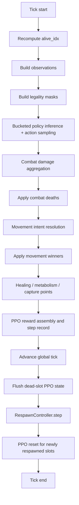
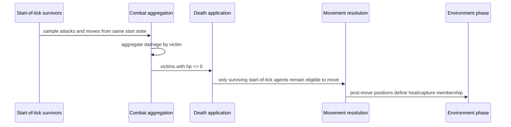

# Neural-Abyss  
## Simulation Engine and World Mechanics

## Abstract

This monograph documents the simulation engine and world mechanics subsystem of **Neural-Abyss** as evidenced by the provided code dump. The subsystem is implemented primarily through `engine.tick.TickEngine`, `engine.agent_registry.AgentsRegistry`, `engine.grid.make_grid`, `engine.mapgen`, `engine.game.move_mask`, `engine.ray_engine`, `engine.spawn`, and `engine.respawn`. The engine is a discrete-time, grid-based, synchronous multi-agent runtime built around tensorized state, explicit registry/grid dual representation, combat-before-movement semantics, zone application, optional metabolism, and post-tick respawn. It is tightly coupled to observation construction, masked action selection, per-architecture batched policy inference, statistics, telemetry, and checkpoint-resume operation.

The engine does **not** implement continuous physics, continuous collision response, probabilistic hit rolls, projectile travel, or fully general event queues. Instead, it implements a fixed ordered tick pipeline in which the state transition function is materially shaped by update order: start-of-tick agents observe, act, and participate in combat; dead agents are removed; surviving agents attempt movement; environmental rules update health and score; rewards are assembled; global time advances; and respawn runs after the tick boundary.

The monograph distinguishes three categories throughout:

- **Implementation** — behavior directly evidenced by code.
- **Theory** — formal or conceptual framing used to explain that behavior.
- **Reasoned inference** — cautious interpretation of likely design intent when the code suggests but does not prove motivation.

## Reader Orientation

### Scope

This document covers the simulation engine and world mechanics of Neural-Abyss, including:

- world representation,
- grid and registry structure,
- tick semantics,
- observation-facing engine state,
- legality masking where engine-relevant,
- combat resolution,
- movement resolution,
- healing, metabolism, and capture-point mechanics,
- death handling,
- respawn and lifecycle transitions,
- invariants,
- correctness constraints,
- performance-relevant structure,
- engine interfaces to action selection, telemetry, checkpointing, and viewer code.

### Deliberate non-goals

This document does **not** provide full deep treatment of:

- neural network architecture internals,
- PPO optimization mathematics,
- telemetry schema internals,
- viewer rendering architecture.

Those subsystems are referenced only to the degree required to explain engine-facing interfaces.

### Evidence discipline

The discussion uses three explicit labels when helpful:

- **Implementation.** What the code demonstrably does.
- **Theory.** A conceptual frame that explains the implementation.
- **Reasoned inference.** A conservative interpretation of probable intent.

Whenever comments and executable behavior could diverge, the executable behavior takes precedence.

## Executive Engine View

At subsystem level, the engine is responsible for maintaining a valid world state across repeated discrete ticks. Each tick consumes:

- the current registry state,
- the current grid state,
- current statistics,
- current zone masks,
- current brains attached to alive slots,
- configuration values controlling action space, combat, movement, rewards, and respawn.

Each tick emits:

- a mutated registry,
- a mutated grid,
- updated cumulative statistics,
- per-tick metrics,
- optional PPO trajectory records,
- optional telemetry events and summaries,
- optional respawned agents at the post-tick boundary.

### Core execution model

The engine is not a general event simulator. It is a **fixed-phase state transition system**:

\[
S_{t+1} = F(S_t, \pi(S_t), \theta)
\]

where:

- \(S_t\) is the full engine state at tick \(t\),
- \(\pi(S_t)\) denotes agent decisions produced from start-of-tick observations and masks,
- \(\theta\) denotes fixed configuration and static map/zone structure,
- \(F\) is the hard-coded ordered update pipeline.

That ordering is not incidental. It determines which agents may damage, die, move, heal, score, and respawn.

## World Model

## 1. Core state carriers

The engine stores world state in two primary structures.

### 1.1 Agent registry

`AgentsRegistry` stores per-agent state in a dense tensor `agent_data` with fixed column semantics:

- `COL_ALIVE`
- `COL_TEAM`
- `COL_X`
- `COL_Y`
- `COL_HP`
- `COL_UNIT`
- `COL_HP_MAX`
- `COL_VISION`
- `COL_ATK`
- `COL_AGENT_ID`

It also stores side structures:

- `agent_uids` — an `int64` persistent identifier tensor,
- `brains` — one controller module per slot or `None`,
- `generations` — per-slot generation metadata,
- architecture metadata used to bucket agents for inference.

**Implementation.** The registry capacity is fixed at `config.MAX_AGENTS`. A slot is the canonical index used by grid channel 2, by tick-time damage aggregation, by movement conflict resolution, and by respawn writes.

**Important distinction.** The slot index and the persistent agent UID are not the same thing. The engine uses slot IDs for hot-path spatial bookkeeping and uses `agent_uids` for persistent identity across slot reuse.

### 1.2 Grid tensor

`engine.grid.make_grid` creates a 3-channel tensor of shape `(3, H, W)`.

Channel semantics are:

- `grid[0]` — occupancy / wall / team code  
  - `0.0` empty  
  - `1.0` wall  
  - `2.0` red occupant  
  - `3.0` blue occupant
- `grid[1]` — HP cache at occupied cells
- `grid[2]` — occupying slot ID, `-1.0` for empty

Boundary walls are written directly into `grid[0]` at the outer perimeter. `grid[2]` is initialized to `-1.0` everywhere.

### 1.3 Dual-truth design

The engine explicitly maintains the same world in two representations:

- the registry as per-agent truth,
- the grid as spatial query cache.

This dual structure is central to performance and central to correctness risk. The tick engine repeatedly updates both and includes optional invariant checks specifically to detect divergence.

## 2. Static versus dynamic world state

### Static or quasi-static state

- map dimensions,
- perimeter walls,
- randomly generated interior walls,
- heal masks,
- capture-point masks,
- configuration constants,
- direction tensors,
- scratch buffers.

### Dynamic state

- alive flags,
- positions,
- health,
- occupancy,
- slot placement,
- team score counters,
- kill/death counters,
- per-tick reward buffers,
- respawn controller state,
- telemetry phase state,
- PPO pending windows and respawn resets.

## 3. Spatial substrate

The world is a discrete rectangular grid. Movement, combat targeting, raycasting, and zone membership are all expressed against this lattice.

There is no evidence of:

- continuous coordinates,
- sub-cell occupancy,
- rotation state,
- momentum,
- acceleration,
- path integration between cells.

The engine is therefore a **cell-based synchronous lattice simulation** rather than a continuous game physics system.

## 4. Walls and topology

Walls are encoded directly in `grid[0] == 1.0`. The boundary is always walled. `engine.mapgen.add_random_walls` adds interior wall segments through a random-walk process that tends to continue straight but can turn and can introduce occasional gaps.

**Implementation.** Wall geometry is merged into the same occupancy channel that also stores dynamic team occupancy. This keeps read-side logic simple: a single channel answers “empty versus blocked versus occupied-by-team.” It also couples terrain and occupancy semantics into one categorical plane.

## 5. Zones

`engine.mapgen.make_zones` creates a `Zones` dataclass containing:

- `heal_mask: bool(H, W)`
- `cp_masks: list[bool(H, W)]`

Zones are stored separately from the grid. The grid does not encode heal or capture-point state in dedicated channels.

This is an important design decision:

- movement and combat read the grid,
- environment effects read separate masks,
- static spatial modifiers remain orthogonal to dynamic occupancy state.

## 6. Unit typing and class asymmetry

The code supports at least two unit classes:

- soldier (`UNIT_SOLDIER == 1`)
- archer (`UNIT_ARCHER == 2`)

Class asymmetry is expressed in:

- base HP,
- base ATK,
- vision range,
- legal attack range,
- line-of-sight relevance,
- instinct-context density decomposition,
- respawn unit selection.

## 7. Observation-facing world encoding

The engine constructs observations from world state through `_build_transformer_obs`, using:

- 32-ray first-hit sensing (`raycast32_firsthit`) → 256 features,
- a 23-dimensional rich base vector,
- a 4-dimensional instinct vector,
- total `OBS_DIM = 32 * 8 + 27 = 283` under default configuration.

The rich base vector contains normalized self, position, team, class, attack, vision, zone membership, tick progress, and cumulative team score/kill/death/capture summaries. The instinct vector contributes local density and threat estimates.

This is not merely a policy concern. It reveals what parts of the engine state are operationally exposed to agents each tick.

## Figure 1 — World-state structure

```mermaid
flowchart TD
    A[AgentsRegistry.agent_data<br/>alive, team, x, y, hp, unit, hp_max, vision, atk, agent_id] --> B[TickEngine]
    C[AgentsRegistry.agent_uids / brains / generations] --> B
    D[Grid[0]: wall / empty / team] --> B
    E[Grid[1]: hp cache] --> B
    F[Grid[2]: slot id cache] --> B
    G[Zones.heal_mask] --> B
    H[Zones.cp_masks] --> B
    B --> I[Observations]
    B --> J[Combat / Movement / Environment]
    B --> K[Telemetry / PPO / Checkpoint interfaces]
```

*Figure 1. The engine operates over a dual world representation: dense per-slot registry state plus a 3-channel spatial grid, with zones stored separately as masks.*

## Time Model and Tick Semantics

## 1. What one tick means

A tick is the engine’s atomic scheduling unit for world advancement. Within one call to `TickEngine.run_tick`, the engine:

1. identifies currently alive slots,
2. constructs observations,
3. samples one discrete action per alive slot,
4. resolves combat from start-of-tick positions,
5. removes dead agents,
6. resolves movement among remaining survivors,
7. applies zone and metabolism logic,
8. assembles rewards and bookkeeping,
9. advances the global tick counter,
10. runs respawn.

A tick is therefore not merely a render frame. It is the full simulation state transition.

## 2. Synchronous update character

The engine is mostly **synchronous at the tick boundary**:

- all alive agents observe the same start-of-tick state,
- all alive agents choose actions against that same state,
- combat aggregates multiple attackers before death removal,
- movement conflict resolution considers many intents together,
- environmental rules apply after movement to the resulting survivor set.

However, the tick is not “fully simultaneous” in the abstract mathematical sense, because the ordered phases are semantically meaningful.

### Consequence 1: attack simultaneity inside a combat-first phase

Agents that are alive at the start of the tick and choose attacks contribute damage in that combat phase even if they also die in the same phase, because damage is aggregated before deaths are applied.

### Consequence 2: no post-combat movement for dead agents

After combat, only survivors are eligible to move.

### Consequence 3: no same-tick movement before combat

Movement does not alter combat reach in the same tick, because combat is resolved before movement.

## 3. Tick boundary semantics

A useful conceptual partition is:

- **start-of-tick state** — the state seen by observation construction and action selection,
- **mid-tick transition state** — transient internal mutations during combat and movement,
- **end-of-tick pre-respawn state** — state after environment effects and reward assembly,
- **post-respawn state** — state that will be visible at the next tick.

Respawn occurs **after** `stats.on_tick_advanced(1)` and therefore belongs to the post-boundary preparation phase rather than to the same competitive interaction window.

## 4. Step versus tick

The code uses “tick” as the canonical world-time concept. Other layers may talk about “step” in PPO or UI contexts, but the engine’s authoritative temporal unit is the tick counter in `SimulationStats`.

## End-to-End Engine Update Pipeline

## 1. High-level ordered flow

As implemented, `run_tick` executes the following ordered phases:



*Figure 2. The tick pipeline is fixed-order rather than queue-driven. Combat, death, movement, environment, reward assembly, tick advance, and respawn occur in a strict sequence.*

## 2. Zero-alive fast path

If no slots are alive at tick start, `run_tick` does not construct observations or sample actions. It:

- optionally finalizes PPO pending windows,
- advances the global tick,
- flushes dead-slot PPO state,
- runs respawn,
- resets PPO state for newly respawned slots,
- returns metrics.

This means the engine can recover from total extinction if respawn is enabled.

## 3. Observation and action preparation

For non-empty worlds:

1. `alive_idx = _recompute_alive_idx()`
2. `pos_xy = registry.positions_xy(alive_idx)`
3. `obs = _build_transformer_obs(alive_idx, pos_xy)`
4. `mask = build_mask(...)`

The engine then groups alive slots by architecture with `registry.build_buckets(alive_idx)` and runs `ensemble_forward` once per bucket, with an optional `torch.func`/`vmap` path for sufficiently large homogeneous buckets.

This structure is performance-relevant: the engine does not run a single monolithic shared policy over all agents. It runs per-architecture batched inference over attached per-slot brains.

## 4. Action encoding

The default action space is 41 discrete actions:

- `0` idle,
- `1..8` movement in the 8 compass directions,
- `9..40` attacks, organized as 8 directions × 4 ranges.

Combat decoding in the engine is:

\[
r = ((a - 9) \bmod 4) + 1
\]
\[
d = \left\lfloor \frac{a - 9}{4} \right\rfloor
\]

where \(r \in \{1,2,3,4\}\) and \(d \in \{0,\dots,7\}\).

The mask builder further constrains legal ranges by unit type:

- soldiers: range 1 only,
- archers: range \(1\) through `ARCHER_RANGE` capped at 4.

## 5. Pseudocode

```text
alive_idx <- alive slots
if empty:
    advance tick
    respawn
    return

obs <- build observations from start-of-tick state
mask <- build legal-action mask from start-of-tick state
actions, logits, values <- sample actions bucketwise

combat:
    aggregate damage by victim from start-of-tick attackers
    update victim hp
    sync hp cache
    determine credited killer per victim
    apply combat deaths

movement:
    only survivors from original alive set may attempt movement
    legal movers target empty cells only
    if multiple movers claim same cell:
        unique highest-hp claimant wins
        ties all fail
    apply winning moves and rewrite grid/registry positions

environment:
    heal on heal-mask cells
    apply metabolism if enabled
    apply metabolism deaths
    score contested / dominated capture points

ppo:
    assemble hp/team/individual rewards
    record step data with done flags

advance global tick
flush dead-slot PPO windows
respawn
reset PPO state for newly respawned slots
```

## Combat Mechanics

## 1. Combat participation

Any start-of-tick alive agent whose sampled action is in the attack portion of the action space participates in combat. Participation is determined before any combat deaths are applied.

This yields an important semantic fact:

> **Implementation.** Combat is start-of-tick synchronous with respect to attacker participation. An attacker that dies in the same combat phase still contributes its already-selected attack.

The code comment “combat-first” therefore does **not** mean “sequential duel order.” It means “combat is resolved before movement.”

## 2. Targeting model

For each attacking slot:

- direction is decoded from the action,
- range is decoded from the action,
- target coordinates are computed as attacker position plus direction vector times range.

The target coordinates are then clamped into bounds.

### Practical implication

Under normal masked operation, out-of-bounds attack intents should already be filtered away by the legality mask. The combat executor itself is therefore partly defensive rather than fully validating. If invalid actions were forced externally, clamping would prevent index failure but could create edge-cell targeting semantics that are not conceptually part of the legal action model.

## 3. Who can hit whom

An attack can damage only a cell whose `grid[2]` contains an occupying slot and whose team differs from the attacker’s team. Friendly-fire damage is rejected in the combat credit path and filtered by target-team checks.

There is no evidence of:

- probabilistic miss chance,
- armor,
- dodge,
- projectile travel time,
- splash damage,
- knockback,
- status effects.

Damage is deterministic and immediate once a valid attacker-victim relation is formed.

## 4. Range model

The engine supports four encoded attack ranges in the 41-action layout, but legality and execution semantics make range class-dependent:

- soldiers are mask-limited to melee range 1,
- archers may attack up to `ARCHER_RANGE`, capped by the 4-column action encoding.

## 5. Line of sight

The combat executor contains optional line-of-sight blocking for archers when `ARCHER_LOS_BLOCKS_WALLS` is enabled.

As implemented, intermediate cells between attacker and target are scanned for steps `1..r-1`. If any intermediate cell is out of bounds or a wall, the shot is blocked. Range-1 attacks have no intermediate cells and therefore cannot be blocked by in-between walls.

**Important subsystem observation.** The legality mask builder also contains an LOS branch, but the uploaded `build_mask` implementation passes the local neighbor occupancy tensor `occ` into `_los_blocked_by_walls_grid0`, whose documented and indexed contract is a full `(H, W)` occupancy plane. As written, that branch appears internally inconsistent. The combat executor’s LOS logic therefore appears more trustworthy than the mask-side LOS path.

This does not prove runtime failure in every deployment, but it does identify a code-grounded correctness risk.

## 6. Damage aggregation

Damage is not applied sequentially attacker by attacker. Instead:

1. valid attacker-victim pairs are formed,
2. attacker damage values are gathered,
3. pairs are sorted by victim,
4. damage is summed per victim using grouped cumulative logic,
5. victim HP is reduced once by the aggregated amount.

This is a vectorized focus-fire model.

### Consequence

If multiple agents attack the same victim in the same tick, all valid damage contributes before death resolution.

## 7. Kill credit

The engine distinguishes between:

- damage aggregation,
- statistical death attribution,
- individual killer credit.

For each victim whose HP crosses from \(>0\) to \(\le 0\) in the combat phase, exactly one killer slot is credited:

- the attacker that dealt the highest same-tick damage,
- ties broken by smallest attacker slot ID.

This credited killer is then used for:

- individual kill reward buffers,
- `agent_scores` updates keyed by persistent agent UID,
- death-side attribution passed into `_apply_deaths`.

Team-level kill/death counters are updated through `SimulationStats`.

## 8. Combat death application

Combat deaths are applied by `_apply_deaths(...)` with `death_cause="combat"` and kill credit enabled.

Death application performs all of the following:

- grid cell clear at the dead slot’s position:
  - `grid[0] = 0`
  - `grid[1] = 0`
  - `grid[2] = -1`
- registry alive flag set to `0`
- team death counters update,
- opposing team kill counters update when credited,
- telemetry hooks run if present,
- tick metrics increment.

The dead slot’s registry row otherwise remains in existence. Death is therefore a state transition on a fixed slot, not object destruction in a dynamic container.

## 9. Combat-order significance

Combat-before-movement and aggregated same-tick damage together imply the following semantics:

- an agent cannot escape an attack by moving later in the same tick,
- an attacker can still contribute damage even if killed in the same combat phase,
- movement phase health reflects combat outcomes,
- movement conflict winners are determined using **post-combat HP**.

## Movement Mechanics

## 1. Movement representation

Movement uses the eight compass directions in `DIRS8`:

- N, NE, E, SE, S, SW, W, NW.

An action in `1..8` indicates intent to move to the adjacent cell in the corresponding direction.

## 2. Legal movement conditions

The mask builder marks a move legal if and only if the destination cell is:

- in bounds,
- empty in `grid[0]`.

Walls and occupied cells are both illegal movement targets.

## 3. Movement phase entry set

Movement is computed only for agents that:

- were alive at tick start,
- survived the combat death application,
- selected a movement action.

Newly respawned agents do not move in the same tick because respawn happens after tick advance.

## 4. Destination computation

The movement executor recomputes destination coordinates from action direction vectors. Coordinates are clamped to bounds as a defensive step.

As with combat, normal operation relies on the legality mask to prevent out-of-bounds movement intents.

## 5. Occupancy rule

The engine only allows moves into cells whose current `grid[0] == 0`. This means the movement system is evaluated against **pre-move occupancy**.

### Consequence: direct swaps are disallowed

If two adjacent agents try to swap positions, each destination is occupied at evaluation time, so both moves are rejected before conflict resolution.

## 6. Conflict resolution

Among movement intents whose destinations are empty, the engine resolves many-to-one conflicts as follows:

1. count claimants per destination,
2. compute maximum HP among claimants to that destination,
3. identify claimants at the destination’s maximum HP,
4. if exactly one maximum-HP claimant exists, that agent wins,
5. if several claimants tie for maximum HP, none wins.

This makes movement conflict resolution:

- synchronous,
- deterministic given HP and slot IDs,
- non-random,
- winner-take-cell only under unique highest HP.

## 7. Position mutation order

For movement winners only:

1. old grid cells are cleared,
2. registry `x, y` are updated,
3. new grid cells are written with team code, HP, and slot ID.

This is an explicit “remove then place” rewrite rather than an implicit recomputation of the entire occupancy grid.

## 8. Movement metrics

The engine tracks movement outcomes in `TickMetrics`:

- attempted,
- can_move,
- blocked_wall,
- blocked_occupied,
- conflict_lost,
- conflict_tie,
- moved.

These are cheap aggregates for diagnostics rather than structural state.

## 9. Movement-order significance

Because movement occurs after combat and before environment effects:

- post-combat survivors reposition before healing and capture-point scoring,
- metabolism drains after movement rather than before it,
- capture-point occupancy is evaluated on post-move positions.

## Figure 3 — Combat and movement ordering



*Figure 3. Combat and movement do not interleave. Start-of-tick agents act against the same initial state, but movement is conditional on survival through combat.*

## Environment and Zone Mechanics

## 1. Healing zones

The engine stores heal tiles in `Zones.heal_mask`. After movement, the engine checks which alive agents stand on heal cells and applies:

\[
\text{HP} \leftarrow \min(\text{HP} + \text{HEAL\_RATE}, \text{HP\_MAX})
\]

The HP cache in `grid[1]` is then synchronized for those slots.

Optional individual healing reward shaping is also supported.

## 2. Metabolism

If `METABOLISM_ENABLED` is true, the engine applies per-tick HP drain after healing:

- soldiers use `META_SOLDIER_HP_PER_TICK`,
- archers use `META_ARCHER_HP_PER_TICK`.

That drain is subtracted from current HP, the grid HP cache is synchronized, and any resulting deaths are applied with:

- `death_cause="metabolism"`
- `credit_kills=False`

This is a built-in anti-stalemate mechanic.

### Ordering consequence

Heal happens before metabolism. The net effect on a heal tile is therefore approximately:

\[
\Delta \text{HP} \approx \text{HEAL\_RATE} - \text{class-specific metabolism drain}
\]

subject to clamping at `HP_MAX`.

## 3. Capture points

Capture points are stored as separate boolean masks in `Zones.cp_masks`. For each capture-point mask, the engine counts alive red and blue occupants after movement.

For a given capture region:

- if red count > blue count, red receives `CP_REWARD_PER_TICK`,
- if blue count > red count, blue receives `CP_REWARD_PER_TICK`,
- if counts tie, no team receives that dominance reward.

The engine also supports an individual contested-control shaping reward: on a contested point with both teams present, agents of the dominant team standing on that point may receive `PPO_REWARD_CONTESTED_CP`.

## 4. What is implemented versus what is only scaffolded

Implemented in the tick loop:

- heal zones,
- capture points,
- metabolism drain.

Not evidenced as active engine mechanics in the provided `run_tick` body:

- hazard zones,
- poison fields,
- environmental collision damage,
- resource extraction zones,
- terrain movement modifiers.

The presence of metrics fields such as `deaths_environmental` or `deaths_collision` should not be mistaken for active implementation of those mechanics in the current tick pipeline.

## Lifecycle Transitions

## 1. Initial spawn

The code dump contains initial spawn support through `engine.spawn`, with placement into empty cells, assignment of class-specific stats, brain attachment, unique ID creation, and synchronized registry/grid writes.

Initial life is therefore slot instantiation plus occupancy commit.

## 2. Alive to dead transition

A slot becomes dead when `_apply_deaths` is called for that slot. The essential transition is:

- `COL_ALIVE` goes false,
- the slot’s grid occupancy is removed,
- the slot stops participating in observation, combat, movement, and environment phases.

The slot itself remains available for later reuse.

## 3. Dead to alive transition: respawn

The engine owns a persistent `RespawnController` and calls `respawner.step(...)` after tick advance.

Respawn supports two broad mechanisms:

- **floor refill** — maintain a minimum population floor per team with cooldown/hysteresis,
- **periodic reinforcement** — every `RESP_PERIOD_TICKS`, allocate a `RESP_PERIOD_BUDGET` inversely proportional to team alive counts.

### Allocation rule

If the two teams have alive counts \(a\) and \(b\), the periodic budget is split inversely to alive count:

\[
w_r = \frac{1}{a}, \quad w_b = \frac{1}{b}
\]
\[
q_r = \operatorname{round}\!\left(B \cdot \frac{w_r}{w_r + w_b}\right), \quad q_b = B - q_r
\]

This biases reinforcements toward the weaker side.

## 4. Spawn location semantics

Respawn location is chosen by `_pick_location`, which supports:

- uniform free-cell sampling,
- optional near-parent placement when cloning near-parent is enabled.

A cell is respawn-eligible only if:

- it respects wall margin,
- `grid[0] == 0.0`,
- `grid[2] == -1.0`.

Thus respawn respects both occupancy and slot-cache emptiness.

## 5. Parentage and cloning

Respawn can create:

- fresh brains,
- cloned and perturbed brains derived from a parent of the same team.

The parent-selection machinery is richer than the world mechanics strictly require, but two lifecycle facts matter here:

- new agents can inherit controller structure from existing team members,
- child generation and spawn metadata are recorded.

## 6. Unit inheritance

Respawn child unit type can either:

- inherit parent unit on clone,
- or be sampled from the configured archer ratio,
depending on `RESPAWN_CHILD_UNIT_MODE`.

## 7. Post-respawn cleanup

After respawn, the engine optionally resets PPO state for slots that were dead before respawn and are alive after it. This prevents cross-life contamination in trajectory state.

## State Invariants and Correctness Constraints

The engine includes explicit invariant checking in `_debug_invariants(where)` when enabled by environment flag.

## 1. Supported explicit invariants

| Invariant | Meaning | Why it matters | Enforcement / repair site |
|---|---|---|---|
| Alive positions in bounds | Every alive slot’s `(x, y)` lies within grid limits | Prevents invalid indexing and phantom occupancy | Checked in `_debug_invariants` |
| `grid[2]` matches alive slot IDs at alive positions | Spatial slot cache must equal registry slot index | Required for victim lookup, raycasting, and death application | Checked in `_debug_invariants`; maintained by spawn, move, death, respawn writes |
| `grid[0]` matches team encoding at alive positions | Team occupancy cache must equal registry team field | Required for enemy detection and capture-point counting | Checked in `_debug_invariants`; maintained in all spatial write paths |
| No duplicate slot IDs in `grid[2]` | A slot may occupy at most one cell | Prevents ghost copies and double-targeting | Checked in `_debug_invariants` |
| Alive-slot set equals present-slot set in `grid[2]` | Registry and grid must describe the same living population | Prevents dead-on-grid and alive-off-grid mismatch | Checked in `_debug_invariants` |
| No ghost cells | A cell may not have `grid[2] >= 0` while `grid[0] == 0` | Prevents inconsistent occupancy interpretation | Checked in `_debug_invariants` |

*Table 1. Explicit invariants directly evidenced by the engine.*

## 2. Implicit invariants strongly relied upon by the code

The engine also materially relies on the following, even when not asserted in the same function:

- `grid[1]` should match current registry HP for occupied cells,
- `grid[2]` must contain slot IDs, not persistent UIDs,
- `build_unit_map` assumes that `grid[2]` indexes rows in `agent_data`,
- dead slots should not retain occupancy in the grid,
- alive slots should have attached brains or be repaired/cleared by bucket construction,
- zone masks must lie on the same device as engine tensors after `_ensure_zone_tensors`.

## 3. Invariant repair patterns

The engine uses explicit write discipline to maintain consistency:

- spawn writes registry then grid,
- death clears grid then alive flag,
- movement clears old grid, updates registry position, writes new grid,
- healing/metabolism call `_sync_grid_hp_for_slots`,
- respawn writes registry and grid together.

The code therefore prefers **incremental cache maintenance** over full grid recomputation from registry every tick.

## 4. Why these invariants matter mathematically

Let:

- \(R_t\) be the registry state at tick \(t\),
- \(G_t\) be the grid cache at tick \(t\).

The engine correctness contract requires a consistency relation \(C(R_t, G_t)\) to hold. If \(C\) fails, then later functions may read contradictory views of the world:

- combat may target the wrong slot,
- raycasting may misclassify occupancy,
- movement may think a cell is free when a slot still claims it,
- respawn may place on stale occupancy,
- telemetry may record impossible events.

The system is therefore not merely updating state. It is maintaining a **coupled representation invariant**.

## Mathematical and Conceptual Framing

## 1. State transition system

A compact formalization of one tick is:

\[
S_t = (R_t, G_t, Z, \Sigma_t)
\]

where:

- \(R_t\) is registry state,
- \(G_t\) is grid state,
- \(Z\) is static zone state,
- \(\Sigma_t\) is statistics / controller / reward-buffer state.

The engine computes:

\[
A_t = \pi(O_t, M_t)
\]

where:

- \(O_t\) are observations built from \(S_t\),
- \(M_t\) are legality masks from \(S_t\),
- \(A_t\) are sampled actions.

Then:

\[
S_{t+1} = F_{\text{respawn}}\Big(F_{\text{advance}}\big(F_{\text{reward}}\big(F_{\text{env}}\big(F_{\text{move}}\big(F_{\text{death}}\big(F_{\text{combat}}(S_t, A_t)\big)\big)\big)\big)\big)\Big)
\]

This equation matters because the operators do **not** commute. Reordering them changes the game.

## 2. Occupancy mapping

Define an occupancy map:

\[
\Omega_t : \mathcal{X} \to \{0,1,2,3\}
\]

where \(\mathcal{X}\) is the set of grid cells and values encode empty, wall, red, or blue occupancy.

Define a slot map:

\[
\Phi_t : \mathcal{X} \to \{-1\} \cup \{0,\dots,N-1\}
\]

Then the engine requires that for every alive slot \(i\) with position \(p_i\),

\[
\Phi_t(p_i) = i
\]

and

\[
\Omega_t(p_i) =
\begin{cases}
2 & \text{if team}(i)=\text{red}\\
3 & \text{if team}(i)=\text{blue}
\end{cases}
\]

This is the formal core of the grid/registry consistency invariant.

## 3. Movement conflict rule

Let \(D_t(i)\) be the destination cell intended by surviving mover \(i\). Define the claimant set for cell \(c\):

\[
C(c) = \{ i \mid D_t(i) = c \}
\]

If \(|C(c)| = 1\), that mover wins. If \(|C(c)| > 1\), define

\[
h^*(c) = \max_{i \in C(c)} HP_t(i)
\]

A mover \(i\) wins cell \(c\) iff:

- \(i \in C(c)\),
- \(HP_t(i) = h^*(c)\),
- \(i\) is the **unique** claimant at that maximum.

If several claimants share \(h^*(c)\), no claimant wins.

## 4. Event-order dependence

Because combat uses pre-move positions and movement uses post-combat survivor sets, the engine is **order-sensitive**:

\[
F_{\text{move}} \circ F_{\text{combat}} \neq F_{\text{combat}} \circ F_{\text{move}}
\]

The chosen ordering favors tactical lethality and positional commitment over evasive last-moment relocation.

## Engine Interfaces to Other Subsystems

## 1. Action selection interface

The engine exposes alive-slot observations and legality masks to per-slot brains through:

- `registry.build_buckets(alive_idx)`
- `ensemble_forward(bucket.models, bucket_obs)`

This interface is intentionally bucketed by architecture rather than globally homogeneous.

## 2. Observation interface

The observation builder depends directly on engine state:

- positions from the registry,
- occupancy, HP, and slot IDs from the grid,
- unit subtype mapping through `build_unit_map`,
- heal and capture-point masks,
- cumulative team statistics.

The policy therefore receives a world summary that is partly egocentric, partly tactical, and partly strategic.

## 3. PPO interface

The tick engine is not merely an environment shell. It contains direct PPO hooks:

- cached value prediction handling,
- decision recording,
- reward component assembly,
- `done` determination from alive flags,
- dead-slot flushes,
- post-respawn reset logic.

This is tight coupling between engine semantics and RL runtime semantics.

## 4. Telemetry interface

Telemetry is attached externally from `main.py` by setting `engine.telemetry`. The engine then uses phase hooks such as:

- combat damage,
- combat kill credit,
- movement,
- reward component summaries,
- respawn birth ingest.

This indicates that the engine is instrumented but not owned by telemetry.

## 5. Checkpointing and viewer interface

`main.py` constructs the world, creates `TickEngine`, and repeatedly calls `engine.run_tick()`. Viewer, results writing, telemetry, and checkpointing wrap around the engine rather than being embedded into its core control loop. Checkpoint restore populates registry, grid, stats, and zones before the engine resumes ticking.

## Design Decisions and Trade-offs

## 1. Discrete ticks instead of continuous time

**Implementation.** All world evolution happens in `run_tick`.

**Likely rationale.** This simplifies large-scale synchronous multi-agent execution, deterministic ordering, and batched RL data collection.

**Trade-off.** It sacrifices continuous interaction fidelity and introduces hard ordering effects that can dominate behavior.

## 2. Grid world instead of continuous geometry

**Implementation.** Positions are cell coordinates; movement is directional adjacency; raycasts discretize onto lattice cells.

**Likely rationale.** Efficient spatial lookup, tensorization, simpler occupancy invariants, and easy action masking.

**Trade-off.** Geometry is coarse. Diagonal and shallow-angle perception are artifacts of grid discretization and truncation.

## 3. Dual registry-plus-grid state instead of recomputing one from the other each tick

**Implementation.** The engine maintains both at all times.

**Likely rationale.** Fast spatial queries without scanning all agents and fast per-slot updates without rebuilding the grid.

**Trade-off.** Significant invariant burden. Any missed write creates hard-to-debug split-brain errors.

## 4. Combat-before-movement ordering

**Implementation.** Combat damage and deaths precede movement.

**Likely rationale.** More stable tactical interpretation of actions from start-of-tick state, simpler physics semantics, and clearer reward attribution.

**Trade-off.** Agents cannot “dash out” of danger after action selection. This changes tactical equilibrium relative to movement-first systems.

## 5. Aggregated same-tick damage

**Implementation.** Damage is grouped by victim before death application.

**Likely rationale.** Vectorized focus-fire resolution and consistent handling of many simultaneous attackers.

**Trade-off.** The system is less sequentially intuitive than attacker-by-attacker resolution and makes start-of-tick simultaneity stronger.

## 6. Highest-HP movement conflict rule

**Implementation.** Unique highest-HP claimant wins; ties fail.

**Likely rationale.** Deterministic tie-free preference toward stronger survivors without random arbitration.

**Trade-off.** The rule can make movement outcomes highly sensitive to small HP differences and may reinforce snowball behavior.

## 7. Zones as separate masks rather than extra grid channels

**Implementation.** Heal and capture regions are boolean masks outside the grid tensor.

**Likely rationale.** Separation of static environmental semantics from dynamic occupancy.

**Trade-off.** Multi-source spatial reasoning is slightly more distributed across structures.

## 8. Per-slot brains with bucketed batched inference

**Implementation.** Each slot owns a brain; inference is grouped by architecture signature.

**Likely rationale.** Preserve individuality while still exploiting batch structure.

**Trade-off.** More complex registry metadata and inference orchestration than a single shared policy.

## 9. Incremental grid maintenance instead of full spatial recomputation

**Implementation.** The engine rewrites touched cells on death, move, spawn, and respawn.

**Likely rationale.** Lower per-tick cost.

**Trade-off.** The system depends on every write path being correct. Full recomputation would be simpler conceptually but more expensive.

## 10. Post-tick respawn controller with floor plus periodic reinforcement

**Implementation.** Respawn is stateful, budgeted, and team-balancing.

**Likely rationale.** Maintain engagement density, avoid permanent collapse, and create macro-level population control.

**Trade-off.** Respawn changes the game from pure elimination toward persistent conflict ecology.

## Extension Guidance

## 1. Adding a new environment mechanic safely

A new mechanic should be inserted only after deciding its intended ordering relative to:

- combat,
- movement,
- healing,
- metabolism,
- scoring,
- respawn.

The safest process is:

1. specify which phase owns the mechanic,
2. determine whether it mutates registry, grid, stats, or all three,
3. update all affected caches explicitly,
4. add metric counters,
5. add invariant checks if the mechanic changes occupancy or life state.

## 2. Adding a new zone type

The current architecture naturally supports new static zone masks because heal and capture zones are already stored outside the grid. A conservative extension would:

- add the mask to `Zones`,
- move it to device in `_ensure_zone_tensors`,
- apply its effect in a dedicated environment subphase,
- synchronize `grid[1]` if it changes HP,
- update telemetry and rewards only if required.

## 3. Changing combat semantics

Any combat change must answer at least four questions:

- does it still aggregate by victim or become sequential,
- does LOS live in the mask, the executor, or both,
- does it remain combat-before-movement,
- how does kill credit work under multi-attacker ties.

Without explicit answers, combat changes will likely break reward attribution or movement semantics.

## 4. Changing movement resolution

Movement changes must preserve the registry/grid dual invariant. A direct swap system, for example, would require different legality logic and different cell-write ordering. The current “target must already be empty” assumption is deeply embedded.

## 5. Adding invariant checks

The safest low-cost additions would be:

- occupied cells’ `grid[1]` matches registry HP at those slots,
- dead slots are absent from all bucketed brain inference sets,
- respawned slots have valid brains and unit types,
- zone tensors remain on engine device.

## Failure Modes, Risks, and Limitations

## 1. Split-brain state risk

Because the world exists in both registry and grid form, any missed mutation can create:

- ghost occupancy,
- stale HP caches,
- wrong slot lookups,
- impossible telemetry.

This is the single largest structural correctness risk.

## 2. Ordering sensitivity

The engine’s behavior depends strongly on its ordered phases. Small reordering changes can alter:

- tactical viability,
- reward signals,
- conflict outcomes,
- population dynamics.

This is not a weakness by itself, but it makes changes high-risk.

## 3. Mask / executor mismatch risk

The legality mask and the executor both express combat legality assumptions. If they diverge, the engine can either:

- allow actions that the executor later nullifies,
- or hide actions that the executor could have processed.

The uploaded LOS inconsistency in `build_mask` is an example of this risk.

## 4. Clamping-as-defense limitations

Combat and movement destination calculations clamp coordinates, but legal semantics are intended to come from masking rather than executor-side hard validation. Forced invalid actions could therefore produce edge behaviors that are outside the intended legal model.

## 5. Fixed discrete geometry limitations

The grid simplifies everything, but it also constrains the richness of motion, angle fidelity, and local spatial nuance.

## 6. Slot reuse complexity

Respawn reuses dead slots. That is efficient, but it requires careful reset of:

- PPO state,
- identity-facing metadata,
- grid occupancy,
- life-state assumptions in analytics.

## 7. Performance versus transparency tension

The engine uses scatter operations, grouped victim aggregation, cached scratch buffers, batched inference, and incremental cache updates for performance. Those choices improve throughput but make the system harder to reason about than a slower object-by-object reference engine.

## Conclusion

The Neural-Abyss engine is a discrete-time, grid-based, combat-first multi-agent runtime built around a deliberately redundant but high-throughput world representation. Its defining properties are not continuous physics or generic game-loop flexibility, but ordered tensorized state transitions: start-of-tick observation, masked action selection, aggregated combat, explicit death application, HP-biased movement conflict resolution, post-move environment effects, tick-boundary reward assembly, and stateful respawn.

The subsystem’s most important truths are therefore structural rather than decorative:

- the registry and grid must remain consistent,
- ordering decisions define gameplay,
- combat is simultaneous within its phase but precedes movement,
- movement is conflict-resolved over empty destinations only,
- environment rules are applied after movement,
- respawn belongs to the post-tick boundary.

Those features make the subsystem suitable for large-scale batched simulation, but they also make invariants, write discipline, and phase ordering the primary determinants of correctness.

## Glossary

**Tick**  
One complete engine update cycle that advances the world by one discrete time unit.

**Grid**  
The `(3, H, W)` spatial tensor used for occupancy, HP cache, and slot lookup.

**Registry**  
The dense per-slot state store containing alive flags, team, position, HP, unit type, and other attributes.

**Occupancy**  
The dynamic interpretation of `grid[0]` as empty, wall, red-occupied, or blue-occupied.

**Slot**  
A fixed registry index reused across the life and death of agents.

**Persistent UID**  
A stable agent identifier stored separately from slot position.

**Combat resolution**  
The phase that aggregates attack damage, applies HP reduction, determines kill credit, and then applies combat deaths.

**Movement conflict**  
A many-to-one destination claim situation resolved by unique highest post-combat HP.

**Lifecycle transition**  
A change in alive/dead state, including death application and respawn.

**Zone**  
A static spatial mask such as a heal region or capture-point region.

**Respawn floor**  
A minimum team population target maintained by the respawn controller.

**Periodic reinforcement**  
Scheduled respawn budget allocation that favors teams with fewer alive agents.

## Appendix A — Concise module-to-responsibility table

| Module | Primary responsibility |
|---|---|
| `engine.tick` | Tick pipeline, combat, movement, environment effects, reward assembly, respawn orchestration |
| `engine.agent_registry` | Per-slot state, persistent IDs, brains, inference bucketing |
| `engine.grid` | Base grid allocation and boundary wall initialization |
| `engine.mapgen` | Interior wall generation and static zone-mask construction |
| `engine.game.move_mask` | Legal-action masking for movement and attack range/type constraints |
| `engine.ray_engine.raycast_32` | 32-ray first-hit observation features |
| `engine.ray_engine.raycast_firsthit` | Unit subtype spatial map and older 8-ray path |
| `engine.spawn` | Initial population placement and baseline brain/unit assignment |
| `engine.respawn` | Floor refill, periodic reinforcement, parent selection, clone/fresh spawn logic |
| `simulation.stats` | Team-level cumulative score, kill, death, and capture bookkeeping |
| `main` | World construction, checkpoint restore, telemetry attachment, viewer/headless orchestration |

## Appendix B — Engine-relevant configuration surface

| Config | Role in engine semantics |
|---|---|
| `GRID_WIDTH`, `GRID_HEIGHT` | World size |
| `NUM_ACTIONS` | Action-space layout; default 41 enables ranged action encoding |
| `ARCHER_RANGE` | Archer legal range cap |
| `ARCHER_LOS_BLOCKS_WALLS` | Optional LOS blocking for ranged attacks |
| `HEAL_ZONE_COUNT`, `HEAL_ZONE_SIZE_RATIO`, `HEAL_RATE` | Heal-zone generation and effect strength |
| `CP_COUNT`, `CP_SIZE_RATIO`, `CP_REWARD_PER_TICK` | Capture-point generation and dominance reward |
| `METABOLISM_ENABLED`, `META_SOLDIER_HP_PER_TICK`, `META_ARCHER_HP_PER_TICK` | Post-move attrition |
| `MAX_AGENTS` | Registry and reward-buffer capacity |
| `VISION_RANGE_BY_UNIT`, `RAYCAST_MAX_STEPS` | Observation radius and ray length |
| `RESPAWN_ENABLED`, `RESP_FLOOR_PER_TEAM`, `RESP_MAX_PER_TICK` | Respawn activation and per-tick cap |
| `RESP_PERIOD_TICKS`, `RESP_PERIOD_BUDGET` | Periodic reinforcement schedule |
| `RESP_HYST_COOLDOWN_TICKS` | Floor-refill hysteresis |
| `SPAWN_ARCHER_RATIO` | Initial and some respawn unit composition |
| `USE_VMAP`, `VMAP_MIN_BUCKET` | Architecture-bucketed inference acceleration |

## Appendix C — Engine-relevant data-structure summary

| Structure | Shape / type | Meaning |
|---|---|---|
| `registry.agent_data` | `(capacity, 10)` float tensor | Per-slot world truth |
| `registry.agent_uids` | `(capacity,)` int64 | Persistent IDs |
| `registry.brains` | Python list | One brain module per slot |
| `grid` | `(3, H, W)` float tensor | Occupancy, HP cache, slot cache |
| `heal_mask` | `(H, W)` bool | Heal tiles |
| `cp_masks` | list of `(H, W)` bool | Capture-point regions |
| observation | `(N_alive, OBS_DIM)` | Per-tick policy input |
| action mask | `(N_alive, NUM_ACTIONS)` bool | Legal-action filter |
| reward buffers | `(capacity,)` float tensors | PPO reward component accumulation |

## Appendix D — Short audit notes

### Directly evidenced implemented mechanics

- boundary walls,
- random interior walls,
- 8-direction movement,
- 8-direction × 4-range combat encoding,
- class-dependent combat range,
- optional archer LOS blocking,
- aggregated multi-attacker damage,
- deterministic kill credit,
- combat deaths,
- post-combat movement,
- heal zones,
- metabolism drain,
- capture-point scoring,
- floor and periodic respawn.

### Evidenced scaffolding but not active in current tick loop

- environmental death counters,
- collision death counters,
- unknown death counters beyond generic handling.

### Important code-grounded risk

- The LOS helper call in `engine.game.move_mask.build_mask` appears inconsistent with the helper’s stated `(H, W)` occupancy input contract.
