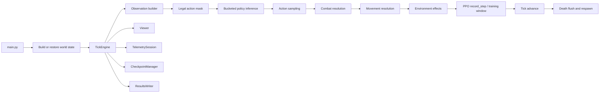
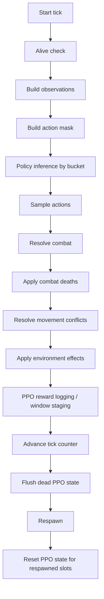
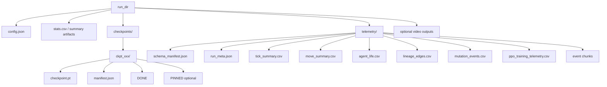

# Neural-Abyss

**Technical Monograph for a Tensorized Multi-Agent Grid Simulation Runtime with Per-Slot Learning, Viewer Instrumentation, Resumable Execution, and Telemetry**

---

## Abstract

`Neural-Abyss` is a repository-scale system for running, observing, resuming, and optionally training a discrete-time, grid-based, multi-agent combat simulation. The implementation couples a tensorized world state, a dense slot-oriented agent registry, engineered local observations, per-agent neural policies, an optional per-slot Proximal Policy Optimization (PPO) runtime, a Pygame viewer, resumable checkpoints, background result writing, and structured telemetry. The resulting system is not merely a model collection and not merely a simulator. It is an operational runtime in which simulation mechanics, online learning, developer inspection, persistence, and post-run analysis are designed to coexist within one executable environment.

This document is a repository-grounded technical monograph for that environment. Its purpose is to explain the implementation from first principles through subsystem detail while maintaining a strict distinction between three categories of statement. **Implementation** refers to behavior directly evidenced by the code. **Theory** refers to mathematical or systems concepts that clarify what the implementation is doing. **Inference** refers to conservative interpretation of likely design intent when the code suggests a rationale but does not formally state one. The code dump remains the authority for implementation claims; external sources are used only to explain relevant reinforcement-learning and PyTorch concepts, not to overwrite the repository’s actual behavior.

---

## Reader Orientation

### Intended reader

This monograph is written for a technically ambitious reader who may not know this repository but wants to understand it at an expert engineering level. It assumes comfort with Python and general machine-learning vocabulary but does not assume prior familiarity with this codebase, PPO, vectorized tensor simulation, or the repository’s internal terminology.

### Scope

The document covers:

- repository identity and system-level framing
- source-tree cartography
- world representation and tick semantics
- agent storage, observations, action masking, and policy inference
- the MLP brain family and ensemble inference path
- the optional per-slot PPO runtime
- viewer and inspection workflow
- checkpointing, telemetry, result persistence, and resume behavior
- operational modes such as UI, headless, and inspector/no-output
- design decisions, trade-offs, limitations, and extension points

### Non-claims

The document does **not** claim:

- empirical performance superiority
- experiment results
- scaling guarantees
- reproducibility beyond what the code actually preserves
- correctness proofs not encoded in the implementation
- external validation, peer review, or institutional endorsement

### Evidence discipline used throughout

To keep the narrative disciplined, the following labels are used conceptually even when not repeated on every paragraph:

- **Implementation:** directly evidenced from repository files, classes, functions, constants, environment variables, comments, control flow, or artifact names.
- **Theory:** standard background concepts such as PPO clipping, advantage estimation, actor–critic structure, partial observability, and PyTorch function transforms.
- **Inference:** cautious interpretation of why a design may have been chosen, when that motive is not explicitly asserted by the code.

### Repository naming note

The implementation tree is physically organized under the package path `Infinite_War_Simulation/`, and the runtime also exposes the UI title string `Neural Siege` in some places. This monograph uses **`Neural-Abyss`** as the repository-level title because that is the intended repository identity for the document, while referring to concrete implementation paths exactly as they appear in code.

---

## Executive System View

At a high level, `Neural-Abyss` can be understood as a loop over **ticks**. During each tick, the engine identifies alive agents, builds local observations, computes a legal-action mask, runs policy inference per architecture-compatible bucket, samples actions, resolves combat, resolves movement, applies environmental effects such as healing and metabolism, records PPO data when enabled, advances the simulation clock, flushes dead-agent learning state, and respawns new agents into vacated slots. Around that core loop, the repository layers operational systems for UI rendering, manual inspection, periodic and on-demand checkpointing, background result writing, telemetry sidecars, and resume-in-place continuity.



> **Figure 1.** Repository-level control flow. The diagram emphasizes that the engine is only one part of the system. Operational subsystems attach to the same runtime rather than existing as external afterthoughts.

A second perspective is data-oriented rather than control-oriented. The simulation state is primarily stored in tensors:

- a **grid tensor** with channels for occupancy, HP, and slot ID
- a dense **agent registry tensor** with columns such as alive, team, position, HP, unit type, and vision
- Python-side lists and mappings for **brain modules** and auxiliary metadata
- optional PPO buffers, optimizer state, scheduler state, and cached value estimates
- output artifacts in results, telemetry, and checkpoint directories

That combination reveals the repository’s computational worldview: a live simulation is treated as an evolving tensor program with a relatively small number of explicit Python orchestration layers around it.

---

## Motivation and Design Thesis

### Problem space

The repository addresses a compound problem rather than a single narrow task. It provides machinery for:

1. simulating a populated two-team combat world on a grid,
2. equipping agents with learnable neural policies,
3. optionally training those policies online during simulation,
4. making the runtime inspectable by humans during execution,
5. preserving long-running progress through checkpoints and append-safe results,
6. producing observability artifacts detailed enough for lineage and behavioral analysis.

A standalone learner would solve only a subset of that problem. A standalone simulator without learning would solve a different subset. `Neural-Abyss` instead treats simulation, learning, inspection, and operational continuity as one integrated engineering object.

### Why a simulation runtime instead of only an offline learner?

**Implementation:** The repository contains a full `TickEngine`, grid/map generation, spawning, respawn control, movement and combat resolution, a viewer, checkpointing, result persistence, telemetry, and an optional PPO runtime. This is direct evidence that the project’s subject is the operational runtime, not just the policy class.

**Inference:** Such a design likely exists because the interesting questions are not only “can a policy be optimized?” but also:

- how does behavior unfold in a structured world over long horizons?
- how do learning, mutation, and respawn interact?
- how can an operator pause, inspect, checkpoint, and resume the same evolving system?
- how can one maintain observability without stopping the simulation?

### Design thesis

The repository appears to embody four recurring design commitments.

#### 1. Dense state over object-heavy state

The core world and registry are tensorized. That favors vectorized operations, GPU compatibility, and easier batching of observation and action logic.

#### 2. Slot-local individuality over shared-policy homogeneity

The PPO runtime is explicitly per-slot and non-sharing. Brains are attached to slots, resets occur on respawn, and even inference batching preserves separate parameter sets. That indicates a deliberate preference for heterogeneity and local behavioral divergence, despite higher cost.

#### 3. Fail-fast schema discipline over permissive ambiguity

Observation dimensions, action shapes, checkpoint formats, schema manifests, and many config assumptions are checked aggressively. The code repeatedly chooses runtime errors over silent mismatch.

#### 4. Operational tooling as a first-class concern

Viewer interaction, checkpoint continuity, background writers, telemetry sidecars, manual checkpoint triggers, and no-output inspection mode are all repository-level features. This is not a research prototype that only optimizes once and exits; it is built to be watched, paused, resumed, and audited.

---

## Codebase Cartography

### Source-tree overview

The uploaded evidence base contains 36 Python files. The largest concentration of complexity sits in `utils/telemetry.py`, `ui/viewer.py`, `rl/ppo_runtime.py`, `engine/tick.py`, `engine/respawn.py`, `config.py`, and `main.py`. The repository is therefore not architecturally thin. It distributes complexity across simulation logic, runtime operations, and observability.

### Major modules

| Module area | Primary purpose |
|---|---|
| `main.py` | Program entrypoint, fresh-start vs resume flow, results directory management, telemetry attachment, UI vs headless dispatch, graceful shutdown |
| `config.py` | Environment-variable parsing, derived constants, validation, runtime profiles, central schema and feature flags |
| `engine/` | World model, registry, map generation, spawning, respawn, tick semantics, movement masking, ray casting |
| `agent/` | Observation schema helpers, MLP brain family, ensemble inference over heterogeneous model buckets |
| `rl/ppo_runtime.py` | Optional per-slot PPO data collection and training runtime |
| `ui/` | Camera, viewer, side panel, overlays, selection, hotkeys, runtime inspection |
| `utils/checkpointing.py` | Atomic checkpoint save/load, RNG preservation, brain reconstruction, periodic/manual trigger logic |
| `utils/persistence.py` | Background writer process for results files |
| `utils/telemetry.py` | Structured telemetry, schema manifests, lineage edges, mutation events, tick summaries, training diagnostics |
| `recorder/` | Frame/video recording helpers and schemas |
| `simulation/stats.py` | Simulation statistics accumulation and summary handling |
| `benchmark_ticks.py` | Throughput micro-benchmark utility |
| `lineage_tree.py` | Downstream lineage visualization utility |

### Entrypoints and lifecycle

The practical entrypoint is `main.py`. Its top-level orchestration performs the following high-level sequence:

1. resolve whether a checkpoint path has been supplied,
2. either construct a fresh world and spawn agents or reconstruct containers and apply a loaded checkpoint,
3. instantiate the `TickEngine`,
4. optionally restore runtime state from checkpoint,
5. set up results writing,
6. create a checkpoint manager under `run_dir/checkpoints/`,
7. create and attach a telemetry session,
8. optionally patch in frame recording and UI score tracking,
9. expose a shutdown flag,
10. enter either `Viewer.run(...)` or a headless loop,
11. flush remaining runtime state, telemetry, results, and optional on-exit checkpoint.

### Dependency surface inferred from imports

The code directly imports and depends on at least the following implementation surface:

- Python standard library modules such as `os`, `time`, `json`, `math`, `random`, `argparse`, `shutil`, `signal`, `tempfile`, `multiprocessing`, and `pathlib`
- `torch`, `torch.nn`, `torch.nn.functional`, `torch.optim`, `torch.optim.lr_scheduler`
- optional `torch.func` transforms such as `functional_call`, `vmap`, and `stack_module_state`
- `numpy`
- `pygame`
- recorder/video packages implied by `recorder/video_writer.py`
- plotting/analysis utilities in `lineage_tree.py` (the exact plotting package is downstream and not central to runtime discussion)

The repository therefore spans simulation, learning, rendering, persistence, and analytics rather than depending on a single framework axis.

---

## Canonical Terminology

The codebase uses a number of terms that are similar but not interchangeable.

| Term | Repository meaning |
|---|---|
| **tick** | One complete discrete update of the simulation world |
| **step** | Context dependent; often a tick, but in PPO code may also refer to one `record_step` event or window bookkeeping |
| **slot** | A stable storage position in the registry; a slot can host different individuals across time after death and respawn |
| **agent ID / UID** | Persistent individual identifier, separate from slot index; stored in a side tensor because the main registry tensor is float-based |
| **registry** | The dense slot-oriented store of per-agent attributes and attached brain modules |
| **grid** | The world tensor storing occupancy-like channels over space |
| **brain** | A neural actor–critic module attached to one slot |
| **brain kind** | A string identifier naming one architecture family, such as `whispering_abyss` |
| **bucket** | A group of alive slots whose brains share a compatible architecture and can be inferred together |
| **observation** | The flat feature vector passed into a brain; by default 283 dimensions |
| **ray token** | The learned summary of 32 ray feature vectors |
| **rich token** | The learned summary of the 27-dimensional non-ray feature tail |
| **action mask** | Boolean legality mask over the discrete action space |
| **checkpoint** | Atomic snapshot directory with `checkpoint.pt`, `manifest.json`, completion markers, and retention logic |
| **resume continuity** | Reusing the original run directory and append-safe output streams when resuming from a checkpoint |
| **telemetry** | Structured sidecar logging separate from the simpler background results writer |
| **inspector / no-output mode** | Viewer mode that restores runtime state without creating results, telemetry, or checkpoints |

---

## Mathematical and Conceptual Foundations

### 1. Agent–environment interaction

A useful formalization is a partially observed, discrete-time, multi-agent environment. Let:

- \(t \in \mathbb{N}\) denote the tick index,
- \(s_t\) denote the full simulator state at tick \(t\),
- \(o_t^i\) denote the observation visible to agent slot \(i\),
- \(a_t^i\) denote the discrete action chosen for that slot,
- \(r_t^i\) denote the reward used by PPO when enabled.

The simulator evolves according to an environment transition rule

\[
s_{t+1} = T(s_t, a_t^1, a_t^2, \dots, a_t^N),
\]

but the code does not expose full state to the agent policy. Instead it constructs engineered observations from local rays and compact scalar context. From the policy’s perspective, the environment is therefore better modeled as **partially observed** than as a fully observed MDP.

### 2. Engineered observation as a structured compression

The default observation dimension is

\[
\text{OBS\_DIM} = 32 \times 8 + (23 + 4) = 283.
\]

**Implementation:** `config.py` defines `RAY_TOKEN_COUNT = 32`, `RAY_FEAT_DIM = 8`, `RICH_BASE_DIM = 23`, and `INSTINCT_DIM = 4`, with `OBS_DIM = RAYS_FLAT_DIM + RICH_TOTAL_DIM`. `agent/obs_spec.py` enforces this layout. `agent/mlp_brain.py` validates the same contract.

The brain family then forms two learned tokens:

- a ray-summary token from the 32 ray feature vectors,
- a rich token from the 27-dimensional non-ray tail.

In equations, if \(x_{t,r}^i \in \mathbb{R}^8\) is the feature vector for ray \(r\) and \(z_t^i \in \mathbb{R}^{27}\) is the non-ray tail, then the default MLP family uses

\[
e_{t,r}^i = W_{ray}\,\mathrm{LN}(x_{t,r}^i),
\]

\[
\bar{e}_t^i = \frac{1}{32} \sum_{r=1}^{32} e_{t,r}^i,
\]

\[
u_t^i = W_{rich}\,\mathrm{LN}(z_t^i),
\]

\[
h_t^i = \mathrm{LN}([\bar{e}_t^i ; u_t^i]).
\]

That final vector \(h_t^i\) is then processed by the chosen architecture-specific trunk.

### 3. Discrete masked policy over actions

The action space is discrete with default cardinality 41.

**Implementation:** `config.py` defines `NUM_ACTIONS = 41`. `engine/game/move_mask.py` documents two layouts: a smaller legacy layout up to 17 actions and the repository’s default 41-action layout:

- index 0: idle
- indices 1–8: movement in 8 directions
- indices 9–40: directional attacks arranged as 8 direction blocks × 4 ranges

If \(\ell_t^i \in \mathbb{R}^A\) denotes raw logits from the actor head and \(m_t^i \in \{0,1\}^A\) is the legality mask, then a common masked-policy interpretation is

\[
\tilde{\ell}_t^i(a) =
\begin{cases}
\ell_t^i(a), & m_t^i(a)=1 \\
-\infty, & m_t^i(a)=0
\end{cases}
\]

followed by a categorical distribution

\[
\pi_\theta(a \mid o_t^i) = \mathrm{softmax}(\tilde{\ell}_t^i).
\]

The exact sampling code is in the engine rather than in the brain module, but this mathematical interpretation matches the documented action-mask semantics and the actor-logit interface.

### 4. Actor–critic decomposition

The brain outputs two objects for each batch element:

- policy logits over actions,
- a scalar value estimate.

If \(f_\theta\) denotes the shared representation and trunk, the output structure is

\[
\ell_t^i = W_\pi f_\theta(o_t^i), \qquad
V_\phi(o_t^i) = W_V f_\theta(o_t^i).
\]

This is the standard actor–critic pattern: one head proposes actions, another estimates expected return.

### 5. PPO objective and clipping rationale

**Theory:** PPO commonly optimizes the clipped surrogate objective introduced by Schulman et al. (2017). Given importance ratio

\[
r_t(\theta) = \frac{\pi_\theta(a_t \mid o_t)}{\pi_{\theta_{old}}(a_t \mid o_t)},
\]

and an advantage estimate \(\hat{A}_t\), the clipped policy loss uses

\[
L^{CLIP}(\theta) =
\mathbb{E}\left[
\min\left(
r_t(\theta)\hat{A}_t,
\mathrm{clip}(r_t(\theta), 1-\epsilon, 1+\epsilon)\hat{A}_t
\right)
\right].
\]

The clipping discourages very large policy changes within one update window while preserving the simplicity of first-order optimization. The repository’s PPO runtime comments explicitly describe clipped policy objective, clipped value loss, entropy bonus, minibatches, gradient clipping, optional KL-based early stopping, and GAE.

### 6. GAE for advantage estimation

**Theory:** Generalized Advantage Estimation (GAE) constructs a lower-variance, biased estimator of advantage by exponentially weighting temporal-difference residuals. If

\[
\delta_t = r_t + \gamma V(o_{t+1}) - V(o_t),
\]

then one common form is

\[
\hat{A}_t^{GAE} = \sum_{l=0}^{\infty} (\gamma \lambda)^l \delta_{t+l}.
\]

The repository’s PPO runtime explicitly advertises GAE. This matters because the environment is on-policy and windowed; variance reduction is especially useful when each slot trains on relatively local data.

### 7. Vectorized inference over independent parameter sets

A subtle but important theory-to-implementation bridge concerns `torch.func.vmap`. The repository does **not** share one policy across all agents. Instead it maintains **independent models** but still attempts to infer compatible subsets in a batched way. The `torch.func` path works conceptually by treating a module as a pure function over explicit parameter and buffer dictionaries, stacking those parameter sets, and then mapping one per agent. PyTorch’s official `torch.func.vmap` and `functional_call` documentation describes exactly this family of transforms. The repository leverages them for inference only, not for shared optimization.

### 8. Event ordering in discrete simulations

Because the world updates in ticks, ordering becomes part of semantics. If combat occurs before movement, a unit can be killed before it has a chance to relocate. If movement occurred first, the same world state could produce a different survivor set and thus different downstream rewards, telemetry, and respawn. `Neural-Abyss` therefore has a meaningful **operational semantics**, not just a bag of mechanics. This matters when interpreting behavior, fairness, and training targets.

---

## Simulation Engine

### Structural role of `TickEngine`

`engine/tick.py` is the center of the repository’s runtime semantics. It binds together the registry, the grid, statistics, zones, respawn control, optional PPO runtime, scratch buffers, action masking, observation construction, combat, movement, environmental effects, telemetry hooks, and respawn.

### World state representation

#### Grid tensor

**Implementation:** `engine/grid.py` defines a grid tensor of shape `(3, H, W)`.

- Channel 0 stores occupancy-like categorical state:
  - `0.0` empty
  - `1.0` wall
  - `2.0` red occupant
  - `3.0` blue occupant
- Channel 1 stores HP
- Channel 2 stores slot ID, with `-1` used as an empty sentinel

This is a compact world representation. It permits direct tensor indexing for occupancy checks, HP synchronization, and fast picking in the viewer.

#### Agent registry tensor

**Implementation:** `engine/agent_registry.py` defines a dense per-slot matrix `agent_data` with ten core columns:

- alive
- team
- x
- y
- HP
- unit
- max HP
- vision
- attack
- agent ID

The registry also stores a separate `agent_uids` tensor because the main data matrix is float-based and is not suitable for long-lived unique identifiers under all numeric modes. This is a telling design choice: the repository favors dense contiguous numeric storage, then compensates for the limitations of that choice where necessary.

### Tick semantics

The engine comments and control flow establish the following approximate high-level order.



> **Figure 2.** Tick-level update ordering. This order is semantically important: changing it would change both world evolution and learning targets.

### Fast-path when everyone is dead

**Implementation:** The engine has a specific branch for the case in which no agents are alive. In that branch, it can skip ordinary observation/action logic, advance appropriate bookkeeping, respawn, and reset PPO state for newly occupied slots. This prevents unnecessary inference work on empty populations.

### Observation pipeline inside the engine

The engine constructs observations for alive agents. The final shape is asserted as `(N_alive, OBS_DIM)`.

**Implementation highlights:**

- rays are produced through the ray-engine helpers, especially `engine.ray_engine.raycast_firsthit`
- the ray block is expected to have `32 * 8 = 256` dimensions
- the rich tail contributes the remaining 27 dimensions
- the code allocates and reuses scratch tensors for performance
- observation correctness is guarded by explicit runtime shape checks

The engine therefore treats the observation vector as an externally visible contract, not as an incidental byproduct.

### Action legality and masked decision-making

The engine invokes `build_mask(...)` from `engine/game/move_mask.py` before sampling actions. That mask determines what the actor is allowed to do from the current state.

#### Movement legality

Movement actions are legal only if the neighboring target cell is in bounds and empty. The mask builder computes candidate neighbor coordinates for all eight directions and checks occupancy channel 0 of the grid.

#### Attack legality

For the 41-action layout, attack legality depends on:

- whether an enemy is present in the target cell,
- whether the target is in bounds,
- whether the attacker’s unit type allows that range.

Soldiers are limited to range 1. Archers may attack through ranges 1 through `ARCHER_RANGE`, clipped to 4 in this action layout.

#### Line-of-sight caveat

**Implementation caveat:** `move_mask.py` defines `_los_blocked_by_walls_grid0(occ0, x0, y0, dxy, RMAX)` with a documented expectation that `occ0` is the full occupancy grid channel of shape `(H, W)`. However, in `build_mask(...)`, the LOS helper is called with `occ`, which at that point is the local neighbor occupancy tensor of shape `(N, 8)`, not the full occupancy plane. The signature and the call site do not agree. This is not a theoretical concern but a direct code-level inconsistency. The monograph therefore treats wall-blocked LOS as **intended behavior** by documentation, while also noting that the current helper wiring appears inconsistent and deserves audit.

### Bucketed policy inference

The engine does not necessarily run one giant policy batch across all alive agents. Instead it asks the registry to build **buckets** of slots whose brains are architecture-compatible. For each bucket, inference is run together.

This choice matters because the repository simultaneously wants:

- independent per-slot models,
- architecture diversity across slots,
- efficient inference where possible.

Buckets are the compromise mechanism that makes those requirements coexist.

### Combat resolution

**Implementation:** Combat occurs before movement. Damage is aggregated by victim, kill credit is resolved deterministically, and death is applied before any move phase.

Important features visible in code comments and flow:

- focus-fire damage aggregation by victim
- deterministic kill-credit assignment:
  - highest same-tick damage wins
  - ties are broken by smallest attacker slot ID
- optional line-of-sight considerations for archers
- immediate synchronization of grid HP after registry HP changes
- optional dense shaping rewards for damage dealt/taken when PPO is enabled
- telemetry phases explicitly mark combat substeps

This indicates a deliberate preference for deterministic resolution inside each tick, even when policy sampling itself is stochastic.

### Death application

The engine applies deaths after combat and again after environmental effects where needed. Telemetry is emitted after relevant state mutation so that logs reflect committed state rather than merely proposed changes.

### Movement resolution

Movement is not simply “every valid move succeeds.” The engine uses conflict-resolution logic over candidate destinations.

**Implementation:** `engine/tick.py` preallocates move-conflict buffers. The comments and control flow indicate the following policy:

- agents propose moves into target cells,
- destinations are flattened to keys,
- claimants to the same cell are compared,
- the highest-HP claimant wins,
- if claimants tie at the maximal HP, nobody moves into that cell.

This is a meaningful game mechanic because it couples movement outcome to instantaneous health, not just occupancy.

### Environmental effects

After movement, the engine applies environmental mechanics such as:

- metabolism / HP drain if enabled,
- heal-zone recovery,
- capture-point scoring.

**Implementation:** `config.py` exposes `HEAL_RATE`, metabolism toggles and per-unit drain rates, capture-point count/size/reward, and related reward-shaping knobs. The engine comments mention healing recovery shaping and contested capture-point reward paths.

This ordering means that a move into a healing or control zone can matter within the same tick’s environmental phase.

### Respawn integration

At the end of the tick, dead units are flushed from PPO state, the respawn controller is stepped, telemetry ingests spawn metadata, and PPO state is reset for newly respawned slots. This is important: respawn is not an external script. It is part of the engine’s canonical lifecycle.

### Invariants and defensive checks

The engine repeatedly checks shape contracts, observation dimensions, action ranges, mask compatibility, and post-respawn state. This is consistent with the broader repository philosophy that silent drift is more dangerous than abrupt failure.

---

## Agent Intelligence Stack

### Observation specification and schema authority

`agent/obs_spec.py` centralizes observation parsing and semantic grouping.

#### Flat split

The canonical split is:

\[
o = [\text{rays\_flat} \mid \text{rich\_base} \mid \text{instinct}].
\]

With defaults:

- `rays_flat`: 256 dimensions
- `rich_base`: 23 dimensions
- `instinct`: 4 dimensions

This helper layer is significant because it prevents each model variant from re-implementing slicing logic independently.

#### Semantic token groups

`build_semantic_tokens(...)` can materialize semantically grouped slices of `rich_base`:

- `own_context`
- `world_context`
- `zone_context`
- `team_context`
- `combat_context`
- `instinct_context`

The current MLP family does not directly use those multiple semantic tokens as separate inputs; instead it uses one combined rich token. However, the existence of the grouping API indicates that the repository has been designed with observation schema extensibility in mind.

### Brain family architecture

The active neural policy family lives in `agent/mlp_brain.py`. Every variant obeys the same external contract:

- input: batch of observations shaped `(B, OBS_DIM)`
- output: action logits `(B, act_dim)` and values `(B, 1)`

#### Shared preprocessing

All variants first convert the observation into a common two-token representation.

1. reshape the 256-dimensional ray block into `(B, 32, 8)`,
2. layer-normalize each ray feature vector,
3. project each ray feature vector into a learned width \(D\),
4. mean-pool across the 32 rays to obtain one ray token,
5. layer-normalize and project the 27-dimensional rich vector into one rich token,
6. concatenate the two tokens,
7. apply a final normalization.

With default `BRAIN_MLP_D_MODEL = 32`, the final flat shared input width is

\[
2D = 64.
\]

This design has several implications.

**Implementation:** All five MLP variants receive exactly the same input semantics and differ only in trunk shape.

**Inference:** The repository appears to value fair comparison across architectures. By fixing the tokenization path and varying only the trunk, it becomes easier to attribute behavioral differences to architectural variation rather than to hidden preprocessing changes.

### The five concrete variants

#### 1. Whispering Abyss

Shape: `64 -> 96 -> 96 -> heads`

This is the simplest compact baseline. It uses two plain GELU feedforward layers before actor and critic heads.

#### 2. Veil of Echoes

Shape: `64 -> 128 -> 96 -> 64 -> heads`

This variant widens first, then narrows. It is deeper than the previous one and may encourage staged compression before the heads.

#### 3. Cathedral of Ash

Shape: `64 -> 80 -> residual block × 3 -> heads`

This variant introduces a fixed-width residual stack. Residual connections preserve an identity path and can stabilize deeper refinement.

#### 4. Dreamer in Black Fog

Shape: `64 -> 80 -> gated block × 2 -> heads`

This variant uses gated residual transformations. The gate branch modulates the value branch, providing a learned feature-selection effect without full attention machinery.

#### 5. Obsidian Pulse

Shape: `64 -> 128 -> bottleneck residual block × 2 -> heads`

This variant keeps a larger outer width while compressing through a smaller inner bottleneck. It trades some expressivity for potentially lower inner-path cost.

### Initialization and numerical discipline

The brain family uses orthogonal initialization:

- hidden layers: gain \(\sqrt{2}\)
- actor head: small configurable gain, default 0.01
- critic head: gain 1.0

This is consistent with common PPO practice, where modest initial actor logits help avoid prematurely overconfident policies.

The code also performs normalization in `float()` before casting back where needed, which reflects care around numerical stability in mixed-precision or heterogeneous-dtype contexts.

### Ensemble inference over independent models

`agent/ensemble.py` provides a public `ensemble_forward(models, obs)` interface that returns a dist-like object exposing `.logits` and a value vector.

Two execution strategies exist.

#### Safe loop path

The canonical fallback iterates model-by-model, feeding each aligned observation to its corresponding network and concatenating outputs. It is reliability-oriented and does not require `torch.func`.

#### `torch.func` / `vmap` path

When enabled and when a bucket is large enough, the repository attempts a vectorized inference path:

1. stack parameters and buffers across the models in the bucket,
2. treat the first model as a structural template,
3. call `functional_call(base, (params_i, buffers_i), ...)`,
4. `vmap` that pure function over all independent parameter sets and aligned observations.

This is a sophisticated middle ground. The repository does **not** collapse to one shared model, but it still tries to recover some batched efficiency.

#### Cached stacked-state reuse

The expensive stacked-state construction is cached using a key built from:

- device identity,
- ordered model object identities,
- parameter/buffer freshness tokens including tensor version counters.

This is important because optimizer steps, `load_state_dict`, or buffer changes naturally invalidate the cache without requiring manual user intervention.

#### Reliability-first fallback

If `torch.func` is unavailable, if a bucket contains TorchScript modules, or if the vectorized call fails, the code falls back safely to the loop path. Performance is treated as optional; correctness is treated as mandatory.

---

## Learning Runtime

### Optionality and repository framing

The PPO subsystem is significant but not all-defining. The package comment in `rl/__init__.py` explicitly states that the live simulation can run without RL components. This matters for repository framing: the runtime is broader than its training logic.

### Per-slot, no-sharing design

`rl/ppo_runtime.py` labels itself as a **Per-Agent PPO Runtime (No Parameter Sharing, Slot-Local Optimizers)**. This is one of the repository’s most consequential architectural choices.

Each slot has:

- its own model parameters,
- its own optimizer,
- its own learning-rate scheduler,
- its own rollout buffer,
- its own lifecycle resets on respawn.

This design rejects a “hive mind” architecture.

**What it enables:**

- divergent individual policies,
- localized adaptation,
- easier genealogical interpretation of cloned/mutated descendants,
- explicit separation between individuals in the same team.

**What it costs:**

- much higher memory consumption than shared-policy training,
- more optimizer state,
- more complicated batched training logic,
- more expensive checkpoint payloads,
- potentially slower overall learning throughput.

### PPO windowing

The runtime collects trajectories and trains on windows of fixed size, controlled by `PPO_WINDOW_TICKS` (default 64). Each `record_step(...)` contributes one aligned transition set for the participating slots. When a window boundary is reached, the runtime can prepare returns and advantages, then train each slot or compatible slot group.

### Buffer contents

The per-slot buffer stores at least the usual PPO ingredients:

- observations
- actions
- log-probabilities
- value estimates
- rewards
- done flags
- action masks
- optional bootstrap-related state

This is evidence that the implementation is a real online PPO collector, not merely a placeholder trainer.

### Loss structure

The runtime comments and function structure indicate the following ingredients:

- clipped policy surrogate loss
- clipped value loss
- entropy regularization
- minibatch updates
- gradient clipping
- optional KL-based early stopping
- GAE
- cosine annealing learning-rate scheduler

### Mathematical view

If one suppresses slot indices for clarity, the policy component follows standard PPO:

\[
L_\pi(\theta) =
-\mathbb{E}\left[
\min\left(
r_t(\theta)\hat{A}_t,\;
\mathrm{clip}(r_t(\theta),1-\epsilon,1+\epsilon)\hat{A}_t
\right)
\right].
\]

A typical value loss term is

\[
L_V(\phi) = \mathbb{E}\left[(V_\phi(o_t) - \hat{R}_t)^2\right],
\]

with optional clipping depending on implementation detail. Entropy regularization adds a term of the form

\[
L_H = -\beta \, \mathbb{E}[\mathcal{H}(\pi(\cdot \mid o_t))].
\]

The total optimization target is then a weighted combination of policy, value, and entropy terms. The exact sign convention and clipping logic are implementation details, but the runtime comments explicitly describe the canonical PPO ingredients above.

### Window-boundary state and value caching

A notable engineering detail is the existence of slot-local value caches and pending boundary state. This suggests that the runtime is careful about avoiding extra inference passes for bootstrap values at the edge of windows. In a large multi-agent runtime, such details matter for both throughput and correctness.

### Respawn-aware learning resets

When a slot was dead and becomes alive again after respawn, the engine calls PPO reset helpers. This is one of the repository’s strongest signals that the learning unit is **the current individual occupying the slot**, not the slot container itself. Reusing an optimizer’s momentum state across genetically or behaviorally new individuals would contaminate the learning interpretation, so the code resets that state.

### Batched training without shared parameters

The runtime includes grouped/batched training helpers for compatible slots. This is conceptually parallel to the inference-bucketing strategy: preserve independent model states while opportunistically batching the mechanics of forward and backward computation where architecture compatibility permits it.

### Reward shaping and runtime pragmatics

The engine and PPO runtime jointly support various dense shaping paths, including damage dealt, damage taken, healing-related recovery, and capture-point incentives. This is a repository-level pragmatic design choice rather than a canonical PPO requirement. It reflects the reality that sparse terminal-only signals are often difficult in multi-agent combat worlds.

### Divergence between clean theory and operational implementation

Canonical PPO is often introduced as if one agent interacts with one environment trajectory. `Neural-Abyss` diverges from that textbook simplification in multiple ways:

- many slots operate simultaneously in one shared world,
- action masks vary per slot per tick,
- slots can die and later host new individuals,
- training windows may contain incomplete local trajectories,
- optional telemetry and viewer hooks run alongside learning,
- different slots can hold different architecture variants.

That divergence does not make the implementation unprincipled. It means the repository is an **operational PPO system embedded inside a complex simulator**, not a didactic PPO toy.

---

## Runtime Modes and Operational Flow

### Fresh start

A fresh run constructs a new grid, registry, statistics object, map walls, zones, and initial population. Spawn mode can be symmetric or uniform-random depending on `SPAWN_MODE`.

### Resume from checkpoint

When `FWS_CHECKPOINT_PATH` is provided, `main.py` loads the checkpoint, creates empty containers, reconstructs the `TickEngine`, applies loaded runtime state, verifies tick consistency, and then continues execution.

**Implementation:** resume restoration includes at least brains, world payload, stats, viewer state, respawn controller state, PPO runtime state, and RNG state.

### Resume-in-place output continuity

If `FWS_RESUME_OUTPUT_CONTINUITY=1` and `FWS_RESUME_FORCE_NEW_RUN=0`, the runtime reuses the original run directory inferred from the checkpoint path. The background results writer is opened in append mode, and strict CSV schema compatibility can be enforced with `FWS_RESUME_APPEND_STRICT_CSV_SCHEMA`.

This is an important operational feature. Resume does not have to create a disconnected second run folder; it can extend the lineage of the original run.

### UI mode

If `FWS_UI=1`, the repository launches the Pygame viewer.

The viewer can:

- pan and zoom the camera,
- inspect a selected agent,
- display unit colors and overlays,
- toggle rays, threat vision, HP bars, and brain labels,
- pause and single-step,
- change speed multiplier,
- save the selected brain’s weights,
- trigger a manual checkpoint with F9,
- toggle fullscreen.

The UI is therefore not a passive renderer. It acts as an operational console for the simulation.

### Headless mode

If UI is disabled, `main.py` runs a headless loop. Headless mode supports:

- periodic status printing at tick intervals,
- optional headless telemetry summary sidecars,
- periodic checkpoints,
- trigger-file-based checkpoint requests,
- graceful shutdown via signal handling.

The repository explicitly acknowledges that console I/O can bottleneck throughput, and config knobs exist to trade visibility against speed.

### Inspector / no-output mode

`FWS_INSPECTOR_MODE=ui_no_output` or the compatibility flag `FWS_INSPECTOR_UI_NO_OUTPUT=1` launches a special viewer mode that restores runtime state but does **not** create a results folder, writer, telemetry, or checkpoints.

This is a distinct operational mode with a clear purpose: inspect a checkpointed world state without polluting the artifact tree.

### Manual checkpoint trigger file

Both UI and headless flows support a filesystem trigger file, defaulting to `checkpoint.now` in the run directory. Creating that file during execution can request a checkpoint without directly interacting with the process.

### Benchmark mode

`benchmark_ticks.py` provides a dedicated micro-benchmark path for headless throughput. It warms up the engine, runs a specified number of ticks, synchronizes CUDA if needed, and reports mean, median, p95 tick duration, and ticks per second.

---

## Telemetry, Persistence, and Reproducibility

### Separation of persistence roles

The repository distinguishes between at least three output layers:

1. **Checkpointing** for durable full-state restore,
2. **ResultsWriter** for simpler run artifacts and append-safe summary streams,
3. **TelemetrySession** for structured, higher-granularity event and diagnostic sidecars.

This separation is architecturally meaningful. It prevents checkpoints from becoming the only source of truth for analysis and prevents telemetry from carrying the burden of deterministic restore.

### Background result writing

`utils/persistence.py` uses a background process for writing selected results artifacts. The design is explicitly Windows-aware and uses spawn-safe patterns. It avoids freezing the simulation on slow disk writes and may drop queued messages when backpressure becomes too high rather than stalling the runtime indefinitely.

This is a strong operational choice: the repository prefers survivable observability degradation over simulation deadlock.

### Checkpoint structure

`utils/checkpointing.py` defines an atomic checkpoint directory protocol:

- `checkpoint.pt`
- `manifest.json`
- `DONE`
- optional `PINNED`
- `latest.txt` in the enclosing checkpoint root

Checkpoint save follows a temporary-directory then rename pattern, which is the right general strategy for crash-safe checkpoint publication on one filesystem.

### What a checkpoint contains

The checkpoint payload includes at least:

- metadata such as tick and notes
- serialized brains with architecture kind and state dict
- world payload
- stats payload
- viewer state
- respawn-controller state
- PPO state if enabled
- RNG state for Python, NumPy, PyTorch CPU, and possibly CUDA

This is unusually comprehensive for a simulation project and is one reason the repository can support meaningful resume semantics.

### RNG preservation and deterministic resume

The checkpointing layer explicitly captures and restores:

- Python `random`
- NumPy RNG
- PyTorch CPU RNG
- PyTorch CUDA RNG where possible

It also documents that RNG should be restored **last** in the resume flow so that constructor-time randomness does not shift the resumed sequence. This is a correct and thoughtful detail.

### Telemetry directory contents

`utils/telemetry.py` manages a telemetry subtree under the run directory and names numerous sidecars, including:

- `agent_life.csv`
- `lineage_edges.csv`
- `schema_manifest.json`
- `run_meta.json`
- `agent_static.csv`
- `tick_summary.csv`
- `move_summary.csv`
- `counters.csv`
- `telemetry_summary.csv`
- `ppo_training_telemetry.csv`
- `mutation_events.csv`
- `dead_agents_log_detailed.csv`
- chunked event files

The telemetry layer therefore supports both coarse and fine-grained analysis.

### Schema manifest and resume compatibility

When starting a fresh run, the telemetry session writes a schema manifest. During resume-in-place, it can validate compatibility before appending. This is a valuable guardrail because silent schema drift across resumed segments can corrupt longitudinal analysis.

### Lineage and mutation observability

The telemetry session and `main.py` expose lineage-related fields such as:

- parent ID
- child ID
- spawn reason
- mutation flags
- rare mutation indicators
- mutation deltas for HP, attack, and vision

This confirms that the repository is designed for evolutionary or genealogical analysis in addition to short-horizon control metrics.

### Reproducibility limits

Despite strong checkpoint discipline, reproducibility remains bounded by real-world constraints.

- Viewer interaction changes runtime timing and may change execution paths if it triggers checkpoints or manual actions.
- Telemetry and background writing are best-effort operational systems, not pure mathematical observers.
- If hardware, torch build, CUDA device count, or nondeterministic kernels differ, post-resume trajectories may diverge.
- Config changes between save and load can invalidate assumptions even if some paths are validated.

The repository is therefore **resume-aware** and **reproducibility-conscious**, but not omnipotently deterministic in every environment permutation.

---

## Viewer and Human Inspection Workflow

### Purpose of the viewer

The viewer is not merely cosmetic. It is an active debugging and operational instrument. Its side panel exposes selected-agent details such as position, HP, attack, vision, brain information, and parameter count. Its legend and controls turn the simulation into something that can be interrogated while alive.

### Viewer controls

The code explicitly lists the following controls in the side panel:

- WASD / arrows: pan
- mouse wheel: zoom
- click agent: inspect
- space: pause
- `.` while paused: single-step
- `+` / `-`: speed multiplier
- `R`: toggle rays
- `T`: toggle threat vision
- `B`: toggle HP bars
- `N`: toggle brain labels
- `S`: save selected brain
- `F9`: manual checkpoint
- `F11`: fullscreen

This is a substantial inspection surface.

### Agent inspection model

The viewer maintains a selected slot ID, caches world-to-screen camera state, and uses cached CPU copies of grid ID channels and agent maps for fast picking. This is important because direct per-frame GPU-to-CPU reads for arbitrary interactive queries would be far more expensive.

### Pause and single-step

Pause and single-step are especially important in a simulation that combines combat, movement, environmental effects, and optional learning. They let an operator inspect temporal causality rather than only aggregate outcomes.

### Manual checkpointing from UI

Pressing F9 does not directly dump ad hoc state. It requests a checkpoint save and routes it through the same checkpoint manager used elsewhere. Viewer state such as camera offsets, zoom, pause state, speed multiplier, and score dictionary is included in the saved viewer payload.

### Viewer monkey-patching of PPO score tracking

The viewer patches `engine._ppo.record_step` to collect per-agent scores for display, while still calling the original method. This is a pragmatic UI-centric engineering choice. It avoids modifying the engine’s core learning API solely to support viewer overlays.

### Operational role

The viewer serves at least four concrete roles:

1. debugging mechanics,
2. inspecting learned or evolving policies,
3. performing manual intervention such as checkpoint saves,
4. validating that resume restored the expected live state.

---

## Design Decisions and Trade-offs

This section isolates major design choices that are directly evidenced by code and interprets their implications conservatively.

### 1. Discrete tick loop instead of continuous simulation

**Implementation:** The engine is named `TickEngine`; update order is explicit and stage-based.

**Why it may have been chosen:** Discrete ticks simplify event ordering, batched tensor computation, checkpoint serialization, and UI stepping.

**What it enables:** deterministic stage ordering, straightforward instrumentation, clear action cadence.

**What it costs:** finer-grained continuous interactions are approximated by stepwise updates; ordering artifacts become part of semantics.

### 2. Grid world instead of continuous geometry

**Implementation:** world state is `(3, H, W)`; movement is directional cell-to-cell; ray features operate over grid topology.

**Why it may have been chosen:** grids simplify occupancy, ray casting, conflict resolution, and rendering.

**What it enables:** cheap indexing, simple masks, interpretable spatial structure, direct viewer mapping.

**What it costs:** geometric fidelity, smooth motion, and more realistic continuous-range interactions.

### 3. Dense tensor registry instead of Python object-per-agent

**Implementation:** `agent_data` stores per-slot attributes in a fixed-column tensor.

**Why it may have been chosen:** tensor operations scale better and are easier to batch than Python object graphs.

**What it enables:** vectorized alive masks, team counts, observation construction, and conflict resolution.

**What it costs:** schema rigidity, less self-documenting per-agent state, occasional need for companion structures such as `agent_uids`.

### 4. Slot-local policies instead of parameter sharing

**Implementation:** PPO runtime explicitly states no parameter sharing and slot-local optimizers.

**Why it may have been chosen:** to preserve individual differentiation, allow lineage-style inheritance, and avoid shared-policy homogenization.

**What it enables:** heterogeneous behavior and more meaningful clone/mutation narratives.

**What it costs:** heavy memory and optimizer overhead, more complicated batching, slower scaling.

### 5. Bucketed compatible inference instead of fully independent loops or fully shared batch

**Implementation:** registry builds buckets; ensemble inference may use `vmap` over compatible models.

**Why it may have been chosen:** to regain some batched efficiency without abandoning independent parameters.

**What it enables:** a middle path between heterogeneity and throughput.

**What it costs:** additional complexity around cache validity, architecture compatibility, and fallback logic.

### 6. Two-token MLP input instead of feeding the raw flat vector directly

**Implementation:** all MLP variants transform rays into one summary token and rich features into one rich token.

**Why it may have been chosen:** to preserve some observation structure without introducing full attention-based models.

**What it enables:** a controlled, comparable input interface across variants.

**What it costs:** the 32 rays are mean-pooled, so directional nuance is compressed before the trunk; richer token-to-token interactions are unavailable at that stage.

### 7. Combat before movement

**Implementation:** tick comments and flow place combat resolution ahead of movement.

**Why it may have been chosen:** to make threat zones immediate and to avoid “escape after being targeted” semantics within the same tick.

**What it enables:** consistent kill-credit assignment and a more aggressive tactical dynamic.

**What it costs:** moving out of danger cannot rescue an agent once the tick’s combat phase begins.

### 8. HP-based move conflict resolution

**Implementation:** among claimants to a destination, max HP wins; max-HP ties cancel the move.

**Why it may have been chosen:** to impose a deterministic and interpretable priority rule without adding more random tie-breaking noise.

**What it enables:** stronger agents control space more effectively.

**What it costs:** movement outcome becomes partially dependent on combat state, which can reinforce snowball dynamics.

### 9. Rich telemetry and append-safe continuity

**Implementation:** telemetry manifests, lineage edges, mutation events, headless summaries, training diagnostics, append-safe resume.

**Why it may have been chosen:** long runs are hard to understand without structured observability.

**What it enables:** post-run forensics, lineage studies, schema-aware resumed analysis.

**What it costs:** implementation size, I/O overhead, more failure modes to guard against.

### 10. Viewer coupling to live runtime

**Implementation:** viewer receives engine, registry, stats, optional run directory, and can trigger checkpoints.

**Why it may have been chosen:** operator convenience and immediate inspection.

**What it enables:** rich interactive debugging.

**What it costs:** UI code becomes a semantically meaningful participant rather than a purely external consumer.

### 11. Atomic directory checkpoints with markers

**Implementation:** temp directory, atomic write, `DONE`, `latest.txt`, optional `PINNED`.

**Why it may have been chosen:** robust crash resilience and understandable manual inspection.

**What it enables:** safer long-run interruption and resume flows.

**What it costs:** more filesystem complexity than a single monolithic file.

### 12. Respawn into reused slots with PPO reset

**Implementation:** respawn reoccupies dead slots; PPO state is reset for those slots.

**Why it may have been chosen:** fixed slot capacity simplifies tensors and buffers.

**What it enables:** bounded memory footprint despite long genealogies.

**What it costs:** slot identity and individual identity must be kept distinct, which complicates reasoning and logging.

---

## How to Run, Inspect, Resume, and Extend

### Minimal fresh run

A defensible minimal launch is:

```bash
python main.py
```

This uses the defaults from `config.py`, including UI enabled by default.

### Fresh headless run

On PowerShell:

```powershell
$env:FWS_UI = "0"
python .\main.py
```

On a POSIX shell:

```bash
FWS_UI=0 python main.py
```

### Resume from checkpoint

The checkpoint path is supplied through `FWS_CHECKPOINT_PATH`.

PowerShell example:

```powershell
$env:FWS_CHECKPOINT_PATH = "results\sim_...\checkpoints\ckpt_t...."
$env:FWS_RESUME_OUTPUT_CONTINUITY = "1"
python .\main.py
```

This requests resume and, by default, reuse of the original run directory for append-safe continuity.

### Force a new run directory on resume

```powershell
$env:FWS_CHECKPOINT_PATH = "results\sim_...\checkpoints\ckpt_t...."
$env:FWS_RESUME_FORCE_NEW_RUN = "1"
python .\main.py
```

This restores state from the checkpoint but writes into a new results folder.

### Inspector / no-output UI restore

```powershell
$env:FWS_UI = "1"
$env:FWS_INSPECTOR_MODE = "ui_no_output"
$env:FWS_CHECKPOINT_PATH = "results\sim_...\checkpoints\ckpt_t...."
python .\main.py
```

This is the cleanest repository-supported way to inspect a saved runtime state without emitting new run artifacts.

### Manual checkpoint trigger from filesystem

During a running job with a live run directory, create the file named by `FWS_CHECKPOINT_TRIGGER_FILE` (default `checkpoint.now`) inside the run directory. The headless loop and viewer paths contain logic that can detect this request and save a checkpoint.

### Benchmarking

```bash
python benchmark_ticks.py --ticks 500 --warmup 50
```

### Important runtime knobs

A full environment-variable catalog would be too long to inline completely because `config.py` is extensive, but the most operationally important knobs include:

| Variable | Purpose |
|---|---|
| `FWS_UI` | UI on/off |
| `FWS_INSPECTOR_MODE` | `ui_no_output` special viewer mode |
| `FWS_INSPECTOR_UI_NO_OUTPUT` | backward-compatible no-output inspector flag |
| `FWS_CHECKPOINT_PATH` | checkpoint to restore |
| `FWS_RESUME_OUTPUT_CONTINUITY` | append to original run directory on resume |
| `FWS_RESUME_FORCE_NEW_RUN` | force a new run directory on resume |
| `FWS_RESUME_APPEND_STRICT_CSV_SCHEMA` | schema guard for append-mode outputs |
| `FWS_CHECKPOINT_EVERY_TICKS` | periodic checkpoint cadence |
| `FWS_CHECKPOINT_ON_EXIT` | clean-exit checkpoint |
| `FWS_CHECKPOINT_KEEP_LAST_N` | retention count |
| `FWS_CHECKPOINT_TRIGGER_FILE` | trigger filename for manual save |
| `FWS_HEADLESS_PRINT_EVERY_TICKS` | headless print cadence |
| `FWS_USE_VMAP` | enable `torch.func` batched inference path |
| `FWS_VMAP_MIN_BUCKET` | minimum bucket size before attempting `vmap` |
| `FWS_PPO_ENABLED` | enable or disable the PPO runtime |
| `FWS_GRID_W`, `FWS_GRID_H` | world dimensions |
| `FWS_START_PER_TEAM`, `FWS_MAX_AGENTS` | initial and total population capacity |

### Extension guidance

#### Adding a new mechanic

A mechanic that changes simulation state generally belongs in `engine/tick.py` and may need support in:

- `config.py` for tunable parameters,
- `utils/telemetry.py` if the mechanic should be observable,
- `ui/viewer.py` if it affects visualization,
- checkpoint payloads if persistent state must survive resume.

The safest extension pattern is to place the mechanic in an explicit tick phase rather than letting it mutate state from scattered helper calls.

#### Adding a new brain architecture

A new MLP-family architecture should preserve the shared contract in `agent/mlp_brain.py`:

- same observation expectations,
- same output shapes,
- same `brain_kind` naming convention,
- factory registration in `create_mlp_brain(...)`,
- optional display-name and short-label config additions.

If the new architecture changes the observation contract rather than just the trunk, the resulting change is repository-wide and must be propagated carefully.

#### Extending telemetry

Telemetry additions should respect the repository’s schema discipline:

- update manifests,
- keep append safety in mind,
- define new CSV/event fields explicitly,
- ensure resume-in-place compatibility or fail-fast on mismatch.

#### Modifying runtime modes

Runtime-mode changes are concentrated in `main.py`, `config.py`, and `ui/viewer.py`. The most important principle is to preserve the distinction between:

- fresh run,
- resume run,
- append-continuity run,
- no-output inspection run.

Conflating those modes would damage the operational clarity the repository currently maintains.

---

## Limitations, Assumptions, and Failure Modes

### 1. Observation compression is strong

The current MLP family reduces 32 ray vectors to a mean-pooled summary token before the trunk. This is simple and comparable across variants, but it necessarily discards some higher-order directional structure before deeper processing.

### 2. Per-slot learning is expensive

No-sharing PPO is conceptually attractive for individuality, but it is costly. Large populations and rich models will stress memory, optimizer state, checkpoint size, and telemetry throughput.

### 3. Viewer and observability features are not free

The repository works hard to reduce UI and telemetry overhead, but rich inspection still costs CPU time, GPU synchronization, and I/O. Headless mode exists for a reason.

### 4. Slot identity is not individual identity

Respawn reuses slots. Any downstream analysis that equates slot index with one continuous individual will be wrong. The repository provides UID and lineage fields precisely because this distinction matters.

### 5. Resume determinism is best-effort, not absolute

RNG restoration is strong, but exact post-resume determinism still depends on environment parity, device parity, and deterministic kernel behavior.

### 6. The LOS helper wiring deserves audit

As noted earlier, the wall-blocking LOS helper’s documented input contract does not match the object passed at the call site in `move_mask.py`. The intention is clear; the present implementation should be treated as an audit target.

### 7. Telemetry complexity creates surface area

`utils/telemetry.py` is the largest file in the repository. That reflects richness, but also means schema evolution and append-mode correctness deserve careful testing whenever new fields are added.

### 8. Configuration centralization is powerful but heavy

`config.py` exposes many knobs. This is useful for experimentation and profiles, but it also means that repository behavior can change significantly through environment variables. Documentation and config snapshots are therefore essential for interpreting runs.

### 9. Online learning inside a live simulator is operationally subtle

Reward shaping, death flushes, respawn resets, local windows, and variable active populations make the learning process richer than textbook PPO. This is powerful but also harder to reason about analytically.

---

## Conclusion

`Neural-Abyss` is best understood as a repository for **running a living simulation system**, not as a thin wrapper around a policy network and not as a pure game engine with incidental ML. Its core contribution is the integration of a tensorized grid-world runtime, slot-oriented agent storage, structured local observations, interchangeable actor–critic brain variants, optional per-slot PPO, interactive inspection, resumable checkpoints, append-safe run continuity, and telemetry rich enough to support lineage and mutation analysis.

The code consistently favors explicit contracts, defensive validation, operational recoverability, and individual-agent heterogeneity. Those choices increase implementation size and runtime complexity, but they also make the repository suitable for long-lived experiments in which simulation mechanics, learning dynamics, and developer observability must all remain first-class.

---

## Glossary

| Term | Definition |
|---|---|
| \(A\) | Number of discrete actions; default 41 |
| \(D\) | Shared learned token width in the MLP family; default 32 |
| actor head | Linear head producing action logits |
| agent UID | Persistent individual identifier distinct from slot index |
| bucket | Group of slots with architecture-compatible brains for batched inference |
| checkpoint continuity | Reuse of the original run directory when resuming from a checkpoint |
| critic head | Linear head producing scalar value estimate |
| GAE | Generalized Advantage Estimation |
| grid | Tensorized world representation over spatial cells |
| inspector mode | Viewer path that restores runtime without creating outputs |
| slot | Stable registry position reused across death/respawn |
| tick | One complete discrete update cycle of the world |
| vmap | PyTorch transform that vectorizes a function over a batch dimension |
| world state | Combined state of grid, registry, engine, stats, respawn, PPO, and attached tooling |

---

## Appendix A — Compact Source Map

The uploaded aggregate source dump contains the following Python files:

| Path | Lines |
|---|---:|
| `__init__.py` | 1 |
| `agent/__init__.py` | 26 |
| `agent/ensemble.py` | 458 |
| `agent/mlp_brain.py` | 901 |
| `agent/obs_spec.py` | 304 |
| `benchmark_ticks.py` | 90 |
| `config.py` | 1647 |
| `dump_py_to_text.py` | 63 |
| `engine/__init__.py` | 9 |
| `engine/agent_registry.py` | 808 |
| `engine/game/move_mask.py` | 446 |
| `engine/grid.py` | 211 |
| `engine/mapgen.py` | 476 |
| `engine/ray_engine/raycast_32.py` | 582 |
| `engine/ray_engine/raycast_64.py` | 131 |
| `engine/ray_engine/raycast_firsthit.py` | 568 |
| `engine/respawn.py` | 1426 |
| `engine/spawn.py` | 626 |
| `engine/tick.py` | 2160 |
| `lineage_tree.py` | 211 |
| `main.py` | 1153 |
| `recorder/__init__.py` | 1 |
| `recorder/recorder.py` | 315 |
| `recorder/schemas.py` | 315 |
| `recorder/video_writer.py` | 329 |
| `rl/__init__.py` | 7 |
| `rl/ppo_runtime.py` | 1882 |
| `simulation/stats.py` | 499 |
| `ui/__init__.py` | 9 |
| `ui/camera.py` | 322 |
| `ui/viewer.py` | 1892 |
| `utils/checkpointing.py` | 1129 |
| `utils/persistence.py` | 620 |
| `utils/profiler.py` | 289 |
| `utils/sanitize.py` | 264 |
| `utils/telemetry.py` | 3425 |

---

## Appendix B — Key Runtime Phases in Pseudocode

```text
procedure RUN_TICK():
    determine alive slots
    if no slots alive:
        flush dead PPO state
        respawn
        reset PPO for new occupants
        return

    obs  <- build observations for alive slots
    mask <- build legal action mask
    buckets <- group alive slots by architecture compatibility

    for each bucket:
        logits, values <- ensemble_forward(bucket.models, bucket.obs)
        sample masked actions

    resolve combat
    apply combat deaths
    resolve movement conflicts
    apply healing / metabolism / capture effects

    if PPO enabled:
        record_step(obs, act, logp, val, reward, done, mask)
        if training window boundary:
            train per slot or grouped compatible slots

    increment tick
    flush dead PPO state
    respawn
    ingest spawn telemetry metadata
    reset PPO state for respawned slots
```

---

## Appendix C — Artifact and Output Topology



> **Figure 3.** Output topology. Checkpoints preserve reconstructable runtime state; telemetry preserves analysis-oriented traces; results writing supplies simpler run-level artifacts.

---

## Appendix D — Theory References

1. John Schulman, Filip Wolski, Prafulla Dhariwal, Alec Radford, Oleg Klimov. **Proximal Policy Optimization Algorithms**. arXiv:1707.06347, 2017.
2. John Schulman, Philipp Moritz, Sergey Levine, Michael Jordan, Pieter Abbeel. **High-Dimensional Continuous Control Using Generalized Advantage Estimation**. arXiv:1506.02438, 2015.
3. PyTorch documentation. **`torch.func.vmap`**. Official API reference.
4. PyTorch documentation. **`torch.func.functional_call`**. Official API reference.

---

## Appendix E — Evidence Base

This monograph was grounded in the uploaded aggregate repository source dump containing 36 Python files under the implementation tree rooted at `Infinite_War_Simulation/`. External material was used only for reinforcement-learning and PyTorch transform theory.
