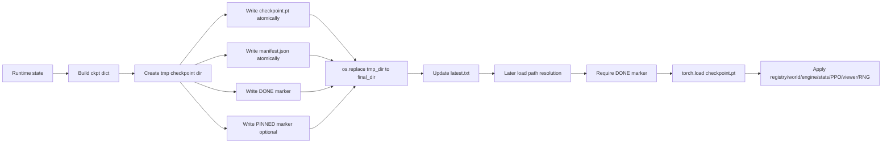
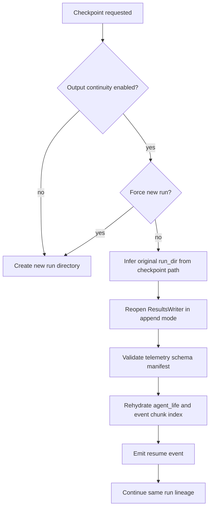

# Neural-Abyss  
## Telemetry, Persistence, and Operational Observability

### Abstract

This document analyzes the telemetry, persistence, checkpointing, benchmarking, lineage, and operational observability subsystem of **Neural-Abyss** as evidenced by the provided repository source dump. The subsystem exists to make long-running, stateful simulation and learning runs inspectable, restartable, and analyzable without forcing the main simulation loop to pay the full cost of durable logging on every tick. It combines a background results writer, a structured telemetry session, a checkpoint manager with atomic directory-finalization semantics, append-aware resume behavior, optional raw video capture, and post-run utilities such as a tick micro-benchmark and lineage reconstruction tooling.

The implementation is notably pragmatic. It does not pursue a single, absolute durability model. Instead, it separates artifacts into classes with different reliability and latency characteristics. Some outputs are explicitly best-effort and may be dropped under load to protect runtime throughput; others use atomic write patterns and completion markers to provide stronger integrity properties. Resume-in-place continuation is supported, but only under schema compatibility constraints. Inspector no-output mode deliberately disables all artifact creation. The resulting design is neither a generic observability stack nor a generic MLOps package. It is a repository-specific operations layer tightly coupled to simulation state, agent lineage, and PPO-adjacent runtime state.

---

## Reader orientation

### What this document covers

This monograph focuses on the operational surfaces by which Neural-Abyss:

- creates run directories and persistent output artifacts,
- writes per-tick and event-oriented data to disk,
- records telemetry for later analysis,
- saves and restores checkpoints,
- resumes runs while preserving output continuity when configured,
- emits additive headless summaries and optional media artifacts,
- supports lineage reconstruction and benchmark measurement.

### What this document does not cover in depth

This document does not attempt full subsystem coverage of:

- simulation mechanics,
- neural architecture internals,
- PPO mathematics,
- viewer/UI architecture beyond its persistence interfaces.

Those subsystems are referenced only where they materially interact with persistence or observability.

### Evidence discipline

Three categories are used throughout:

**Implementation**  
Behavior directly evidenced by code in the provided repository dump.

**Theory**  
General systems concepts used to explain why a design is operationally meaningful.

**Reasoned inference**  
A conservative explanation of likely design intent when the code strongly suggests, but does not explicitly state, the motivation.

Where a config flag exists but an implementation path was not clearly evidenced in the inspected code, that limitation is stated explicitly.

---

## Executive subsystem view

At a subsystem level, Neural-Abyss accepts four broad classes of operational input:

1. **Live runtime state**  
   The engine, registry, grid, zones, stats object, respawn controller, RNG state, viewer state, and optional PPO runtime.

2. **Streaming runtime observations**  
   Per-tick summaries, death batches, movement summaries, event records, headless tick metrics, GPU probe strings, and PPO training diagnostics.

3. **Operator control signals**  
   Resume checkpoint paths, explicit manual checkpoint trigger files, checkpoint cadence settings, no-output inspection mode, and optional video settings.

4. **Configuration metadata**  
   Resolved config snapshots, experiment tags, seeds, schema versions, and feature flags.

It emits several distinct artifact families:

- run directories under the configured results root,
- `config.json`,
- `stats.csv`,
- `dead_agents_log.csv`,
- a `telemetry/` subtree with manifests, summaries, event chunks, and detailed agent records,
- checkpoint directories under `run_dir/checkpoints/`,
- final run summaries,
- optional raw AVI output,
- optional post-run lineage inputs,
- benchmark console reports.

The subsystem therefore sits between the simulation runtime and the filesystem. It is not only a logger. It is also a **continuity layer**. It determines whether resumed execution extends an existing run lineage or starts a fresh artifact lineage, whether schema mismatches are tolerated, and whether an interrupted process can be restored into a coherent operational state.

---

## Conceptual framing

Long-running simulation systems face four operational problems.

### 1. Visibility during execution

A simulation that runs for hours or days without externalized state is difficult to trust. Operators need at least coarse answers to questions such as:

- Is the run progressing?
- Are populations diverging or collapsing?
- Are kills, deaths, damage, and control-point scores behaving plausibly?
- Is PPO training still active and stable?
- Is GPU usage healthy?

Neural-Abyss addresses this through a layered telemetry design rather than a single monolithic log.

### 2. Recoverability after interruption

A stateful run that can only restart from tick zero is operationally expensive. The repository therefore includes checkpoint creation, restore logic, and on-exit save support. A checkpoint is treated as a structured snapshot of world, registry, engine, PPO, stats, viewer, and RNG state, not merely model weights.

### 3. Output continuity across resumes

A restarted run can either create a new artifact lineage or append to the original one. Neural-Abyss supports both, with resume-in-place continuation enabled by default and explicitly guarded by schema checks for append-sensitive outputs.

### 4. Post-run forensic analysis

Observability is not limited to the live process. The repository retains lineage edges, life-history snapshots, detailed death records, optional movement summaries, headless summary sidecars, and dedicated scripts such as `lineage_tree.py` and `benchmark_ticks.py`.

This framing is not abstract. It is reflected directly in implementation choices: a background writer for fast-path tick rows, a distinct telemetry session for structured semantic artifacts, atomic checkpoint directories with completion markers, and append-aware manifest compatibility checks.

---

## Output artifact architecture

### Run directory structure

The base output root is configured by `RESULTS_DIR`, defaulting to `results`. Fresh runs use timestamped directories in the form:

```text
results/sim_YYYY-MM-DD_HH-MM-SS/
```

This naming is implemented by `ResultsWriter._timestamp_dir()`.

When resuming with output continuity enabled, the runtime infers the original run directory from the checkpoint path and reuses it instead of creating a new one. This means a single run directory can represent multiple process lifetimes.

### High-level artifact map

```mermaid
flowchart TD
    A[Runtime state] --> B[ResultsWriter]
    A --> C[TelemetrySession]
    A --> D[CheckpointManager]
    A --> E[Optional raw recorder]

    B --> B1[config.json]
    B --> B2[stats.csv]
    B --> B3[dead_agents_log.csv]
    B --> B4[state_meta sidecars]

    C --> C1[telemetry/schema_manifest.json]
    C --> C2[telemetry/run_meta.json]
    C --> C3[telemetry/tick_summary.csv]
    C --> C4[telemetry/telemetry_summary.csv]
    C --> C5[telemetry/events/events_*.jsonl]
    C --> C6[telemetry/agent_static.csv]
    C --> C7[telemetry/move_summary.csv]
    C --> C8[telemetry/counters.csv]
    C --> C9[telemetry/ppo_training_telemetry.csv]
    C --> C10[telemetry/mutation_events.csv]
    C --> C11[telemetry/dead_agents_log_detailed.csv]
    C --> C12[agent_life.csv]
    C --> C13[lineage_edges.csv]

    D --> D1[checkpoints/ckpt_t.../checkpoint.pt]
    D --> D2[checkpoints/ckpt_t.../manifest.json]
    D --> D3[checkpoints/ckpt_t.../DONE]
    D --> D4[checkpoints/ckpt_t.../PINNED optional]
    D --> D5[checkpoints/latest.txt]

    E --> E1[simulation_raw.avi]

    A --> F[Final summary]
    F --> F1[summary.json or summary_fallback.txt]
```



**Figure 1.** Artifact families emitted by the persistence and observability subsystem. The important design point is that not all artifacts are produced by the same mechanism or with the same durability model.

### ResultsWriter artifacts

The background writer process creates or appends:

- `config.json`
- `stats.csv`
- `dead_agents_log.csv`
- `<label>.state_meta.json`

`stats.csv` is the low-level per-tick root statistics stream. `dead_agents_log.csv` is the root structured death stream consumed from the stats object’s drained death log. The state-metadata sidecar is intentionally torch-agnostic and stores keys and tensor-shape metadata rather than full weight payloads.

### Telemetry artifacts

The telemetry session creates a richer, more analysis-oriented surface. The implementation explicitly identifies these paths:

- `telemetry/schema_manifest.json`
- `telemetry/run_meta.json`
- `telemetry/agent_static.csv`
- `telemetry/tick_summary.csv`
- `telemetry/move_summary.csv`
- `telemetry/counters.csv`
- `telemetry/telemetry_summary.csv`
- `telemetry/ppo_training_telemetry.csv`
- `telemetry/mutation_events.csv`
- `telemetry/dead_agents_log_detailed.csv`
- `telemetry/events/events_*.jsonl`
- `agent_life.csv`
- `lineage_edges.csv`

Not all of these are necessarily populated in every run. Many are gated by config flags or feature activity.

### Checkpoint artifacts

The checkpoint manager uses a directory-per-checkpoint structure:

```text
run_dir/checkpoints/ckpt_t{tick}_{timestamp}/
    checkpoint.pt
    manifest.json
    DONE
    PINNED   # optional
```

The checkpoints root also maintains:

```text
run_dir/checkpoints/latest.txt
```

The presence of `DONE` is operationally significant: load refuses incomplete checkpoint directories.

### Optional media artifact

The runtime includes a simple recorder that writes:

```text
simulation_raw.avi
```

This artifact lives directly under the run directory, not under `telemetry/`.

### Final summary artifact

At shutdown, the runtime attempts to write:

- `summary.json`

and falls back to:

- `summary_fallback.txt`

if the structured JSON summary write fails.

---

## Results writing and persistence flow

### Separation of responsibilities

Neural-Abyss does not use one writer for everything.

| Module / component | Responsibility | Durability posture |
|---|---|---|
| `utils.persistence.ResultsWriter` | Fast-path run directory creation, config snapshot, tick rows, root death log, state metadata sidecars | Best-effort, non-blocking, queue-drop on overload |
| `utils.telemetry.TelemetrySession` | Structured semantic telemetry, manifests, event chunks, agent life snapshots, headless summary sidecars | More structured, periodic flushes, atomic writes for selected files |
| `utils.checkpointing.CheckpointManager` | Snapshot save/load, manifesting, pruning, latest-pointer management | Stronger integrity posture via temp dir + final replace + completion markers |
| Main runtime | Orchestration, resume mode selection, summary generation, recorder setup | Mixed |

This is one of the most important architectural facts in the repository. It prevents the strongest durability path from being imposed on the hottest runtime loop.

### Background writer architecture

`ResultsWriter` is implemented as a separate process using a multiprocessing queue. The explicit design goal is to avoid stalling the simulation loop on disk I/O. The writer is Windows-aware: files are opened in the child process after initialization rather than inherited from the parent.

Its message types include:

- `_MsgInit`
- `_MsgTickRow`
- `_MsgDeaths`
- `_MsgSaveModel`
- `_MsgClose`

The main process enqueues writes with `put_nowait`. If the queue is full, the message is dropped deliberately. This is not an accidental weakness; the class documentation states that it is preferable to drop logs than freeze the simulation.

### Root persistence flow

The headless loop makes the fast path visible:

```text
run one tick
→ enqueue stats row
→ drain and enqueue death rows
→ invoke additive telemetry sidecar hook
→ optionally checkpoint
→ optionally print / sanity-check / continue
```

Because `rw.write_tick(stats.as_row())` and `rw.write_deaths(deaths)` are non-blocking, the writer path is operationally decoupled from simulation advancement.

### Append behavior

When `ResultsWriter.start(..., append_existing=True, strict_csv_schema=...)` is used, the child process opens `stats.csv` and `dead_agents_log.csv` in append mode and reads existing headers if the files already exist and are non-empty. If strict schema checking is enabled, header mismatch raises an error rather than silently corrupting row alignment.

This behavior matters during resume-in-place. It is the low-level mechanism that allows multiple process lifetimes to contribute to a single run directory while guarding against accidental schema drift.

### Finalization behavior

`ResultsWriter.close()` behaves as follows:

1. send `_MsgClose`,
2. join for up to two seconds,
3. terminate forcefully if still alive.

This is another explicit trade-off. Clean shutdown is preferred, but logging is not allowed to block application exit indefinitely.

### Persistence-flow pseudocode

```text
if inspector_no_output_mode:
    disable all output producers
else:
    choose run_dir:
        if resume continuity active:
            reopen original run_dir in append mode
        else:
            create new timestamped run_dir

    start ResultsWriter
    create CheckpointManager(run_dir)
    initialize TelemetrySession(run_dir)
    optionally initialize simple AVI recorder

for each tick:
    engine.run_tick()
    ResultsWriter.write_tick(stats.as_row())
    ResultsWriter.write_deaths(stats.drain_dead_log())
    TelemetrySession.on_headless_tick(...)       # headless sidecar only
    CheckpointManager.maybe_save_periodic(...)
    CheckpointManager.maybe_save_trigger_file(...)

on shutdown:
    flush final deaths to ResultsWriter
    TelemetrySession.close()
    optionally save on-exit checkpoint
    write final summary.json
    ResultsWriter.close()
    recorder.close()
```

---

## Telemetry system

### Subsystem role

The telemetry system is not merely a second logger. It encodes **domain-aware observability**:

- agent births and deaths,
- lineage edges,
- mutation records,
- reward-related life totals,
- headless performance summaries,
- PPO training diagnostics,
- event-chunk emission with sequence metadata,
- structured snapshots of agent life histories.

This is the layer that gives the run forensic meaning.

### Telemetry session initialization

`TelemetrySession(run_dir)` creates the telemetry directory and configures behavior from many environment-backed settings:

- enable/disable master switch,
- schema version,
- event chunk size,
- flush cadence,
- validation cadence,
- event-type toggles,
- move-summary controls,
- headless summary controls,
- PPO rich telemetry controls,
- anomaly policy.

If telemetry is enabled, the runtime attaches context via:

- `registry`
- `stats`
- `ppo_runtime`

This attachment is required because several telemetry outputs are derived, not merely forwarded.

### Telemetry file matrix

| Artifact | Format | Write pattern | Operational purpose |
|---|---|---|---|
| `telemetry/schema_manifest.json` | JSON | Atomic overwrite | Declares schema/version/mechanics contract |
| `telemetry/run_meta.json` | JSON | Atomic overwrite | Run metadata, config snapshot, seed, device, start tick |
| `telemetry/agent_static.csv` | CSV | Append | Stable per-agent attributes when enabled |
| `telemetry/tick_summary.csv` | CSV | Append | Low-frequency macro state series |
| `telemetry/telemetry_summary.csv` | CSV | Append | Headless live sidecar with TPS/GPU/tick-metric windows and optional PPO summary |
| `telemetry/events/events_*.jsonl` | JSONL chunks | Buffered then atomic chunk write | Event stream for births, deaths, resume, and other typed events |
| `telemetry/move_summary.csv` | CSV | Buffered append | Aggregated movement telemetry |
| `telemetry/counters.csv` | CSV | Buffered append | Long-form counters `(tick,key,value)` |
| `telemetry/ppo_training_telemetry.csv` | CSV | Append | Rich PPO diagnostics when enabled |
| `telemetry/mutation_events.csv` | CSV | Append | Rare-mutation or mutation event stream when enabled |
| `telemetry/dead_agents_log_detailed.csv` | CSV | Append | Rich death forensics |
| `agent_life.csv` | CSV | Atomic overwrite snapshot | Current life-history snapshot of all known agents |
| `lineage_edges.csv` | CSV | Append | Parent-child lineage edges |

**Table 1.** Telemetry artifact surface as directly evidenced by the implementation.

### Event telemetry

The event stream is written as JSONL chunk files under `telemetry/events/`. The implementation currently reserves configuration knobs for alternate event formats and gzip, but the actual writer path remains JSONL-oriented. If a different format is requested, the event is annotated and JSONL is still used. That is an implementation fact, not a conjecture.

The event emitter adds ordering metadata such as:

- tick,
- event type,
- tick-level event sequence,
- phase,
- phase-local event sequence.

This is significant because many game-like runtimes produce multiple causal events on the same tick. Sequence metadata preserves within-tick ordering for downstream analysis.

### Birth telemetry and lineage

Birth handling is comparatively rich. `record_birth(...)` accepts:

- `agent_id`,
- `slot_id`,
- `team`,
- `unit_type`,
- optional `parent_id`,
- generation metadata,
- mutation flags,
- mutation deltas,
- spawn reason,
- notes.

Lineage edges are written separately, while life-history state is maintained in memory and later snapshotted into `agent_life.csv`.

At startup, `bootstrap_from_registry(...)` seeds birth records for already-alive agents so that lineage and life-history data remain consistent from tick zero. This bootstrap is intentionally skipped on resume-in-place to avoid duplicate birth rows in an existing lineage artifact set.

### Death telemetry

`record_deaths(...)` records structured death rows with:

- dead agent IDs,
- dead teams,
- dead unit types,
- dead slots,
- notes,
- optional death causes,
- optional killer IDs,
- optional killer slots,
- optional killer teams.

The implementation freezes final movement totals into the life record at death time and writes richer death rows to `telemetry/dead_agents_log_detailed.csv`, explicitly leaving the legacy root `dead_agents_log.csv` untouched.

This dual-path design is operationally useful. The root death log stays stable for older tooling, while richer forensics evolve under telemetry.

### Tick summary telemetry

`_write_tick_summary(tick)` computes and appends summary rows to `telemetry/tick_summary.csv`. The summary includes, at minimum:

- tick,
- elapsed seconds,
- alive counts by team,
- mean HP by team,
- kills by team,
- deaths by team,
- damage dealt by team,
- damage taken by team.

This is a low-frequency macro time series designed to be cheap to write and easy to plot.

### Headless live summary sidecar

The headless loop calls `telemetry.on_headless_tick(...)`. This hook accumulates windowed tick metrics, caches parsed GPU summary fields when polled, and writes `telemetry_summary.csv` on the configured summary cadence.

Its field surface includes:

- tick and elapsed-time data,
- throughput metrics such as `tps_window` and `tps_avg`,
- score and control-point totals and deltas,
- alive counts and mean HP,
- kills, deaths, and damage totals/deltas,
- optional parsed GPU fields,
- optional windowed `TickMetrics` aggregates,
- optional PPO last-train summary fields.

This file is additive relative to console output. It exists specifically so that headless observability does not depend on terminal logging verbosity.

### Agent life snapshot semantics

`agent_life.csv` is especially important. It is not appended row-by-row in the ordinary sense. Instead, the telemetry session maintains an in-memory life table keyed by agent ID and periodically emits an atomic snapshot overwrite.

This snapshot includes basic lineage and lifecycle fields, but also:

- movement totals,
- reward totals,
- mutation metadata,
- death metadata,
- derived lifespan where available.

On resume-in-place, the session rehydrates this file into memory so that later snapshots extend prior knowledge instead of forgetting it.

### Telemetry validation and anomaly policy

The session supports periodic validation and an anomaly handler. The anomaly path can either remain non-fatal or abort, depending on configuration. The default operational posture is defensive but fail-soft: telemetry should reveal problems, not crash the simulation unless explicitly configured to do so.

---

## Manifest, metadata, and schema semantics

### Telemetry schema manifest

The runtime constructs a telemetry schema manifest before telemetry begins. It contains at least:

- `schema_version`
- `lineage_fields`
- `reward_fields`
- `death_causes`
- `mechanics`

The `mechanics` subsection includes booleans and descriptors such as:

- whether archer line-of-sight blocks on walls,
- whether metabolism is enabled,
- whether heal zones are enabled,
- control-point zone count,
- respawn child-unit mode,
- respawn parent-selection mode.

This manifest performs two roles. First, it documents the semantic contract of the telemetry outputs. Second, during resume-in-place, it is used as a compatibility gate.

### Schema compatibility on resume

`validate_schema_manifest_compat(manifest)` requires that an existing manifest be present and compares a selected set of keys:

- `schema_version`
- `lineage_fields`
- `reward_fields`
- `death_causes`
- `mechanics`

If these diverge, resume-in-place append fails. This is an important integrity constraint: it prevents one logical run directory from mixing incompatible telemetry semantics.

### Run metadata

`run_meta.json` stores run-level metadata such as:

- schema version,
- config snapshot,
- seed,
- device,
- grid height,
- grid width,
- start tick,
- whether the run was a resume,
- resume source path.

The runtime intentionally avoids overwriting `run_meta.json` during resume-in-place. That choice preserves the original run metadata as the identity anchor of the artifact lineage.

### Results-writer config snapshot

Separately, the results writer stores `config.json` at the run root. In append mode it preserves the existing file if already present.

### Metadata guarantees and non-guarantees

The metadata layer provides meaningful semantic context, but not unlimited guarantees:

- It improves interpretability and schema safety.
- It does not by itself guarantee complete reproducibility.
- It does not guarantee that best-effort dropped writer rows can be reconstructed.
- It does not fully solve code-version compatibility, although checkpoint metadata includes a `git_commit` field when available.

---

## Checkpointing architecture

### Conceptual model

A Neural-Abyss checkpoint is a **snapshot directory**, not just a tensor file. The directory structure and completion markers are part of the integrity model.

### Save timing

Checkpoint creation can occur through several mechanisms:

- periodic tick cadence (`CHECKPOINT_EVERY_TICKS`),
- clean process exit (`CHECKPOINT_ON_EXIT`),
- external trigger file detection,
- likely viewer/manual interactions through broader runtime pathways when present.

### Checkpoint contents

The save path builds a checkpoint payload containing:

- `checkpoint_version`
- `meta`
- `world`
- `registry`
- `engine`
- `ppo`
- `stats`
- `viewer`
- `rng`

More concretely:

#### Meta
Contains:
- tick,
- timestamp,
- notes,
- saved device,
- runtime device,
- git commit.

#### World
Contains:
- `grid`,
- zone payload including heal mask and control-point masks.

#### Registry
Contains:
- `agent_data`,
- `agent_uids`,
- `generations`,
- `next_agent_id`,
- per-slot brain payloads including kind and CPU state dictionary where present.

#### Engine
Contains:
- `agent_scores`,
- selected respawn-controller state.

#### PPO
Contains:
- enabled flag,
- checkpoint state from the PPO runtime when present.

#### Stats
Contains extracted simulation statistics.

#### Viewer
Contains optional viewer state.

#### RNG
Contains random-number-generator state, restored last for reproducibility.

This is a broad operational snapshot, not merely a model checkpoint. That distinction matters because resumed simulation correctness depends on more than neural weights.

### Atomic save pattern

The save path uses a temp directory named with a `__tmp` suffix, writes files inside it, then finalizes with `os.replace(tmp_dir, final_dir)`. Inside the temp directory it writes:

- `checkpoint.pt`
- `manifest.json`
- optional `PINNED`
- `DONE`

Only after the directory is complete does it atomically replace the final directory path and update `latest.txt`.

This is stronger than a naive single-file overwrite because it makes “checkpoint exists and is complete” a directory-level property.

### Pruning policy

`prune_keep_last_n(...)` retains only the latest configured number of non-pinned checkpoints, with important protections:

- pinned checkpoints are not removed,
- the checkpoint referenced by `latest.txt` is not removed,
- incomplete temp directories are ignored.

This strikes a balance between disk growth and rollback capability.

### Save/restore flow



**Figure 2.** Checkpoint lifecycle. The decisive integrity step is not merely writing `checkpoint.pt`; it is finalizing a completed directory and requiring `DONE` on load.

### Restore logic

`resolve_checkpoint_path(...)` accepts several forms:

- direct path to `checkpoint.pt`,
- checkpoint directory,
- checkpoints root directory containing `latest.txt`.

`load(...)` refuses incomplete checkpoint directories that lack `DONE`.

`apply_loaded_checkpoint(...)` then restores the snapshot into live runtime objects, with multiple structural validations:

- registry shape and capacity,
- expected number of columns,
- brain list length,
- generation-vector length,
- agent UID length,
- monotonic next-agent-id condition,
- PPO enabled/disabled consistency between checkpoint and runtime.

Brains are recreated by kind and loaded slot-by-slot. RNG is restored last.

### PPO interaction during checkpoint save

Before freezing PPO state into the checkpoint payload, the checkpoint path performs a best-effort telemetry flush if telemetry is attached and exposes `flush()`. This does not affect deterministic state but improves durability of logs around checkpoint boundaries.

---

## Resume semantics and output continuity

### Fresh run versus resumed run

The runtime distinguishes:

- **fresh start**: new world state, new run directory, new telemetry lineage,
- **resume**: load checkpoint, restore runtime state, then either continue existing outputs or create a new run directory.

### Continuity decision

Resume-in-place is active when all of the following are true:

- a checkpoint was requested,
- `RESUME_OUTPUT_CONTINUITY` is true,
- `RESUME_FORCE_NEW_RUN` is false.

If so, the runtime infers the original run directory from the checkpoint path and reopens it in append mode.

### Output continuity semantics

When resume-in-place is active:

- root CSV streams reopen in append mode,
- append-sensitive schema checks can fail-fast,
- the existing telemetry schema manifest is validated for compatibility,
- the original `run_meta.json` is preserved,
- `record_resume(...)` emits an explicit resume event,
- bootstrap birth seeding is skipped to avoid duplicate lineage initialization,
- the next telemetry event chunk index is discovered from existing files,
- the agent-life table is rehydrated from the existing snapshot,
- future checkpoints continue under the same run lineage.

This is stronger than simply “load and keep going.” It is a coordinated continuity protocol.

### Fresh output on resume

If `RESUME_FORCE_NEW_RUN` is true, or continuity is disabled, resumed execution still restores runtime state but emits outputs into a new run directory. In that case the checkpoint acts as a state source, not an artifact-lineage source.

### Inspector no-output mode

The runtime explicitly supports an inspector mode in which there is:

- no results folder,
- no results writer,
- no telemetry,
- no checkpoints.

The code uses a `_NoopRecorder()` in this mode. This is operationally significant because it allows UI inspection or runtime restoration without mutating artifact state or creating misleading output lineages.

### Resume-continuity diagram



**Figure 3.** Resume-continuity control flow. The important point is that output continuation is not an incidental side effect of checkpoint restore; it is an explicit policy.

---

## Benchmarking and post-run analysis utilities

### Tick micro-benchmark

`benchmark_ticks.py` is a self-contained headless throughput benchmark. It:

1. builds grid, registry, and stats,
2. spawns agents,
3. constructs `TickEngine`,
4. runs a warmup phase,
5. measures `n_ticks` iterations,
6. reports total wall time, ticks per second, mean tick time, median tick time, and 95th-percentile tick time,
7. optionally prints a GPU memory summary if CUDA is available.

This utility does not produce structured artifact files in the provided implementation. Its role is operational benchmarking rather than telemetry persistence.

### Lineage analysis utility

`lineage_tree.py` consumes:

- `lineage_edges.csv`
- optional `agent_life.csv`

It reconstructs parent-child relationships and life metadata for downstream visualization or analysis. The visible constants indicate support for Plotly or matplotlib backends. The exact visualization output format was not fully established from the inspected excerpts, so it is safest to state that the script consumes persisted lineage artifacts to build lineage views rather than to assert a specific final file type.

### Optional media capture

The runtime’s simple recorder writes `simulation_raw.avi` when video recording is enabled and OpenCV is available. It captures a coarse occupancy-grid view rather than the full viewer UI. This artifact is useful for visual forensics, but it is written from the main process and therefore carries a direct runtime overhead trade-off.

---

## Interfaces to other subsystems

### Engine to telemetry

The engine exposes a telemetry attachment point:

```text
engine.telemetry = telemetry
```

Within tick execution, telemetry hooks are invoked around key lifecycle phases, including:

- death processing,
- combat-related event ordering,
- respawn/birth ingestion,
- tick-end flush/validation hooks.

The engine therefore does not merely dump passive counters. It actively marks phases and forwards semantic events.

### Stats to root results writer

The headless loop writes `stats.as_row()` to `stats.csv` and drains dead logs into `dead_agents_log.csv`. This makes the stats object the low-level bridge between runtime state and the background writer.

### PPO to checkpoint and telemetry

PPO state enters persistence in two ways:

- via `get_checkpoint_state()` for checkpoint save/restore,
- via rich PPO telemetry and headless summary enrichment when enabled.

This is a bounded interface. The persistence subsystem does not re-derive PPO semantics; it serializes runtime-owned PPO state and selected diagnostics.

### Viewer and inspector interfaces

Viewer state can be stored in checkpoints. Separately, inspector no-output mode changes the entire persistence contract by preventing artifact creation. This is the main viewer-side persistence interaction evidenced in the provided code.

### Recorder interface

Recording is added by wrapping `engine.run_tick` at runtime rather than modifying the engine class directly. This keeps recording optional and outside the core simulation logic, but it also means recording writes occur on the main process path.

---

## Integrity, invariants, and correctness constraints

### Run-directory coherence

A resumed append run must target the correct original run directory. If the inferred directory is wrong, continuity semantics collapse: telemetry lineage, checkpoint lineage, and root CSV streams would diverge from the actual resumed state.

### Telemetry-manifest compatibility

Resume-in-place requires manifest compatibility across selected semantic keys. This invariant matters because otherwise one directory could contain mixed lineage fields, reward definitions, death-cause vocabularies, or mechanics assumptions.

### Stable CSV headers for append paths

Append-mode CSV writers rely on stable headers. The repository provides strict schema guards for both root CSV append paths and telemetry append helpers. Without this invariant, resumed runs could silently shift column meanings.

### Completed-checkpoint invariant

A checkpoint directory is only loadable if `DONE` exists. This invariant distinguishes partial or interrupted save attempts from durable checkpoints.

### Registry-shape and slot-mapping invariants

Checkpoint restore validates registry dimensions, brain vector lengths, generation lengths, UID lengths, and next-agent-id consistency. These checks matter because the simulation uses slot-indexed tensor state; partial mismatch would corrupt semantic identity.

### RNG-last restore invariant

RNG state is restored after other runtime state. This ordering helps ensure that restore-side object creation and state loading do not consume randomness and thereby shift the resumed trajectory unnecessarily.

### No-output-mode non-creation invariant

Inspector no-output mode is meaningful only if it truly creates no run directory, no telemetry, and no checkpoints. The code explicitly enforces this by bypassing all output producers.

### Event-ordering invariants

Telemetry attaches tick and phase sequence counters to events. This matters because many events can occur on the same tick, and downstream analysis may need a stable within-tick order.

### Agent-life consistency invariant

Telemetry assumes births precede deaths in the life table. Duplicate deaths are treated as anomalies. Resume-in-place rehydration exists to preserve this life-table continuity across process restarts.

---

## Reproducibility, recoverability, and operational guarantees

### What the code preserves well

The code appears to preserve the following strongly enough to support practical resumption:

- world grid and zones,
- registry tensors and stable agent IDs,
- per-slot brain state,
- selected engine/respawn state,
- PPO runtime state,
- stats,
- viewer state when provided,
- RNG state,
- run-level continuity metadata,
- telemetry lineage compatibility.

### What can likely be recovered after interruption

If the process exits cleanly or periodic checkpointing is active, the runtime can likely recover to the most recent completed checkpoint with:

- simulation tick restored,
- agent identities and generations restored,
- neural state restored,
- PPO state restored,
- output continuation in the same run directory if configured.

### What is explicitly only best-effort

The following are not hard-durability paths:

- background writer queue contents that have not yet been written,
- tick/death rows dropped because the writer queue was full,
- telemetry writes inside try/except blocks that intentionally avoid crashing the sim,
- main-process AVI recording in the face of process interruption,
- final summary write if the process fails abruptly before shutdown.

### Recoverability limitations

Recoverability is bounded by checkpoint cadence. If checkpoints are sparse, progress between the last checkpoint and failure is lost in terms of restart state, even if some telemetry for that interval exists.

### Reproducibility limitations

The subsystem improves reproducibility through:

- config snapshots,
- run metadata,
- seed storage,
- checkpointed RNG state,
- git commit in checkpoint metadata.

However, it does not guarantee absolute reproducibility because:

- dropped writer messages are allowed,
- some telemetry paths are best-effort,
- optional GPU/CUDA execution may still involve nondeterministic kernels depending on broader runtime configuration,
- code-version compatibility across checkpoint restore is not fully formalized beyond checkpoint version and available field structure.

The correct characterization is **structured recoverability with partial reproducibility support**, not full transactional replayability.

---

## Design decisions and trade-offs

### 1. Background writer with drop-on-full semantics

**Decision:**  
Use a separate process and non-blocking queue for root run outputs.

**Likely rationale:**  
Protect tick-time stability.

**What it enables:**  
High-throughput loops can continue even under logging pressure.

**What it costs:**  
Some logs may be lost.

**Alternative:**  
Synchronous writes or blocking queues.

**Trade-off:**  
Operational throughput is prioritized over guaranteed completeness of root CSV logs.

### 2. Separate telemetry layer rather than extending the root writer

**Decision:**  
Structured telemetry lives outside the background writer.

**Likely rationale:**  
Telemetry semantics are richer, more varied, and not all naturally fit a single queue-driven CSV writer.

**What it enables:**  
Atomic snapshots, event chunks, manifest validation, headless sidecars, lineage-specific outputs.

**What it costs:**  
Subsystem complexity and more artifact types.

### 3. Resume-in-place append as the default

**Decision:**  
Continuity is enabled by default when resuming.

**Likely rationale:**  
Long runs should usually remain a single operational lineage.

**What it enables:**  
One run directory can tell the full story of a run across process restarts.

**What it costs:**  
Append safety becomes a schema problem and demands compatibility checks.

### 4. Manifest-driven compatibility enforcement

**Decision:**  
Resume append validates selected telemetry schema/manifold keys.

**Likely rationale:**  
Protect downstream analysis from mixed semantics.

**What it enables:**  
Safer continuity.

**What it costs:**  
Some resumes fail rather than “just work.”

### 5. Directory-based atomic checkpoints with completion markers

**Decision:**  
Checkpoint save uses temp directories, `DONE`, and final replace.

**Likely rationale:**  
Make incomplete checkpoints unambiguously rejectable.

**What it enables:**  
Cleaner crash recovery and stronger operational trust.

**What it costs:**  
More files and slightly more save complexity.

### 6. Preserve original `run_meta.json` on append resume

**Decision:**  
Resume-in-place avoids overwriting original run metadata.

**Likely rationale:**  
The run directory should retain its original identity.

**What it enables:**  
Stable lineage identity for multi-session runs.

**What it costs:**  
Some later resume metadata must be expressed as events rather than overwritten top-level metadata.

### 7. Atomic overwrite for `agent_life.csv`

**Decision:**  
Life history is snapshotted atomically rather than appended incrementally as the sole source of truth.

**Likely rationale:**  
A coherent current-state table is easier to rehydrate and reason about than reconstructing state from a long append-only log.

**What it enables:**  
Fast resume rehydration and current-state inspection.

**What it costs:**  
Snapshot rewrites are heavier than pure append.

### 8. Main-process raw video recorder

**Decision:**  
Raw AVI recording is optional and simple, but not offloaded.

**Likely rationale:**  
Keep implementation straightforward and dependency-light.

**What it enables:**  
Basic visual forensics.

**What it costs:**  
Potential slowdown if recording cadence is high.

---

## Extension guidance

### Adding a new telemetry stream

A safe extension pattern would include:

1. defining the artifact path in `TelemetrySession.__init__`,
2. defining schema/headers explicitly,
3. deciding whether the stream is append, buffered append, or atomic snapshot,
4. integrating resume behavior if append continuity matters,
5. including the stream in `close()` and possibly `flush()`.

The most important rule is to choose the right durability class. A high-frequency stream should not automatically be implemented as synchronous per-tick file writes.

### Adding a manifest field

If a new field changes semantic interpretation across runs, it should be added to the schema manifest and, if continuity safety matters, to the compatibility comparison set.

### Changing checkpoint cadence

The safest extension point is configuration of `CHECKPOINT_EVERY_TICKS` and retention logic. Very small periods improve recoverability but increase serialization cost and artifact growth.

### Extending checkpoint contents

A new runtime subsystem should provide an extract/apply pair analogous to the existing world, engine, PPO, and stats handling. The key discipline is symmetry: save and restore must agree on shape, meaning, and validation.

### Adding a new analysis artifact

If the artifact is derived from lineage or life-table data, it is usually safer to consume existing persisted outputs rather than expanding the hot runtime write path.

### Instrumenting new runtime events

New events should use the existing event-buffer path so that ordering metadata and chunk semantics remain consistent. Emitting a new standalone ad hoc file for every new event type would fragment observability unnecessarily.

---

## Failure modes, risks, and limitations

### Partial-write risk for best-effort paths

Root writer queue-drop behavior means some rows may never reach disk under pressure. This is an intentional risk acceptance, not a bug.

### Telemetry schema drift risk

Resume-in-place across changed semantics is explicitly risky, which is why the code validates manifest compatibility. However, compatibility covers selected keys only; a subtle semantic change outside those keys could still create interpretability issues.

### Checkpoint/code compatibility risk

A checkpoint can be structurally complete yet still become semantically incompatible with later code revisions if class layouts, expected fields, or subsystem assumptions change beyond what the loader anticipates.

### Artifact growth risk

High-rate events, rich PPO telemetry, move logging, and long-run event chunking can generate substantial disk use. The code provides cadence and toggle controls, but storage growth remains an operational concern.

### Recorder overhead risk

Because AVI capture writes from the main process, aggressive video settings can distort runtime performance characteristics.

### Summary incompleteness risk

The final summary is written on shutdown and can fall back to a text file, but abrupt failure before shutdown can still leave only partial end-of-run metadata.

### Config/implementation divergence risk

The config surface exposes some knobs whose concrete implementation was not fully evidenced in the inspected code excerpts, especially around certain snapshot/report paths. Operators should therefore treat config presence as a capability hint, not as proof that a corresponding artifact will always exist.

---

## Conclusion

The telemetry, persistence, checkpointing, and observability subsystem of Neural-Abyss is best understood as a layered operational control plane for a long-running simulation runtime. It is not a single logging module. It combines three distinct persistence philosophies:

- a best-effort, non-blocking background writer for root tick and death streams,
- a structured telemetry layer for semantic artifacts and analysis-friendly summaries,
- a stronger checkpointing path built around atomic directory finalization and completion markers.

The design is deliberate rather than uniform. Throughput-sensitive paths are allowed to be lossy. Continuity-sensitive and recovery-sensitive paths are more guarded. Resume-in-place is supported, but only under schema and append constraints. Inspector no-output mode deliberately suspends artifact creation. Optional benchmark and lineage utilities consume or complement these persisted structures.

The result is a subsystem optimized for practical long-run operation: inspectable while running, recoverable after interruption, and analyzable after the fact, but without pretending to provide full transactional durability for every emitted byte.

---

## Glossary

**append-in-place**  
Resume mode in which a restored run continues writing into the original run directory instead of creating a new one.

**checkpoint**  
A structured snapshot of runtime state sufficient to restore simulation execution.

**completion marker**  
A file such as `DONE` used to declare that a checkpoint directory is complete and loadable.

**lineage artifact**  
A persisted file used to reconstruct parent-child relations or life histories across agents, especially `lineage_edges.csv` and `agent_life.csv`.

**manifest**  
A metadata file that declares schema or semantic contract information, especially `schema_manifest.json` and checkpoint `manifest.json`.

**no-output inspector mode**  
A runtime mode in which inspection or viewer usage avoids creating results directories, telemetry, or checkpoints.

**resume**  
Restoration of runtime state from a previously saved checkpoint.

**run metadata**  
Structured metadata describing a run, such as seed, config snapshot, device, and start tick.

**schema**  
The structural and semantic contract of a persisted artifact, including fields and interpretation.

**sidecar**  
An auxiliary artifact that complements core outputs, such as `telemetry_summary.csv` or detailed death logs.

**telemetry session**  
The object that manages structured telemetry state, event buffering, validation, flushing, and artifact emission.

---

## Appendix A. Artifact directory table

| Location | Primary writer | Notes |
|---|---|---|
| `run_dir/config.json` | ResultsWriter | Preserved on append resume if already present |
| `run_dir/stats.csv` | ResultsWriter | Per-tick root stats stream |
| `run_dir/dead_agents_log.csv` | ResultsWriter | Root death log |
| `run_dir/*.state_meta.json` | ResultsWriter | Torch-agnostic state metadata sidecars |
| `run_dir/summary.json` | Main runtime | Final summary |
| `run_dir/summary_fallback.txt` | Main runtime | Fallback if JSON summary fails |
| `run_dir/simulation_raw.avi` | Simple recorder | Optional raw occupancy-grid video |
| `run_dir/checkpoints/...` | CheckpointManager | Atomic snapshot directories |
| `run_dir/telemetry/...` | TelemetrySession | Structured semantic observability surface |
| `run_dir/agent_life.csv` | TelemetrySession | Atomic snapshot table |
| `run_dir/lineage_edges.csv` | TelemetrySession | Append lineage edge stream |

## Appendix B. Module-to-responsibility table

| Module | Responsibility |
|---|---|
| `main` runtime orchestration | Select run mode, initialize writer/telemetry/checkpoints, wrap recording, handle shutdown |
| `utils.persistence` | Background results writer and root CSV/config outputs |
| `utils.telemetry` | Structured telemetry artifacts, manifests, summaries, event chunks, agent life tracking |
| `utils.checkpointing` | Save/load/apply checkpoints, pruning, latest-pointer management |
| `benchmark_ticks.py` | Headless micro-benchmark for tick throughput |
| `lineage_tree.py` | Post-run lineage reconstruction from persisted lineage files |

## Appendix C. Checkpoint lifecycle pseudocode

```text
periodic or manual or on-exit trigger
→ build snapshot payload from runtime
→ write payload into temporary checkpoint directory
→ write checkpoint manifest
→ write DONE marker
→ atomically rename temp directory into final checkpoint directory
→ update latest pointer
→ later resolve checkpoint path
→ require DONE marker
→ load checkpoint payload
→ validate structure
→ restore world, registry, engine, PPO, stats, viewer, RNG
```
