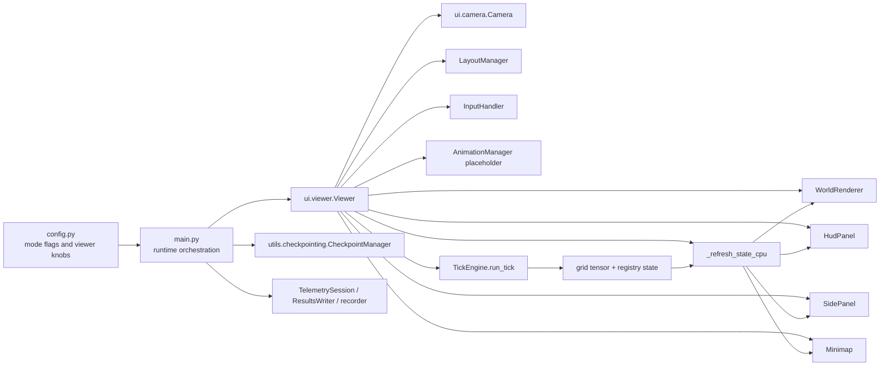
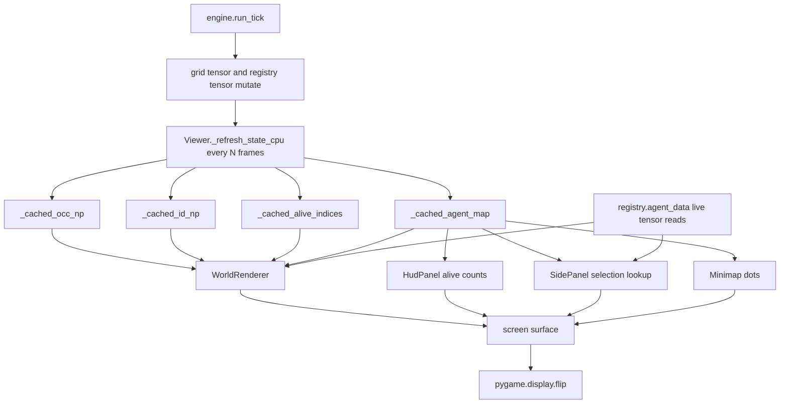
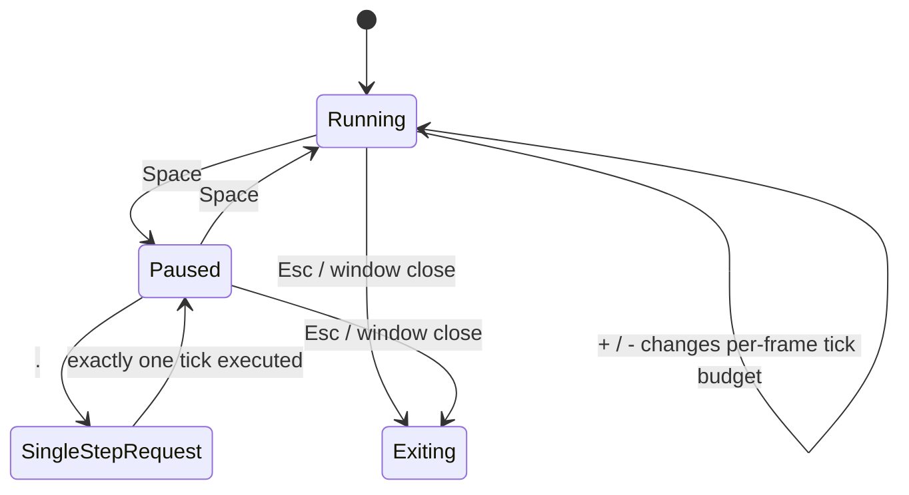

# Neural-Abyss  
## Viewer, Inspector, and Runtime Operations

### Abstract

`Neural-Abyss` contains an integrated runtime-facing viewer rather than a separate observability application. The viewer is implemented primarily in `ui/viewer.py`, with camera mathematics in `ui/camera.py`, orchestration in `main.py`, and checkpoint serialization in `utils/checkpointing.py`. In normal UI mode, the subsystem renders the live grid world, accepts keyboard and mouse input, exposes pause and single-step control, supports selection-driven inspection, and can request manual or periodic checkpoints. In explicit inspector no-output mode, the same viewer path can be launched while suppressing ordinary run-artifact creation such as results folders, telemetry files, checkpoints, and video files. In headless mode, the viewer is bypassed entirely.

The implementation is not a generic GUI framework and does not behave like a detached dashboard. It is a tightly coupled operator tool built directly on top of engine state, grid tensors, registry tensors, and runtime orchestration. That design yields low conceptual distance between simulation state and visual state, but it also introduces trade-offs: mixed live-state and sampled-state reads, deliberate GPU→CPU sampling cadence, viewer/runtime coupling, partial configuration drift, and a different operational footprint between UI and headless execution.

The monograph reconstructs the actual subsystem architecture, render path, interaction surface, inspection behavior, mode semantics, checkpoint control flow, correctness constraints, and operational trade-offs from repository evidence. Background theory is used only to clarify the implementation. Whenever the code suggests intent without proving it, the text labels that material as reasoned inference rather than implementation fact.

---

## Reader Orientation

The monograph addresses the viewer, inspector, and runtime-operations layer of `Neural-Abyss`. The center of gravity is not the simulation engine, the neural architecture, or the PPO runtime in their own right. Those subsystems appear only where necessary to explain how human-facing runtime control and runtime observation are achieved.

The implementation evidence comes from four primary files:

| Module | Operational role |
|---|---|
| `ui/viewer.py` | Rendering, input handling, inspector panel, HUD, overlays, state sampling, manual checkpoint requests |
| `ui/camera.py` | Coordinate transforms, panning, zooming, and world/screen mapping |
| `main.py` | Runtime mode branching, resume behavior, inspector no-output semantics, signal handling, recorder wrapping, viewer launch |
| `utils/checkpointing.py` | Checkpoint payload structure, atomic save/load, runtime restoration interface |

A few narrow interfaces from `engine/tick.py`, `agent/mlp_brain.py`, and configuration constants in `config.py` are also operationally relevant.

The evidentiary discipline in the remainder follows three categories.

**Implementation evidence** refers to behavior directly shown in executable code, function bodies, data structures, or config constants.

**Theory/background** refers to general runtime-viewer concepts used to explain why the implementation works as written: render loops, coordinate transforms, sampled state, and operator-in-the-loop debugging.

**Reasoned inference** refers to likely design intent that is suggested by code structure but not fully guaranteed by implementation. Such claims remain explicitly labeled.

---

## Executive Subsystem View

The viewer/inspector subsystem of `Neural-Abyss` is an integrated runtime control surface that sits inside the same process as the simulation. It does not consume a streaming API, does not subscribe to an external telemetry broker, and does not reconstruct state from log files. Instead, it directly reads the world grid tensor and agent registry state, translates that state into CPU-side cached numpy structures, and draws the result with Pygame.

At a high level, the subsystem provides six human-facing capabilities.

1. **World visualization.** The grid, walls, heal zones, control-point outlines, agents, and optional overlays are drawn into a resizable Pygame window.
2. **Interactive inspection.** A click on the world selects an agent slot, after which the side panel surfaces identity, unit type, score, HP, attack, vision, brain description, and parameter count.
3. **Runtime control.** The operator can pause, single-step, change speed, pan, zoom, toggle overlays, mark selected agents, enter fullscreen, and request manual checkpoint saves.
4. **Operational supervision.** The HUD and minimap present tick progress, team-level status, score history, and spatial framing during long runs.
5. **Checkpoint control.** Manual save requests and periodic/trigger-based saves can be driven through the same viewer loop when `run_dir` and checkpoint management are active.
6. **Mode specialization.** The broader runtime can route execution into normal UI mode, explicit no-output inspector mode, or headless mode, changing not just rendering but persistence and observability behavior.

That subsystem matters because `Neural-Abyss` is a long-running simulation with stateful agents, dynamic world occupancy, checkpointing, and training/runtime coupling. A purely headless workflow is efficient, but it is weaker for debugging local behavior, verifying resume correctness, validating overlays, or inspecting specific agents interactively.

---

## Conceptual Framing

Long-running simulations create an operational problem that differs from both static program debugging and post-hoc analytics. The operator often needs answers to questions such as the following:

- Is the resumed world state plausible after checkpoint restoration?
- Is a selected agent alive, where is it positioned, and what brain module is it using?
- Are control points actually contested or controlled as expected?
- Is threat range behavior consistent with local vision values?
- Is the simulation paused, fast-forwarded, or stepping exactly one tick?
- Can a checkpoint be requested without terminating the process?
- Can runtime inspection occur without contaminating a production output directory?

The `Neural-Abyss` implementation addresses those questions with an **embedded viewer model** rather than a separate observability stack. The viewer therefore solves a hybrid problem: it is neither a player-facing game UI nor a purely offline debugging console. It is closer to a developer/operator instrument panel.

**Theory/background.** In interactive simulation systems, a viewer normally mediates between two cadences:

\[
S(t) \rightarrow \hat{S}(f) \rightarrow R(f)
\]

where:

- \(S(t)\) is the true simulation state after logical ticks,
- \(\hat{S}(f)\) is the sampled state snapshot available to the renderer on frame \(f\),
- \(R(f)\) is the rendered frame.

When simulation state is GPU-resident and rendering is CPU-bound, \(\hat{S}(f)\) is often deliberately sampled less frequently than every visual frame to avoid synchronization cost. That exact design appears in `ui/viewer.py`.

**Implementation evidence.** The viewer docstring explicitly states that GPU→CPU copying is expensive and that CPU-side caches are refreshed only every \(N\) frames rather than every frame. The config variables `VIEWER_STATE_REFRESH_EVERY` and `VIEWER_PICK_REFRESH_EVERY` define those sampling cadences. The viewer then uses `_refresh_state_cpu()` to bulk-copy the minimal draw/picking state into numpy caches and reuses those caches across frames.

**Reasoned inference.** The subsystem appears designed for practical supervision of simulation correctness during development and operational control during long runs, not for polished general-purpose interaction. That inference is supported by the Pygame basis, the keyboard-heavy control surface, the narrowly targeted overlays, the monkey-patched score hook, and the fact that some control/status affordances are printed to stdout rather than surfaced in the UI.

---

## Subsystem Architecture

### Module-level structure



*Figure 1. Integrated viewer architecture in `Neural-Abyss`. The viewer is not a detached client. It is launched by `main.py`, reads simulation state directly, and composes rendering/input/inspection inside one in-process subsystem.*

### Activation and bypass logic

**Implementation evidence.** Runtime branching occurs in `main.py`. The central condition is:

- if `config.ENABLE_UI` is true, the viewer path is used;
- if explicit inspector no-output mode is active, the viewer path is also used even if ordinary UI enablement is not;
- otherwise the headless loop is used.

The helper `_inspector_no_output_mode_active()` recognizes `INSPECTOR_MODE` values including `"ui_no_output"`, `"inspect"`, `"inspector"`, `"no_output"`, and `"viewer_no_output"`, or the legacy boolean flag `INSPECTOR_UI_NO_OUTPUT`.

That behavior yields the following architectural fact: **the viewer is optional, but it is also mode-promotable**. It is optional in the sense that headless execution exists and is explicitly supported. It is promotable in the sense that no-output inspector workflows can force entry into the UI path even when ordinary throughput-oriented settings would have bypassed it.

### Viewer composition

Inside `Viewer.run(...)`, the viewer constructs and retains the following subordinate components:

- `LayoutManager` for window geometry partitioning,
- `WorldRenderer` for world and overlay drawing,
- `HudPanel` for tick/status/graph rendering,
- `SidePanel` for selection inspection and control legend,
- `InputHandler` for keyboard and mouse routing,
- `AnimationManager` as a placeholder animation container,
- `Minimap` for spatial overview.

That composition reflects a simple but disciplined architecture: layout, rendering, inspector, minimap, and input are separated into cooperating helper classes, yet all remain tightly coupled through the `viewer` object.

### Viewer state vs runtime state

The subsystem holds several kinds of state simultaneously.

1. **Live runtime state**, owned by the engine and registry:
   - world grid tensor,
   - agent registry tensor columns,
   - brain modules,
   - stats,
   - engine zones,
   - checkpoint manager and engine run loop.

2. **Viewer interaction state**, owned by `Viewer`:
   - `selected_slot_id`,
   - `last_selected_uid`,
   - `marked`,
   - `paused`,
   - `show_rays`,
   - `threat_vision_mode`,
   - `battle_view_enabled`,
   - `show_brain_types`,
   - `fullscreen`,
   - `speed_multiplier`,
   - `save_requested`.

3. **Viewer cached sampled state**, owned by `Viewer`:
   - `_cached_occ_np`,
   - `_cached_id_np`,
   - `_cached_alive_indices`,
   - `_cached_agent_map`,
   - `_cached_state_data`.

4. **Checkpoint-related viewer payload**, produced only when saving:
   - paused flag,
   - speed multiplier,
   - camera offset/zoom,
   - viewer-side `agent_scores`.

That separation is operationally important. The viewer does not own the simulation truth. It owns the operator-facing control state and a sampled representation of the simulation truth.

### A note on optional UI imports

`ui/__init__.py` attempts to import `Viewer` but falls back to `Viewer = None` on failure, with an explicit comment that the project can run headless even if `viewer.py` is missing. That is an implementation-level sign that headless execution is intended to remain viable as a first-class runtime mode rather than merely a degraded fallback.

---

## Rendering and Refresh Pipeline

### The main data path



*Figure 2. Render/refresh dataflow. Most drawing uses sampled CPU caches, but several overlays and side-panel fields still read live registry tensors directly. The result is a deliberately mixed sampled/live rendering model.*

### Bulk refresh instead of scattered reads

**Implementation evidence.** `_refresh_state_cpu()` performs the core state sampling operation:

- `self.grid.detach().cpu()` copies the grid to CPU,
- occupancy channel `grid_cpu[0]` becomes `occ_np`,
- agent-id channel `grid_cpu[2]` becomes `id_np`,
- alive slots are extracted from `registry.agent_data[:, COL_ALIVE] > 0.5`,
- selected columns `[COL_X, COL_Y, COL_UNIT, COL_TEAM, COL_AGENT_ID]` are gathered in bulk for alive agents,
- unique IDs are taken from `registry.agent_uids` if available,
- brain-type short labels are derived from live Python brain objects,
- the assembled structure is saved as `_cached_state_data`.

The method therefore samples **a coherent batch of render-critical state** rather than issuing many piecemeal `.item()` calls from GPU tensors.

**Theory/background.** That is a standard producer/consumer decoupling pattern. The simulation updates state at tick cadence on GPU-resident tensors. The viewer samples at frame cadence, then renders from CPU-friendly arrays. The cost of GPU synchronization is paid in bulk and amortized across multiple frames.

### Refresh cadence

The viewer stores two refresh intervals:

- `STATE_REFRESH_EVERY_FRAMES`,
- `PICK_REFRESH_EVERY_FRAMES`.

During the main loop:

- `_refresh_state_cpu()` is invoked when the frame delta reaches `STATE_REFRESH_EVERY_FRAMES`;
- the pick-refresh timer is updated when the frame delta reaches `PICK_REFRESH_EVERY_FRAMES`, but no separate picking refresh action is currently performed.

That second point is operationally significant. `PICK_REFRESH_EVERY_FRAMES` exists as a knob and timestamp, yet current implementation ties picking freshness to the full state refresh rather than maintaining an independently refreshed picking cache.

### Static and dynamic rendering split

`WorldRenderer` divides work into two categories.

#### Static background

The static background includes:

- empty cells,
- wall cells,
- heal-zone tiles.

It is drawn into `self.static_surf` by `_draw_static_background()`. Because that operation loops over the entire grid, it is intentionally not performed every frame. The static surface is rebuilt only when necessary, including viewport-size change and zoom-change invalidation.

#### Dynamic foreground

Per-frame dynamic drawing includes:

- control-point outlines and ownership letters,
- agents,
- HP bars,
- brain labels,
- threat-vision overlay,
- grid lines,
- marked-agent outlines,
- rays.

That split is a classic optimization: static terrain is cached; dynamic entities are recomposed every frame.

### Control-point ownership overlay

Control-point rendering is not a raw mask visualization. Instead, for each cached control-point rectangle, the renderer examines the occupancy patch and compares counts of occupancy value `2` versus `3`. Red-majority regions receive a red outline and `"R"` label, blue-majority regions receive blue and `"B"`, and ties receive neutral styling and `"–"`.

That means the overlay communicates **current local occupancy dominance** inside the control-point rectangle rather than, for example, an independently maintained control-state variable.

### Agent rendering

Alive agents are drawn by iterating `state_data["alive_indices"]` and looking up each slot in `state_data["agent_map"]`. Team and unit values determine color keys of the form:

- `red_soldier`,
- `red_archer`,
- `blue_soldier`,
- `blue_archer`.

Archers receive an inner circular glyph when cell size exceeds four pixels. The renderer therefore conveys both allegiance and coarse unit type at the world-cell level.

### Mixed sampled/live overlay semantics

A subtle but important correctness property appears in the overlay implementations.

- `_draw_brain_labels`, `_draw_markers`, and agent-position rendering depend entirely on sampled CPU state.
- `_draw_hp_bars` and `_draw_threat_vision` use sampled positions from `state_data`, but read HP, HP-max, and vision values directly from `registry.agent_data` on demand via `.item()`.

This means the viewer does **not** operate under a strict full-snapshot model. It operates under a mixed model in which spatial positions and occupancy are sampled periodically, while some numeric attributes remain live reads.

**Reasoned inference.** The likely motivation is pragmatic simplicity. Position and occupancy constitute the heavy, broad-area visualization problem and therefore benefit most from batched sampling. Small numbers of scalar reads for selected or visible agents are cheaper and easier to code directly. The cost is that a frame can mix a slightly stale position map with fresher scalar attributes.

### Frame pacing

Render pacing is capped through `self.clock.tick(int(target_fps or config.TARGET_FPS))`. The target defaults to `config.TARGET_FPS`, which defaults to 60 in configuration.

The viewer therefore uses an explicit render-FPS throttle rather than free-running as fast as possible. That is consistent with its role as a human-facing loop rather than a throughput-optimized simulation driver.

### Formalized cadence semantics

A useful abstraction is:

\[
f \in \mathbb{N} \quad \text{(frame index)}, \qquad
k(f) \in \mathbb{N} \quad \text{(logical tick count by frame)}
\]

\[
\hat{S}_f =
\begin{cases}
\text{sample}(S_{k(f)}) & \text{if } f - f_{\text{last refresh}} \ge N_s \\
\hat{S}_{f-1} & \text{otherwise}
\end{cases}
\]

where:

- \(N_s = \texttt{STATE\_REFRESH\_EVERY\_FRAMES}\),
- \(S_{k(f)}\) is the true simulation state after all ticks run in frame \(f\),
- \(\hat{S}_f\) is the cached CPU state used for most rendering.

That formula describes the code’s actual sampled-render semantics better than a naive “one tick, one frame, one snapshot” model.

---

## Interaction Model and Control Surface

### Control inventory

The following table reconstructs the actual human control surface from `InputHandler.handle()` and related viewer methods.

| Input | Condition | Effect |
|---|---|---|
| `A` or Left Arrow | continuous hold | pan camera left |
| `D` or Right Arrow | continuous hold | pan camera right |
| `W` or Up Arrow | continuous hold | pan camera up |
| `S` or Down Arrow | continuous hold | pan camera down |
| `Esc` | keydown | exit viewer loop |
| `Space` | keydown | toggle paused state |
| `.` (period) | keydown and paused | request exactly one single-step tick |
| `M` | keydown and selection exists | toggle current selected slot in marked list, capped at 10 |
| `R` | keydown | toggle ray overlay |
| `T` | keydown | toggle threat-vision mode |
| `B` | keydown | toggle HP-bar overlay (`battle_view_enabled`) |
| `N` | keydown | toggle brain-label overlay |
| `S` | keydown | save selected agent brain weights to `.pth` file |
| `F9` | keydown | request manual checkpoint save |
| `F11` | keydown | toggle fullscreen |
| `+` / `=` | keydown | double speed multiplier up to 16 |
| `-` | keydown | halve speed multiplier down to 0.25 |
| Left mouse click in world rect | mouse down | select agent slot at clicked cell |
| Mouse wheel up | mouse down button 4 | zoom in by factor 1.12 |
| Mouse wheel down | mouse down button 5 | zoom out by factor \(1/1.12\) |
| Window resize | resize event and not fullscreen | resize window and invalidate static background |
| Window close button | quit event | exit viewer loop |

### A control-surface subtlety: `S` is overloaded

A nontrivial ergonomic detail appears in the implementation. Continuous key polling maps `S` to camera-down panning, while discrete `KEYDOWN` handling also maps `S` to `save_selected_brain()`. On a physical key press, both interpretations can become relevant: a held `S` pans downward, and the initial keydown event can trigger a brain save if a selection exists.

That is not theoretical speculation; it follows directly from the coexistence of the continuous key-state branch and the discrete `K_s` handler. The repository therefore implements a genuine control collision between vertical panning and brain export.

### Selection semantics

Selection occurs only through **left-click picking in the world rect**. The click position is translated from screen coordinates to world-cell coordinates via `Camera.screen_to_world()`, adjusted by the world-rect offset, and then resolved to a slot ID using `fast_grid_pick_slot()`.

`fast_grid_pick_slot()` uses the cached CPU id-grid when available; otherwise it falls back to a one-off direct read from `self.grid[2, gy, gx].item()`. That design preserves smooth common-case picking while retaining a safe fallback before caches are populated.

Once a slot is selected:

- `selected_slot_id` stores the slot identity,
- `last_selected_uid` stores the persistent unique ID if available.

That second field is crucial because slots can die and later disappear from the current `agent_map`. The inspector can still label the prior selection by persistent ID even after death.

### Camera semantics

The camera remains entirely in world-cell space rather than pixel space. `Camera.pan(dx_cells, dy_cells)` updates offsets measured in cells and clamps them to the world bounds. `Camera.zoom_at(factor)` scales a multiplicative zoom factor and clamps it into `[0.25, 8.0]`. The effective pixel cell size is:

\[
\texttt{cell\_px} = \max(1, \text{round}(\texttt{base\_cell} \cdot \texttt{zoom}))
\]

That design avoids subpixel drift and preserves crisp grid rendering.

### Pause and speed semantics

The viewer does not use continuous real-time simulation speed scaling. Instead it converts `speed_multiplier` into a discrete tick budget per frame.

- If `speed_multiplier >= 1`, the loop runs `int(speed_multiplier)` full ticks in the frame.
- If `0 < speed_multiplier < 1`, the loop computes `denom = int(1 / speed_multiplier)` and emits one tick only on qualifying frames, creating a coarse slow-motion cadence.
- If paused and `advance_tick` is true, the loop emits exactly one tick.

That produces understandable operator behavior, but it is not a time-delta–based integrator. Sub-1.0 speeds are therefore implemented as **frame-skipping cadence control**, not continuous time scaling.

---

## Inspection Workflows

### Live selection and inspection

The primary inspection workflow is:

1. run the viewer,
2. click an agent in the world,
3. read the side-panel output,
4. optionally toggle rays, threat vision, brain labels, or HP bars,
5. optionally pause and single-step for closer examination.

The side panel uses the selected slot to decide among three states:

- no selection,
- selected but dead,
- selected and alive.

### Alive-agent inspection payload

When the selected slot remains alive, the side panel surfaces:

- persistent ID,
- viewer-tracked cumulative score,
- position,
- unit name,
- brain description,
- HP bar,
- current HP and HP max,
- attack,
- vision radius,
- model summary,
- parameter count.

The brain description is derived from `describe_brain_module(brain)`. The compact overlay label uses `brain_kind_short_label(...)`. The inspector therefore exposes both a rich textual model description and a minimal on-world shorthand.

### Dead-agent continuity

When the selected slot is no longer present in the current `agent_map`, the side panel does not silently clear the selection. It instead shows either:

- `ID: <last_selected_uid> (Dead)`, or
- `Slot: <slot_id> (Dead)`.

That is an important operational choice. It preserves continuity during debugging sessions in which the operator is tracking a particular agent’s lifecycle and wants confirmation that the subject died rather than simply vanished from the interface.

### Marking workflow

Pressing `M` toggles the current selection into or out of the `marked` list. The viewer caps the list at ten entries. Marked entries are then located in the id-grid via `np.argwhere(id_np == slot_id)` and outlined in the world view.

Operationally, that feature supports lightweight manual tagging of a few agents without introducing a more complex bookmark system.

### Paused inspection vs live inspection

Paused inspection differs from live inspection in two ways.

1. The simulation state ceases to advance except through explicit single-step requests.
2. The HUD visually announces `[ PAUSED ]` instead of the speed string.

The repository does not maintain a distinct “snapshot inspector object” for paused mode. The difference is control flow, not state ownership. The same selection, same side panel, and same renderer continue to operate; the engine simply stops advancing between frames until a single-step or unpause event occurs.

### Operational limitations of the inspection model

The inspection model is deliberately narrow.

- It inspects **agents**, not arbitrary world regions as first-class objects.
- It does not surface a hover preview.
- It does not show a structured history pane.
- It does not provide a cross-run comparison interface.
- It does not persist marks across restarts.
- It does not display saved-checkpoint status on-screen, only in stdout and `_ckpt_last_status`.

Those are omissions by implementation, not speculative feature ideas.

---

## Overlay, HUD, and Diagnostic Surfaces

### Overlay inventory

| Surface | Trigger | What it communicates |
|---|---|---|
| Static terrain layer | always | empty cells, walls, heal-zone tiles |
| Control-point outline layer | always | occupancy-dominance state in cached control-point rectangles |
| Agent rectangles | always | alive-agent positions and allegiance/unit class |
| Archer inner glyph | always when cell size > 4 | archer distinction |
| HP bars | `B` toggle and cell size ≥ 8 | per-agent health ratio |
| Brain labels | `N` toggle and cell size ≥ 8 | compact brain-type shorthand |
| Threat vision | `T` toggle and valid selection | selected-agent vision disc plus nearby ally/enemy emphasis |
| Grid lines | `show_grid` and cell size ≥ 6 | cell boundary structure |
| Markers | `M`-driven | manually tagged selected agents |
| Rays | `R` toggle and valid selection | radial line-of-sight approximation |
| HUD top text | always | tick number and paused/speed state |
| Team stat text | always | score, CP points, kills, deaths, alive counts |
| Score graph | when history length ≥ 2 | rolling red-vs-blue lead |
| Minimap | always | spatial distribution and viewport rectangle |
| Side panel | always | selection detail plus legend and controls |

### HUD semantics

The HUD is not decorative. It functions as a compact run-status surface. It contains:

- the current tick,
- either `[ PAUSED ]` or the current speed multiplier,
- red and blue team summary strings,
- a rolling score-lead graph,
- a minimap.

The score graph is computed from a `deque(maxlen=1000)` of score differences `red.score - blue.score`. Values are normalized by the maximum absolute magnitude observed in the retained window before being mapped into graph coordinates.

### Threat-vision semantics

Threat vision is selection-centric rather than global. It is activated only when a selected agent exists in `agent_map`. The overlay then draws:

- a vision-range circle centered on the selected agent,
- filled enemy circles inside that range, with radius and alpha derived from HP ratio,
- small outlined ally circles inside that range.

The implementation therefore uses threat vision as a **local debugging lens**, not as a world-wide tactical heatmap.

### Rays as approximate line-of-sight instrumentation

The ray overlay casts 32 evenly spaced radial rays out to the selected agent’s integer vision range. Each ray stops at the first detected boundary, wall, or occupied cell and is colored according to the hit type.

The implementation does not consume a precomputed observation-ray tensor. It reconstructs a visual approximation directly from current occupancy and selected-agent position. That matters because the overlay is therefore best interpreted as a debugging aid consistent with occupancy geometry, not necessarily as a guaranteed pixel-perfect visualization of the full internal observation pipeline.

### Inspector and HUD consistency constraints

The subsystem relies on several consistency assumptions:

- selected slots should correspond to current `agent_map` entries or be explicitly labeled dead;
- HP bars and threat circles assume that live tensor reads remain compatible with cached positional data;
- minimap viewport math assumes `cam.cell_px > 0`;
- score graph normalization assumes the maximum absolute score is nonzero or defaults to 1.0;
- brain-label drawing assumes short labels remain compact enough to fit inside cells when enabled.

---

## Runtime Modes and Operational Semantics

### Mode comparison

| Mode | Entry condition | Viewer active | Results folder | Telemetry files | Checkpoints | Video recorder | Primary purpose |
|---|---|---:|---:|---:|---:|---:|---|
| Normal UI mode | `ENABLE_UI=True` and no inspector no-output override | yes | yes | yes | yes | yes if enabled | interactive supervised execution |
| Inspector no-output mode | `_inspector_no_output_mode_active()` true | yes | no | no | no | no | interactive inspection without output creation |
| Headless mode | `ENABLE_UI=False` and inspector no-output inactive | no | yes | yes | yes | yes if enabled | throughput-oriented unattended execution |

### Normal UI mode

In normal UI mode, `main.py` still creates `ResultsWriter`, `CheckpointManager`, telemetry, and optional recording infrastructure before launching `Viewer.run(...)`.

Two subtleties matter.

1. The viewer can save manual checkpoints because `run_dir` is passed through.
2. The viewer path does **not** perform the same per-tick CSV/death-log writing that the headless loop performs. The `ResultsWriter` is created, but per-tick writes are concentrated in `_headless_loop(...)`.

That means the operational artifact footprint of “UI mode with outputs enabled” is not identical to headless mode with outputs enabled.

### Inspector no-output mode

Inspector no-output mode is the most distinctive runtime-operations feature in this subsystem. When active:

- `main.py` prints that inspector UI no-output mode is enabled,
- no results folder is created,
- no `ResultsWriter` is created,
- no `CheckpointManager` is created,
- no telemetry session is created,
- no actual video recorder is created; `_NoopRecorder` is used,
- the viewer still launches,
- the viewer receives `run_dir=None`.

That yields a deliberately clean operational mode for resume validation or exploratory inspection. The simulation can be resumed from a checkpoint, rendered, paused, stepped, and inspected without appending telemetry, checkpoints, or ordinary results into a run directory.

A consequence follows directly from `Viewer.run(...)`: pressing `F9` in this mode cannot save a checkpoint. The viewer prints a status message indicating that checkpoint saving was requested but `run_dir` is not set.

### Headless mode

Headless mode bypasses the viewer entirely and enters `_headless_loop(...)`. In that loop:

- `engine.run_tick()` executes in a simple loop,
- `rw.write_tick(stats.as_row())` logs tick summaries,
- `rw.write_deaths(...)` logs death events,
- telemetry summary hooks can run,
- checkpoint trigger files and periodic saves are honored,
- signal-driven shutdown flags are polled between ticks.

Operationally, headless mode is the more complete unattended-output mode, while normal UI mode is the more complete interactive-inspection mode.

### Resume semantics across modes

Resume-from-checkpoint occurs before runtime-mode branching. `main.py` loads the checkpoint, restores world state, constructs a fresh `TickEngine`, applies loaded checkpoint state, validates tick consistency, and only then chooses UI, inspector no-output, or headless execution.

That is an important design property: **mode selection occurs after runtime restoration**, so the same restored world can be supervised either interactively or headlessly.

---

## Operator-Triggered Actions and Control Flow

### Pause, step, and run transitions



*Figure 3. Runtime control-state transitions inside the viewer. The code implements pause as a boolean viewer state, single-step as a one-frame request flag, and speed adjustment as a change to per-frame tick budgeting.*

### Manual checkpoint request

Manual checkpointing is deliberately split into two phases.

1. `InputHandler` sets `self.viewer.save_requested = True` on `F9`.
2. `Viewer.run(...)` processes the request safely between input handling and tick execution.

That split matters because it avoids burying checkpoint serialization inside raw event handling. The manual save path therefore executes in an orderly part of the main viewer loop rather than inside an input callback.

When checkpointing is available, the viewer builds a `viewer_state` payload containing:

- `paused`,
- `speed_mult`,
- `camera.offset_x`,
- `camera.offset_y`,
- `camera.zoom`,
- `agent_scores`.

It then calls `CheckpointManager.save_atomic(...)`, optionally pins the checkpoint, and prunes old ones.

### Periodic and trigger-file checkpointing in the UI loop

The UI loop itself also invokes:

- `maybe_save_trigger_file(...)`,
- `maybe_save_periodic(...)`

after each executed tick, provided checkpointing is enabled.

That means UI mode and headless mode both honor the tick-based checkpoint machinery. The difference is not that UI mode lacks periodic checkpoint capability; the difference is that UI mode lacks the headless loop’s per-tick results-writer path.

### Brain export

`save_selected_brain()` writes the selected brain’s `state_dict()` to a file named:

\[
\texttt{brain\_agent\_<uid>\_t\_<tick>.pth}
\]

in the current working directory. The file is not directed into the active run directory. That is a practical but notable choice: brain export is modeled as a lightweight local artifact, not as a formal run-managed output.

### Exit and shutdown

Inside the viewer itself, exit occurs when:

- the window close event is received, or
- `Esc` is pressed.

In the broader runtime, `main.py` also installs signal handlers for `SIGINT` and `SIGTERM`, stores a shutdown flag, and converts that flag into the existing interrupt path after UI/headless completion. The headless loop explicitly polls that flag between ticks. The viewer loop, by contrast, does not visibly poll `engine.shutdown_requested` inside `Viewer.run(...)`.

**Reasoned inference.** The headless path appears to be more thoroughly engineered for unattended signal-aware interruption than the viewer loop itself. The viewer still benefits from process-level shutdown handling in `main.py`, but the explicit polling discipline is stronger in headless execution.

---

## Interfaces to Other Subsystems

### Interface to engine state

The viewer uses `engine.run_tick()` as the sole simulation-advance entrypoint. It does not manipulate lower-level engine internals to move the world forward. That is an important encapsulation boundary: operator control affects cadence and pausing, but tick advancement still passes through the engine’s public stepping method.

The viewer also uses `engine.zones` to construct cached heal-tile lists and control-point bounding rectangles for rendering.

### Interface to registry state

The agent registry is the viewer’s richest dependency. The viewer reads:

- `registry.agent_data` tensor columns for alive status, position, HP, HP max, vision, attack, team, unit, and legacy IDs,
- `registry.agent_uids` when available,
- `registry.brains` for label and model-description logic.

The side panel and overlays therefore depend on both numeric tensor state and live Python brain objects.

### Interface to checkpointing

Checkpointing is routed through `CheckpointManager`. The viewer does not implement serialization itself; it only requests saves and packages viewer-local metadata.

An important limitation is visible in the complement path. `CheckpointManager.save_atomic(...)` stores a `viewer` dictionary in the checkpoint payload, but `CheckpointManager.apply_loaded_checkpoint(...)` restores registry, engine, stats, PPO, and RNG state without any corresponding viewer-state restoration step. The code therefore proves **viewer-state capture**, but does not prove **viewer-state restore**.

That discrepancy matters for operational interpretation. Manual checkpoints preserve some viewer context in the payload, yet the visible repository path does not consume it to restore camera position, paused state, or viewer-side accumulated scores.

### Interface to telemetry and recording

In normal output mode, `main.py` can attach telemetry to the engine and wrap `engine.run_tick()` so that a recorder writes coarse raw-grid video frames every \(N\) ticks. Because the wrapper replaces `engine.run_tick` before mode branching, viewer-driven ticks also pass through the recording wrapper.

Telemetry is more indirect. The viewer itself does not call telemetry writers. It depends on engine-level or main-level telemetry attachment already having occurred.

### Interface to PPO reward tracking

The viewer installs a monkey patch on `engine._ppo.record_step` if PPO exists. The wrapper reads `agent_ids` and `rewards`, maps slot IDs to persistent IDs, and accumulates them into `self.agent_scores`.

That creates a viewer-local per-agent score channel for inspector display. It does not replace the engine’s own `agent_scores` dictionary; the repository thus contains two score-related stores with different purposes:

- `engine.agent_scores` for engine/checkpoint runtime state,
- `viewer.agent_scores` for UI-side reward display.

---

## Invariants, Correctness Constraints, and UX Constraints

### Selection validity invariant

A valid selection must satisfy one of two states:

1. the selected slot exists in `agent_map`, or
2. the selected slot no longer exists in `agent_map`, in which case the side panel must treat it as dead.

The code does not silently assume selected slots remain alive forever. The dead-selection branch is therefore part of the subsystem’s correctness model.

### Pause invariant

When `paused` is true and `advance_tick` is false, the loop must execute zero simulation ticks for that frame. When `paused` is true and `advance_tick` is true, it must execute exactly one simulation tick.

That invariant is enforced in the `num_ticks_this_frame` logic and is central to step-debugging correctness.

### Speed-control invariant

`speed_multiplier` must remain within the supported discrete range:

\[
0.25 \le \texttt{speed\_multiplier} \le 16
\]

The keyboard handlers enforce that range through bounded doubling and halving.

### Camera-bound invariant

Camera offsets must remain inside world bounds. `Camera.pan()` enforces this through clamping. Without that invariant, selection math and render transforms could address invalid world coordinates.

### Static-surface coherence invariant

Whenever the window geometry or zoom changes in a way that affects world-to-screen mapping, `world_renderer.static_surf` must be invalidated so the background cache is rebuilt with correct dimensions and coordinate scaling.

The implementation explicitly clears `static_surf` on resize and mouse-wheel zoom.

### No-output inspector invariant

In explicit no-output inspector mode, ordinary output-producing components must not be created. `main.py` enforces that by withholding results writer, checkpoint manager, telemetry session, and true recorder creation.

That invariant matters because the whole point of the mode is forensic or exploratory inspection without contaminating the run’s output lineage.

### Cached-state coherence constraint

The viewer assumes that the sampled CPU caches remain usable across a bounded number of frames. If `STATE_REFRESH_EVERY_FRAMES` is too large, rendered positions and selection/picking state can become visibly stale. The code accepts that trade-off explicitly to reduce synchronization cost.

### UI truthfulness constraint

The side-panel legend should ideally reflect the real control surface. In the current repository, it does not fully do so. The implemented controls include single-step (`.`), marking (`M`), and exit (`Esc`), but those bindings are absent from the legend. The legend therefore functions as a helpful but incomplete operator aid rather than an exhaustive control specification.

### Config-consumption constraint

The configuration file exposes UI-related constants such as `UI_FONT_NAME`, `HUD_WIDTH`, `UI_COLORS`, and `VIEWER_CENTER_WINDOW`. The current viewer implementation does not actually consume those names; it uses local constants and unconditional centering instead.

That is not merely cosmetic drift. It means an operator may reasonably expect those knobs to matter even though the current viewer path ignores them.

---

## Design Decisions and Trade-offs

### 1. Integrated in-process viewer instead of detached inspector

**Decision.** The viewer lives in the same process and reads simulation state directly.

**What it enables.**
- minimal translation layer between runtime state and render state,
- easy pause/step control through direct `engine.run_tick()` access,
- simple use of live registry tensors and live brain objects,
- low conceptual overhead during development.

**What it costs.**
- tight coupling between UI and runtime internals,
- more difficult isolation of render bugs from runtime bugs,
- harder substitution with remote or web-based frontends,
- mixed concerns inside one process.

**Reasoned inference.** The code strongly suggests a developer-first operational tool rather than a decoupled production observability service.

### 2. Bulk sampled caches instead of continuous direct GPU reads

**Decision.** `_refresh_state_cpu()` periodically bulk-copies minimal render state.

**What it enables.**
- reduced GPU synchronization overhead,
- smoother UI than many scattered `.item()` calls,
- fast cached picking.

**What it costs.**
- bounded staleness,
- mixed-time semantics between sampled and live-read values,
- another layer of viewer-local state that must remain coherent.

### 3. Static background caching instead of fully redrawing terrain every frame

**Decision.** Walls, empties, and heal zones are drawn into `static_surf` and reused.

**What it enables.**
- lower per-frame CPU cost,
- larger maps at acceptable UI cost,
- cleaner separation between terrain and dynamic overlays.

**What it costs.**
- invalidation logic on resize/zoom,
- background rebuilding complexity,
- reliance on terrain not changing frequently.

### 4. Keyboard-dominant interaction instead of richer widget UI

**Decision.** Most control is routed through keys, not buttons or menus.

**What it enables.**
- minimal implementation overhead,
- rapid expert use during debugging,
- compact code path through `InputHandler`.

**What it costs.**
- discoverability limitations,
- control collisions such as `S`,
- weaker affordance for infrequent operators.

### 5. Slot-based selection with persistent-UID memory

**Decision.** Selection is stored as slot ID, but the last persistent UID is retained.

**What it enables.**
- direct slot indexing into registry structures,
- dead-agent continuity in the inspector,
- compatibility with current grid id-channel picking.

**What it costs.**
- a distinction between slot identity and persistent identity that the UI must manage explicitly,
- extra state bookkeeping in the viewer.

### 6. Manual checkpoint request as deferred flag, not immediate save inside event handler

**Decision.** `F9` sets `save_requested`; serialization occurs later in the main loop.

**What it enables.**
- cleaner control flow,
- safer save placement between ticks,
- easier integration with status tracking.

**What it costs.**
- slightly indirect behavior,
- another viewer-local state flag.

### 7. Inspector no-output mode instead of reusing ordinary UI mode with disabled writer paths ad hoc

**Decision.** `main.py` recognizes a dedicated no-output inspector mode and suppresses output subsystems systematically.

**What it enables.**
- clean resume validation and inspection workflows,
- no accidental telemetry/checkpoint/run-dir contamination,
- a clear operational distinction between inspection and production continuation.

**What it costs.**
- more branching complexity,
- a mode whose semantics must be documented carefully,
- manual checkpoint requests that become intentionally unavailable.

### 8. Viewer-state capture in checkpoint payload without visible restore path

**Decision.** Manual checkpoints serialize viewer state into the checkpoint payload.

**What it enables.**
- future-proofing for camera/paused-state restoration,
- forensic availability of some viewer context.

**What it costs.**
- a misleading expectation if interpreted as full viewer-state resume today,
- payload complexity with incomplete consumption.

---

## Operational Guidance

### Resume validation without output contamination

A serious operator who wants to verify that a resumed checkpoint restored plausibly can use the explicit inspector no-output mode. The code path guarantees:

- checkpoint loading and runtime restoration still occur,
- the viewer still launches,
- no normal results, telemetry, or checkpoint outputs are produced.

That is the cleanest repository-supported way to validate resumed world state, inspect a few agents, toggle overlays, and confirm local behavior without extending run lineage.

### Interactive debugging of mechanics

For local debugging of movement, engagement, or perception behavior, the operationally conservative workflow is:

1. launch UI mode,
2. click a relevant agent,
3. toggle `T` or `R` as needed,
4. pause with `Space`,
5. step with `.` one tick at a time,
6. observe the selected agent and nearby entities in the world, inspector, and HUD.

That workflow is directly supported by the implemented control surface and does not require modifying engine code.

### Confirming overlay correctness

Different overlays answer different correctness questions.

- `R` helps check occupancy-consistent line-of-sight visualization.
- `T` helps check local neighborhood and selected-agent vision radius.
- `B` helps check live HP changes relative to visible units.
- `N` helps check brain assignment heterogeneity in the live world.
- the control-point overlay helps check local ownership visualization.

Because several overlays depend on selected agents or cell-size thresholds, an operator must remember that absence of an overlay can mean a precondition is unmet rather than that the feature is broken.

### Manual checkpoint usage

In normal output-enabled UI mode, `F9` is the explicit safe checkpoint command. The repository also supports periodic and trigger-file checkpointing during UI execution, but `F9` is the direct operator-triggered path.

In no-output inspector mode, `F9` cannot succeed because `run_dir` is absent and no checkpoint manager exists. That is intentional.

### Choosing between UI and headless execution

The repository itself offers a practical division of labor.

- **Headless mode** is better for long unattended runs and richer per-tick results logging.
- **Normal UI mode** is better for live supervision and operator interaction.
- **Inspector no-output mode** is better for resume inspection, diagnosis, and visual validation without output mutation.

That choice is not a matter of taste; it follows directly from what `main.py` creates and what each loop actually does.

---

## Extension Guidance

### Adding a new overlay safely

A new overlay fits most naturally into `WorldRenderer.draw(...)` alongside the existing toggles. Safe extension would require:

1. defining the activation flag on `Viewer`,
2. wiring a keyboard binding in `InputHandler`,
3. implementing a new `_draw_*` helper that consumes either cached state or carefully chosen live reads,
4. ensuring cache invalidation behavior is correct if the overlay depends on geometry or world masks.

The safest default would be to reuse `_cached_state_data` where possible rather than introducing many new scattered GPU reads.

### Adding new inspected fields

New per-agent inspector fields belong in `SidePanel.draw(...)`. The strongest constraint is that slot validity and dead-agent behavior must remain intact. Any new field should therefore either:

- read from live `registry.agent_data[slot_id, ...]` when the slot is alive, or
- display a dead/unavailable state explicitly when the slot is absent from `agent_map`.

### Adding new operator controls

New controls belong in `InputHandler.handle()`. Because the current subsystem already contains one overloaded key (`S`), safe extension should include conflict review before assigning another binding. The side-panel legend should also be updated to avoid widening the gap between real and documented controls.

### Extending viewer-state checkpoint restoration

The existing checkpoint payload already stores a `viewer` dictionary. A future-safe extension path would add explicit consumption of that field during viewer startup after checkpoint restoration. Likely restore targets would include:

- `paused`,
- `speed_multiplier`,
- `cam.offset_x`,
- `cam.offset_y`,
- `cam.zoom`,
- possibly viewer-local `agent_scores`.

That extension would need a deliberate policy decision about whether restored viewer state should always apply or only apply in explicit inspector workflows.

### Decoupling configuration drift

A narrow but valuable refactor would route `FONT_NAME`, color palette selection, HUD width, and centering behavior through current config variables rather than local constants. The repository already exposes those knobs in `config.py`; the viewer simply does not consume them today.

---

## Failure Modes, Risks, and Limitations

### Stale-view risk

Because `_refresh_state_cpu()` runs every \(N\) frames rather than every frame, the world render can lag the true simulation state by a bounded amount. Fast-forward execution amplifies that effect because multiple ticks may occur within a single frame.

### Mixed sampled/live inconsistency

Some overlays and inspector fields use sampled CPU structures while others use live registry tensor reads. That can produce frames in which position and scalar attributes correspond to slightly different moments.

### Mode confusion risk

A user may incorrectly assume that “UI mode” and “headless mode” produce the same run artifacts because both can have outputs enabled. The code disproves that assumption: headless mode writes per-tick summaries via `ResultsWriter`, whereas the viewer loop does not visibly do so.

### Selection invalidation risk

A selected slot can die and disappear from `agent_map`. The side panel handles this gracefully, but any new extension code that assumes selected slots are always alive would violate a real subsystem constraint.

### Control collision risk

The `S` key currently means both “pan down” and “save selected brain” in different branches of the input system. That can create accidental saves during navigation if a selection is present.

### Configuration drift risk

Several config variables suggest runtime customizability that the current viewer does not honor. That can mislead operators or future maintainers unless the drift is recognized explicitly.

### Incomplete checkpoint-viewer round trip

Manual checkpoints serialize viewer metadata, but the visible load path does not restore it into the viewer. An operator could overestimate the completeness of checkpoint restoration if that asymmetry is not understood.

### Placeholder animation subsystem

`AnimationManager` exists and is instantiated, but the current viewer loop does not call its update or draw methods. As implemented, it is scaffolding rather than a functioning runtime diagnostic surface.

### Legend incompleteness

The side-panel legend omits some implemented controls. That is a small but real UX limitation because it weakens the subsystem’s self-documentation.

### Rendering overhead at high zoom or large maps

Even with caching, per-frame drawing cost rises with larger cell sizes and richer overlays. The repository mitigates that partially through cache reuse, cell-size thresholds for HP bars and labels, and a target FPS cap, but it does not eliminate the trade-off.

---

## Conclusion

The viewer, inspector, and runtime-operations subsystem of `Neural-Abyss` is a pragmatic embedded operator tool built directly into the runtime rather than around it. Its strongest properties are its direct access to engine state, explicit pause/step control, compact but meaningful overlays, selection-driven inspection, and the existence of a true no-output inspector mode for clean forensic workflows. Its central technical idea is the deliberate split between high-frequency simulation state and lower-frequency CPU-side sampled rendering state, combined with static-background caching and a keyboard-centric interaction model.

The same design also defines the subsystem’s limitations. The viewer is tightly coupled to internal runtime structures, some configuration knobs are currently drifted from actual consumption, sampled and live reads are mixed, UI mode and headless mode do not have identical artifact semantics, and checkpoint payloads capture more viewer context than the visible restore path consumes. Those are not flaws in abstraction alone; they are direct consequences of a repository that prioritizes practical operational control and debugging over strict subsystem decoupling.

Within the documentation set, the subsystem therefore occupies a specific role: it is the human-facing runtime lens of `Neural-Abyss`, not the engine itself and not merely a cosmetic frontend.

---

## Glossary

**Viewer**  
The Pygame-based runtime window implemented by `ui/viewer.py` that renders world state and accepts human input.

**Inspector**  
The selection-driven side-panel and related workflows that expose detailed information about a chosen agent.

**Overlay**  
Any additional visual layer drawn over the base world representation, such as HP bars, rays, threat vision, labels, or markers.

**HUD**  
The bottom information bar that shows tick/speed state, team summaries, score graph, and minimap.

**Selection**  
The currently chosen agent slot ID, usually set by clicking the world view.

**Pause**  
A viewer-local runtime-control state in which ordinary continuous advancement stops.

**Single-step**  
A paused-state operation that advances exactly one logical tick through the engine.

**No-output inspector mode**  
A runtime mode in which the viewer launches but results folders, telemetry, checkpoints, and video outputs are intentionally not created.

**Runtime control**  
Human-triggered actions that affect execution cadence or operator state without editing code, such as pause, speed, step, or manual checkpoint request.

**Static surface**  
The cached terrain/background surface used by `WorldRenderer` to avoid redrawing every world cell every frame.

**Sampled state cache**  
The CPU-side numpy-based render/picking state generated by `_refresh_state_cpu()`.

**Persistent UID**  
A long-lived agent identity retained separately from slot indices and used to preserve continuity across death and respawn semantics.

---

## Appendix A — Control Binding Table

| Category | Binding | Implementation target |
|---|---|---|
| Exit | `Esc`, window close | viewer loop termination |
| Pause/resume | `Space` | `viewer.paused` |
| Single-step | `.` while paused | `advance_tick=True` |
| Speed up | `+` or `=` | `speed_multiplier *= 2` up to 16 |
| Slow down | `-` | `speed_multiplier /= 2` down to 0.25 |
| Pan | `W/A/S/D` or arrows | `Camera.pan(...)` |
| Zoom | mouse wheel | `Camera.zoom_at(...)` |
| Select | left click in world | cached id-grid picking |
| Mark | `M` with active selection | mutate `viewer.marked` |
| Rays | `R` | toggle `show_rays` |
| Threat vision | `T` | toggle `threat_vision_mode` |
| HP bars | `B` | toggle `battle_view_enabled` |
| Brain labels | `N` | toggle `show_brain_types` |
| Brain export | `S` | `save_selected_brain()` |
| Manual checkpoint | `F9` | set `save_requested=True` |
| Fullscreen | `F11` | recreate display mode |

---

## Appendix B — Mode Comparison Table

| Property | Normal UI | Inspector no-output | Headless |
|---|---:|---:|---:|
| Graphical rendering | yes | yes | no |
| Interactive selection | yes | yes | no |
| Pause / step | yes | yes | no viewer-level pause |
| Manual checkpoint hotkey | yes, if `run_dir` exists | no practical effect | not via hotkey |
| Periodic checkpointing | yes, if enabled | no | yes |
| Trigger-file checkpointing | yes, if enabled | no | yes |
| Results writer tick rows | not visibly in viewer loop | no | yes |
| Telemetry attachment | yes in normal output mode | no | yes |
| Raw video capture wrapper | yes if enabled | no-op | yes if enabled |

---

## Appendix C — Subsystem Module-to-Responsibility Table

| File | Responsibility |
|---|---|
| `ui/__init__.py` | optional viewer exposure for headless-safe imports |
| `ui/camera.py` | panning, zooming, and coordinate transforms |
| `ui/viewer.py` | world rendering, overlays, HUD, side panel, input, selection, manual checkpoint requests, state sampling |
| `main.py` | launch-time mode selection, checkpoint restore, no-output semantics, recorder wrapping, viewer/headless dispatch |
| `utils/checkpointing.py` | atomic checkpoint save/load, runtime-state serialization, checkpoint retention |
| `engine/tick.py` | engine tick advancement and engine-side agent score store used by checkpoint payloads |
| `agent/mlp_brain.py` | brain display-name helpers used by viewer labels and inspector summaries |
| `config.py` | UI/headless/inspector toggles, refresh cadence, render FPS, checkpoint knobs, recording knobs |

---

## Appendix D — Environment and Configuration Knobs Relevant to Viewer/Runtime Operations

| Config name | Env var | Implemented effect |
|---|---|---|
| `ENABLE_UI` | `FWS_UI` | chooses ordinary UI vs headless mode |
| `INSPECTOR_MODE` | `FWS_INSPECTOR_MODE` | can force explicit no-output viewer semantics |
| `INSPECTOR_UI_NO_OUTPUT` | `FWS_INSPECTOR_UI_NO_OUTPUT` | legacy alias for no-output inspector mode |
| `VIEWER_STATE_REFRESH_EVERY` | `FWS_VIEWER_STATE_REFRESH_EVERY` | controls full sampled-state refresh cadence |
| `VIEWER_PICK_REFRESH_EVERY` | `FWS_VIEWER_PICK_REFRESH_EVERY` | stored as a pick-refresh cadence knob; currently not used for separate refresh work |
| `CELL_SIZE` | `FWS_CELL_SIZE` | base cell size passed into camera/viewer |
| `TARGET_FPS` | `FWS_TARGET_FPS` | UI render-loop FPS cap |
| `RECORD_VIDEO` | `FWS_RECORD_VIDEO` | enables coarse raw-grid AVI recording in output-enabled modes |
| `VIDEO_FPS` | `FWS_VIDEO_FPS` | recorder output FPS |
| `VIDEO_SCALE` | `FWS_VIDEO_SCALE` | recorder output pixel scale |
| `VIDEO_EVERY_TICKS` | `FWS_VIDEO_EVERY_TICKS` | frame capture cadence |
| `CHECKPOINT_PATH` | `FWS_CHECKPOINT_PATH` | resume-from-checkpoint path |
| `RESUME_OUTPUT_CONTINUITY` | `FWS_RESUME_OUTPUT_CONTINUITY` | append resumed outputs into original run dir |
| `RESUME_FORCE_NEW_RUN` | `FWS_RESUME_FORCE_NEW_RUN` | force a new run dir even on resume |
| `CHECKPOINT_EVERY_TICKS` | `FWS_CHECKPOINT_EVERY_TICKS` | periodic tick-based checkpoint cadence |
| `CHECKPOINT_ON_EXIT` | `FWS_CHECKPOINT_ON_EXIT` | on-exit checkpoint creation in output-enabled modes |
| `CHECKPOINT_KEEP_LAST_N` | `FWS_CHECKPOINT_KEEP_LAST_N` | retention bound for non-pinned checkpoints |
| `CHECKPOINT_PIN_ON_MANUAL` | `FWS_CHECKPOINT_PIN_ON_MANUAL` | pin manual checkpoints |
| `CHECKPOINT_PIN_TAG` | `FWS_CHECKPOINT_PIN_TAG` | tag applied to pinned manual checkpoints |
| `CHECKPOINT_TRIGGER_FILE` | `FWS_CHECKPOINT_TRIGGER_FILE` | watched filename for external checkpoint requests |

### Config drift note

The following config names exist in `config.py` but are not visibly consumed by the current `ui/viewer.py` implementation:

- `UI_FONT_NAME`
- `VIEWER_CENTER_WINDOW`
- `HUD_WIDTH`
- `UI_COLORS`
- `AUTOSAVE_EVERY_SEC`

That is an implementation fact, not a recommendation.

---

## Appendix E — Viewer Loop Pseudocode

```text
initialize viewer, layout, renderer, panels, input, minimap
build static zone cache
install PPO score hook
refresh CPU state cache once

while running:
    running, advance_tick = handle_input()

    if save_requested:
        if checkpoint manager absent:
            report status
        else:
            save atomic checkpoint with viewer metadata

    num_ticks = ticks_allowed_by(paused, advance_tick, speed_multiplier, frame_count)

    repeat num_ticks times:
        engine.run_tick()
        hud_panel.update()
        if checkpoint manager present:
            maybe_save_trigger_file()
            maybe_save_periodic()

    if state refresh interval elapsed:
        refresh CPU state cache()

    if pick refresh interval elapsed:
        update pick-refresh timestamp only

    render world, HUD, side panel
    flip display
    throttle to target FPS
    increment frame counter

    if tick_limit reached:
        running = False

pygame.quit()
```

This pseudocode reflects the actual control flow in `Viewer.run(...)` without reproducing source listings verbatim.
